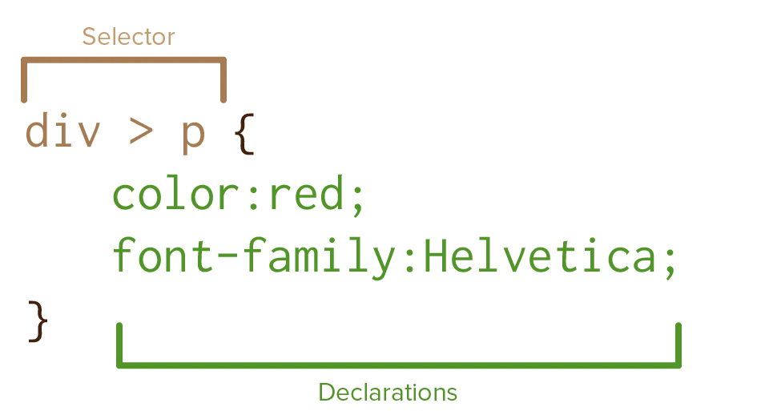

Despite its _size_, CSS is an extremely simple language. All of it follows the same syntax! Once you learn this simple structure, you know how to write 99% of CSS.

In order to style anything, you need to answer three questions.

* WHAT do we want to style?
* What PROPERTY do we want to change?
* What should be the new VALUE of this property?

What a coincidence! Those are exactly the three parts of the CSS syntax!

First, you use a **selector** to grab the HTML element you want to style. Then you type brackets (`{}`).

Within those, you can write **declarations**. The property to change, a `:`, then the new value, and finish with a `;`




This is a test paragraph.



p { /* selects the paragraph tag */
  color: blue; /* sets PROPERTY color to VALUE blue */
  font-family: "Georgia"; /* sets PROPERTY fontFamily to VALUE Georgia */
}



Whitespace doesn't matter. You can put things on newlines, add spaces, whatever you need to make it look more pretty or readable to you.

All declarations can be applied to all elements. In some unique cases, though, they will have no effect on the current element (as they rely on other properties to be set as well).

CSS uses "kebab-case". Properties are written in **lowercase** with spaces replaced by **hyphens** (`-`). So, "Font Family" becomes `font-family`. Or "Border Radius" becomes `border-radius`.

This is "the only syntax" ... mostly. 

For simplicity's sake, I'm leaving out a few other syntaxes (such as the `@`-rules which you saw last chapter). Those are only for very specific or advanced uses. You'll learn those in time. For now, believe me when I say that this one syntax will be 99% of your stylesheets.

You also see a second syntax in the example above: `/* something */`. These are comments. They are for _you_, the coder, to give comments and remarks about what you're doing. The computer completely ignores those.

Many courses advise you to write comments absolutely everywhere. To explain everything your CSS does---that's good right, explaining things? **I do not advise this.** 

In fact, if I could, I wouldn't have mentioned their existence at all. Good CSS explains _itself_. You should pick names and selectors that are simple and explain what they do. (The CSS properties already do a very good job at being named after what they do.) Comments are rarely necessary.

So yes, for now, consider this "the only syntax".

The rest of this course will merely teach you different **selectors, properties and values** that you can slot in there.

To let this sink in, I'm just going to end the chapter here!