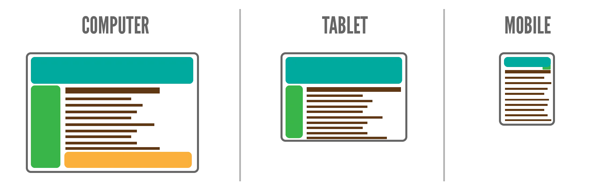

Next chapter we will finally start building an actual website and learning all the different CSS properties. As promised at the start, this will be from BIG to SMALL. This chapter will explain _exactly_ what that order is and what the rest of the course looks like.

In this chapter, though, I want to talk about something else. Before you venture further into the world of CSS, a world of pretty designs and amazing layouts, I always think it's useful to define **"what _is_ a well-styled web page?"**

In my experience, you want to develop good (coding) habits right from the start. Because it's near impossible to _break_ the bad habits later. 

{}
I programmed websites for _years_ with terrible habits. All the CSS was in _one_ stylesheet. I had to use `!important` all over the place, or I had to copy-paste a lot of my code and tweak it a little to make the website "responsive" (to different screen sizes) later.

All those old projects? Most were thrown in the bin. The CSS too bad and unwieldy to be worth saving. The ones I did continue, such as this website, received a _complete_ rewrite that barely used any of the old styling.
{}

And so we ask ourselves: is there a "good" or "bad" way to write CSS? Are there techniques or concepts to keep in mind if we want pretty pages with the least hassle?

To me, this comes down to two things: **responsiveness** and **proper naming**.

## Responsiveness

The web was made to be responsive. You don't know what device a user will use, or what browser, or what screen size. You don't know what they are going to _do_ on your website: but they will _do_ something. So it also needs to _respond_ to input or actions from the user, and the design needs to aid that.

Most courses on CSS teach "responsive design" all the way at the end. I do it here, now, at the start. Because it's the basis of everything, not an afterthought. Your design should _start_ with the knowledge that it has to work on _any_ screen size or for _any_ user.

If you don't ... then why are you even making a web page? Just make an image, or a video, or a document.

Additionally, this perspective helps understand CSS better and why it's designed the way it is. (More on that soon.)

That's the most important topic when it comes to the design, the _end product_.

## Proper Naming

The other element---proper naming---is crucial to keeping the CSS itself clean and fast.

In my [course on HTML](../../html/), I kept repeating the importance of _semantics_. HTML elements should clearly state what they _are_. This piece of text is an article? Use the `<article>` tag. This part is a header? Use the `<header>` tag.

Continuing that train of thought, specific elements will receive specific class names that describe them. You have a comment section? It gets the class `comment-section`. You have an advertisement for your latest book? It gets the class `advertisement-latest-book`.

This is _good_! It's proper, semantic HTML.

### The common mistake

But perhaps because of that, many courses on CSS teach you to use those classes for styling. It sounds sensible, right? You have your comment section, you want to style it, so you write something like ...




A test comment section.



.comment-section {
  font-size: 20px;
}



Wait a minute. Weren't we supposed to keep _meaning_ and _style_ separate? Now they're intertwined. We're styling something based on what it _is_!

And what if we have multiple elements that need the same layout? Both the "comments" section and the section with "related posts" should have the same design. What now? Copy-paste? Use a long list of selectors? Like ...




A test comment section.



.comment-section, .related-posts, .something-else, .even-more {
  font-size: 20px;
}



And what if all these sections have _some_ shared styles, but a few differences?

What if some element changes _meaning_ later, but I want to keep the same visual style?

As you see, this quickly becomes messy and chaotic.

### A better approach

CSS is meant for styling. As such,

> Assign classes that are **named** after **what they look like**. (And don't forget that CSS uses "kebab-case", as explained earlier.)

A common class (in website frameworks) is `align-left` and `align-right`. What do they do? They align text to the left or right. 

As you probably already guessed, because it's _in the name_!

This is how you want to approach your CSS. Think about the different parts of an element's look, then chop it into classes that _say_ what they _look like_.

For example, take our comments section. Maybe we want the following look for one comment:

* A white background
* A rectangle with round borders
* Italicized text

Yes, still apply a `comment` class to each comment. That's semantic HTML and helps you figure out what tags _mean_. Just don't _style_ that.

Instead, apply three more classes: `white-background`, `rounded-rectangle` and `italic`.

Each of these applies some simple CSS. And just by reading it, you know _exactly_ what they do and what the comment looks like.




This is a really nice comment.



body { background: black; }
.white-background { background: white; }
.rounded-rectangle { border-radius: 0.5em; }
.italic { font-style: italic; }



{}
Maybe you just checked the source code of this website to see it in action. I'm sorry, I didn't use this to its full extent on this website. I only learned this _after_ creating it, and still sometimes struggle to apply this idea. But when done well, it's _so much better_ than any alternative.
{}

### What about JavaScript?

Classes and IDs serve _another_ purpose. They are also used to select elements by _JavaScript_, the language for interactivity on the web. 

If you don't know about this, you can skip this section. I do recommend reading the [JavaScript Course](../../javascript/) _after_ finishing this one, though.

You can probably guess how to solve the naming issue.

> Add even more classes which are **named** after what they **do**.

Don't use the `comment` class or any of the CSS classes for JavaScript. That would mean you're mixing meaning again, which we don't want!

Instead, say you have a button that submits a new comment. What do you do? Add a class `submitComment` (JavaScript works with camelCase, not kebab-case). Use that in your JavaScript.

The class clearly says what the button is supposed to _do_. And your JS doesn't depend on classes for the HTML or the CSS.

{}
Though, in the case of JS, there are many other to grab elements. Usually it's safer to traverse the DOM, or select elements by some specific (data) attribute, or filter elements in a more robust way.
{}

## How CSS becomes responsive

### A bunch of boxes

Now that you know _responsiveness_ is the key, how does CSS accomplish this? How does this explain its design philosophy?

First of all, web pages **flow horizontally first, then vertically**. 

* It tries to place each element next to the previous one ( = horizontal)
* If it doesn't fit, the element moves downward, below what's above ( = vertical)

As a web page grows on content, it grows longer _vertically_, which is why we've invented scrolling!

But how does it know an element won't fit? How is it able to move around whole sections of the page?

Because CSS sees _everything_ as its own **box**. 

* A paragraph is a box with a certain size (whatever is needed to contain its text), which forbids anything next to it.
* A link is a box with a certain size (again, whatever size is needed to contain its text), which is inline, and thus allows other text around it.
* And so forth.

The first CSS properties you will learn, next chapters, are about setting the size of this box and how it should flow. Should the box be the full width of the page? Or a fixed size, like 100 pixels? Is it allowed to be next to other elements, or should it force everything else to move down?

Whatever screen size you give it, CSS will shuffle and rearrange those _boxes_ to fit. It's your job, as the designer, to _control_ how this happens and what the final result looks like.




This is a paragraph.

Another paragraph. Notice how it would fit next to the previous one, but it's forced below it anyways.

Now a paragraph with a <a href="https://pandaqi.com">link</a>. Notice how the link uses the tiniest box possible and allows other text around it.



/* This is just to show you the "box" that CSS draws around elements */
p { border: 1px solid gray; }
a { border: 1px solid gray; }



### Media Queries

Most of your responsiveness should come from smart design. Use relative or viewport units, for text, images, everything. Use a simple design that automatically looks good at different aspect ratios.

There are certainly situations, however, where this is not enough (or too complicated).

To apply a set of CSS rules _only_ if a certain condition is met, you use a **media query**. Type `@media <condition> {}` with your CSS between the brackets.

We already saw one such situation before: the difference between _screen_ and _print_. 

{}
On my Pandaqi website, I started creating digital ("playful") rules some time ago. This means the rules of my board game can be viewed and interacted with on the website. Some people, though, still prefer a printed version. What to do? I added CSS that _only_ activates when you try to print the page. It hides some buttons and website elements, changes the font size, and arranges images to fit more easily on A4 paper.
{}

Probably the _most_ common usage is to apply styles only if the screen size is above/below a certain limit. This is how websites make the menu "disappear" on small mobile screens, for example.




A paragraph that should suddenly disappear when you make this example really small.



@media all and (max-width: 500px)
{
  p {
    color: transparent;
  }
}



Media Queries are explained in-depth in a _later_ chapter: [Media Queries](../media-queries/). I just wanted to mention its existence---and these two applications---early on. If you only learned this at the end, by that time you might've already developed bad habits due to a lack of knowledge about what's possible in CSS.

## The Visual Decisions

Finally, we are ready to start learning specific CSS rules. With any design, there is a list of questions that I like to use. They give a nice _order_ or _priority_ to all the different elements. The question at the top has _huge_ implications and should therefore be considered first. The questions at the bottom only change _small_ parts of the design and can be left for later.

As such, that's also the order in which this course teaches parts of CSS.

See the list below.

1. HOW BIG should this element be? (Its dimensions or shape.)
2. WHERE should it be? (Its location.)
3. What should be its BACKGROUND? (As this is actually the largest visible area of any element, usually.)
4. What should be its FOREGROUND? (Its content, usually text.)
5. What should be its DECORATION? (Border, overlays, details.)
6. How should it RESPOND? (React to user interaction or changes, which only applies to specific elements.)

With that in mind, let's (officially) learn your first CSS properties now!