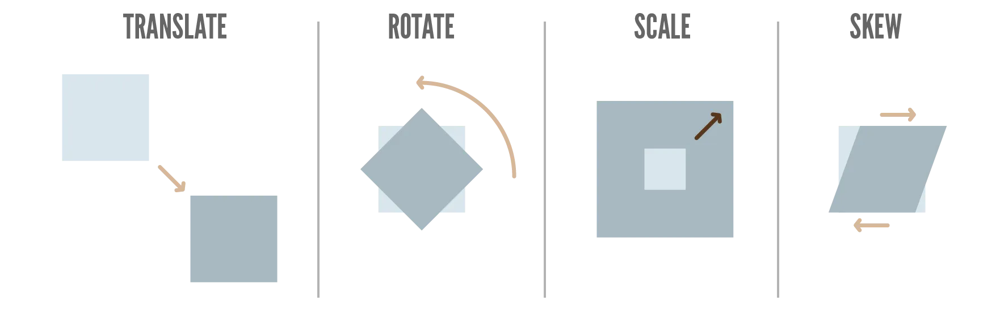
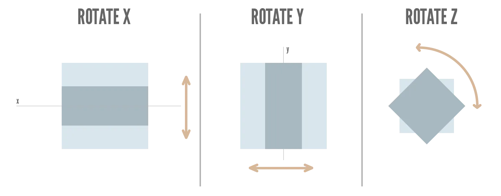

Last chapter mentioned we had two more properties to go that could do _massive_ changes to your design with just one line. Then I explained the `filter` property that applied nice visual effects to the image, changing the (color) _appearance_ of the whole element.

This chapter is about the second thing you could do: changing the dimensions and position of the element at will.

This is done with the `transform` property.

_What's the difference with the properties we already learned for position and size?_ There are a couple of key differences.

* It's only a _visual_ change: behind the scenes, the old box is always maintained, so page flow never changes.
* Because of that, it can be much more _powerful_.
* Which means it also allows a few things that nothing else in CSS can obtain.

You can use this in grand applications, creating a very dynamic website or one that looks 3D. In most cases, however, it's used in subtler ways. 

{}
In many of my websites, tiles or buttons "pop up" when you hover over them. This is a simple transform that scales the element to be slightly larger. Similarly, many websites do a little "wiggle" to attract your attention to something, which is just a small _rotation_ being applied a few times in a row.

Because it doesn't affect page flow, I am free to add all these tiny animations and changes everywhere, without worrying about messing up the rest of the design.
{}

## Transforms

Again, if you ever worked with design software (either 2D or 3D), you'll know what _transform_ means. It is the set of properties that entirely decide how an object is placed inside a space. It has 4 key properties.

* `translate(x,y)`: change position
* `rotate(angle)`: rotate around the center of the element
* `scale(x,y)`: grow and shrink size
* `skew(x-angle,y-angle)`: distorts the element by moving the two opposing edges in _different_ directions.

{}
The _skew_ effect is really powerful for animating or faking 3D. Otherwise, you won't touch it.
{}

All of these have a 2D and 3D variant, except _skew_. 

The 2D version is the default. For the 3D version, add `3d` to the name, and the `z` axis as the third parameter. For example, `translate(x,y)` becomes `translate3d(x,y,z)`

Also, these values set all the axes at the same time. You can always transform axes separately by adding the axis name (as a **capital letter**) and only supplying the value for that axis. For example, `translate(x,y)` becomes `translateX(val)`

## Translate

This moves an element from its original position. 

Notice, in the example, how I can just move the image anywhere---but nothing responds to the change.




Lorem ipsum dolor sit amet, consectetur adipiscing elit, sed do eiusmod tempor incididunt ut labore et dolore magna aliqua. Ut enim ad minim veniam, quis nostrud exercitation ullamco laboris nisi ut aliquip ex ea commodo consequat. Duis aute irure dolor in reprehenderit in voluptate velit esse cillum dolore eu fugiat nulla pariatur. Excepteur sint occaecat cupidatat non proident, sunt in culpa qui officia deserunt mollit anim id est laborum.



img {
  max-width: 100px;
  transform: translate(50px, -100px);
}



## Rotate

This rotates an element around its center.






img {
  max-width: 100px;
  transform: rotate(90deg);
}



Granted, this isn't useful for any text, as it just becomes unreadable. But rotating images or decorative elements can be crucial to creating a unique design.

## Scale

This scales an element relative to its original size. This scaling also happens around its _center point_. 

A value of `1` means it stays the same. Smaller values mean a smaller element, bigger values a bigger element.

In the example below, hover over the image to see the scaling animation. 






img {
  max-width: 100px;
}
&nbsp;
img:hover {
  transform: scale(1.25);
}



{}
Also notice how I set both `x` and `y` scale at the same time. I hope you still remembered from two chapters ago that you can always do this! When a value expects an `x` and `y`, you can always give one value and it uses that for both.
{}

## Skew

Really, the skew effect must be _seen_ rather than explained. As I said, not that useful in most cases, but I wanted to add it for completeness' sake.






img {
  max-width: 100px;
  transform: skew(10deg, 0);
}



## Multiple Transforms

Just like with `filter`, you can combine any number of transforms (on the same element) by providing them as a spaced list. 






img {
  max-width: 100px;
  transform: scale(1.5) rotate(45deg);
}



## Conclusion

This concludes our chapters about how you control the **location** and **dimensions** of any element (or group of elements). With these tools, you'll be able to build the overall skeleton or template of your website.

You'll be able to put blog articles into a grid. Or stick the header to the top of the screen at all times. Or set the whitespace (padding + margin) for all elements to space them out correctly.

These properties are enough to get a website that is 80%--90% there. Because all the building blocks have the right shape and size, and they are all in the right place. 

You also already learned many cool ways to make your website _responsive_ and to _animate_ elements. (For example, by changing the transform or adding a filter whenever somebody interacts with the element.)

Now, we will look at the actual _content_ of those boxes. The **background** and **foreground** (text).