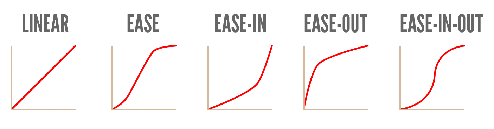

At this point in the course, you have seen pretty much every major part of CSS. You should be able to create good-looking websites with that and _almost_ any design you envisioned.

Now we get to the details. The flourishes. The nice touches.

And the biggest element in that category is **animation**. 

For example, in the chapter on [Pseudo-Classes](../pseudo-classes/), we applied a different style when you _hovered_ over a link (as opposed to the link's regular style). But this change was instantaneous! It happened immediately, with no transition.

Most designs become prettier and more useful when you _do_ animate such changes.

## Transition

The easiest way is by using the `transition` property. It allows you to set CSS properties that should _gradually_ transition when changed, plus how long this change should take.

In other words, it accepts a comma-separated list of `<property> <time unit>`.

A "time unit" is a number with the unit `s` (for _seconds_). For example, `1s` means one second.

The example below will take 0.3 seconds (300 milliseconds) to transition, whenever the value of `color` or `font-size` is changed.



<a href="#">A juicy link!</a>


a {
  color: black;
  font-size: 1em;
  transition: color 0.3s, font-size 0.3s;
}
&nbsp;
a:hover {
  font-size: 1.5em;
  color: red;
}



This works for (almost) any property! As long as you spelled the property name correctly, and provided a time greater than 0, the browser tries to smoothly transition. These days, it only fails on really complex things (such as interpolating between two `background-image` values.)

On my websites, my links and buttons _always_ have a transition property. My CSS usually changes the color, background-color, scale (with a transform), and shadow (with a filter). A "pop out" effect is usually nice. It's just one line, but it makes the website interface so much more smooth and polished.

{}
Also, note how the `transition` property is set on the original element, not the `:hover`. For this property to work, it needs to already have been set _before_ the hover styles take over. That's why you almost always set these on just a plain element, with no pseudo-classes attached.
{}

## Animation

This is nice, but what if you need more control? What if you want more complex animations, which don't just change a few properties in a straightforward way?

Then you can open the box called CSS animations.

Now **two steps** are required.

* _Define_ the animation somewhere.
* Then _use_ it wherever needed.

### Define an Animation

To define an animation, use `@keyframes <name> {}`. You can invent the name yourself, though I recommend something simple and descriptive, in "kebab-case". (I see many online examples that name animations with camelCase, which is ugly and confusing to me.)

_Why "keyframes"?_ CSS decided to do animation via keyframes, which is generally the most popular method. It works very similar to those "color stops" we discussed in the [Gradients](../gradients/) chapter.

When the animation plays, it steps through the timeline from 0% to 100%. A keyframe simply says ...

* "Hey, I want to happen at THIS moment (e.g. 20%)"
* And here are the new styles I want applied

In syntax, this simply looks like `<time> { <styles> }`. You can add as many of these keyframes as you want. The order also doesn't matter, though it's obviously easiest (for you) to add them in the right chronological order.

The example below creates an animation that changes the background color from black, to red (halfway the animation), to white.



@keyframes background-change-anim {
  0% { background-color: black; }
  50% { background-color: red; }
  100% { background-color: white; }
}



### Use a defined animation

Now that you've saved this animation under that name, you can use it anywhere! 

| Property                | Values     | Description |
| ----------------------- | ---------- | ----------- |
| `animation-name`        |            | The name of the animation this element should play. |
| `animation-duration`    | Time Unit  | The amount of time between 0% and 100%. |
| `animation-delay`       | Time Unit  | How long to _wait_ before starting the animation. |
| `animation-iteration-count` | Number `infinite` | How often to _repeat_ the animation. |
| `animation-direction`   | `normal` `reverse` `alternate` `alternate-reverse` | Whether to animate normally (start -> finish) or in reverse (finish -> start). |
| `animation-timing-function` | (see below) | How to time the keyframes. |
| `animation-fill-mode` | (see below) | What to do with the keyframes when the animation isn't playing. |

In most cases, just the first two properties are enough: what animation to play and for how long.



<button>A juicy button!</button>


@keyframes background-change-anim {
  0% { background-color: black; }
  50% { background-color: red; }
  100% { background-color: white; }
}
&nbsp;
button:hover {
  background-color: black;
  animation-name: background-change-anim;
  animation-duration: 0.75s;
}



If you add an animation to an element, it starts to play as soon as the styling rules are applied. For example, if you simply add the animation property to every `a`, then all links will animate as soon as the page finished loading. (You can _delay_ this with the property given above, but that doesn't really help.)

That's usually not what you want. You want the animation to happen in response to something. As such, animations are usually ...

* Added in _pseudo-class_ selectors (so they only trigger when a certain state or condition is met.)
* Or through regular _classes_ that are added/removed at runtime (by JavaScript).



@keyframes background-change-anim {
  0% { background-color: black; }
  50% { background-color: red; }
  100% { background-color: white; }
}
&nbsp;
/* whenever I want to play the animation, I add this class name to the element on the spot */
.play-background-change {
  animation-name: background-change-anim;
  animation-duration: 1s;
}



{}
If you intend to repeatedly animate an element, don't forget to _remove_ the class before adding it again. Otherwise, adding the class will just cause CSS to shrug and say "this element already has this class", and not do anything.
{}

## Timing Functions

By default, an animation moves through time uniformly. The duration between keyframes `10%` and `20%` is equally long as the duration between keyframes `40%` and `50%` (for example).

The timing property changes this. For example, you can speed up the animation at the start (moving to `10%` in no time), then slow down near the end (suddenly taking twice as long for `10%` of the animation).

This is often perceived as more natural and organic. A linear, uniform animation feels too stiff, artificial and boring.

In the example below, try the different easing functions and see what happens. (Whenever you change the code, it refreshes, so the animation wil play again.)






@keyframes move-left {
  0% { left: 0; }
  100% { left: calc(100% - 100px); } /* you'll learn this soon! */
}
&nbsp;
div {
  position: absolute;
  left: 0;
  width: 100px;
  height: 100px;
  border-radius: 50%;
  background-color: red;
  animation-name: move-left;
  animation-duration: 1.5s;
  animation-timing-function: ease-in;
}



There are more easing functions for even more control. I judged them too complicated and rare to include in this course. As always, check out the CSS documentation for that.

## Fill Mode

One final issue that plagues animation (in any medium) is what to do when the animation is **not** playing.

There are two questions here:

* Which styles should be applied _before_ the first keyframe starts?
* Which styles should be applied _after_ the animation ends?

By default, 

* CSS just keeps whatever styling the element already has, until the first keyframe comes around
* When the animation is done, it reverts _back_ to that original styling.

You saw this in the example above. I need to set `background-color` to make sure it starts on the right one, then when the animation is done, it forgets the final keyframe and returns to that original style.

The `animation-fill-mode` property can change this. It accepts four values.

* `none`: the default
* `forwards`: the first keyframe of the animation is applied as the current style, even before it starts
* `backwards`: the last keyframe of the animation is _maintained_, even after the animation ends
* `both`: both forwards and backwards

In the example below, notice how the circle stays on the right and doesn't reset back to the left.






@keyframes move-left {
  0% { left: 0; }
  100% { left: calc(100% - 100px); }
}
&nbsp;
div {
  position: absolute;
  width: 100px;
  height: 100px;
  border-radius: 50%;
  background-color: red;
  animation-name: move-left;
  animation-duration: 1.5s;
  animation-timing-function: ease-in;
  animation-fill-mode: both;
}

