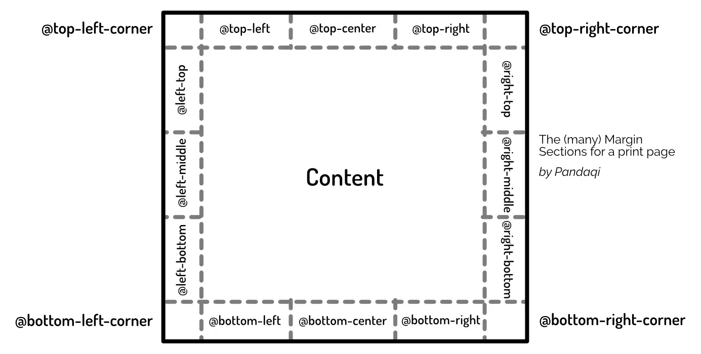

This chapter will talk about specific CSS properties and syntax to style a page **for print**. These only go into effect when you visit a webpage and try to print it. (The shortcut for this is usually `CTRL+P`.)

By default, webpages are endless. They aren't cut into "pages" (of a fixed size). It just grows vertically to fit everything inside. It's one page, with a scrollbar for interaction.

Print is an entirely different beast. Yes, there are commonalities, but the fact that you're limited to _page size_ and content has to be divided into _chunks_ ... changes almost everything.

Then why do it?

I'll give the example I gave before. My latest novels are all _websites_. I write the story as a website. I style it using CSS---which is very powerful, as you know by now. When done, I visit that website (on my own laptop) and ask to _print_ it. 

That PDF, that final product, is the _actual_ file that's being printed and turned into physical books.

I'm far from the only one. Many websites (especially educational ones like these) also sell physical books with their content. Many writers, especially those who also program or work digitally, prefer creating their book as a website and then turning it into a PDF at the end.

The languages of the web (HTML, CSS, JavaScript) are very powerful and versatile. You've read this course---you know this. With just one line of CSS, you can change a font across the entire book, or radically change what headers look like. Things that are impossible or hours of work in something like Microsoft Word.

So yes, there are real use cases for turning web to print, and it's important to learn. 

## Browser Support

That said, browser support has been slow and inconsistent. To overcome this issue (for now), people created [Paged.js](https://pagedjs.org/).

It's a JavaScript library that fills in the gaps. It listens to the CSS properties I'm about to explain below, but makes _sure_ your browser understands and executes them.

As their website states: the ultimate goal is to become redundant, because browsers actually _support_ all of his natively. We're getting there. By the time you read this, we might have even arrived! 

{}
At this moment, Google Chrome is far ahead on this. Some books I've been able to create and publish _without_ Paged.
{}

## @page

You guessed it: another `@`-rule. This one allows you to set CSS styles that apply to every _page_.

It has a unique property `size` which requires two numbers: the width and height of the page.

It also supports named values for the common sizes (`a3`, `a4`, `a5`, `letter`, `legal`, `ledger`, `b4`, `b5`). In that case, though, it requires this name and also an _orientation_ (`portrait` or `landscape`).



@page {
  size: a4 portrait;
  /* size: 210mm 279mm; */
}



Besides that, you can use many regular CSS properties, but not all. Check [the full list on this page](https://developer.mozilla.org/en-US/docs/Web/CSS/@page). 

### Margins

The most important one is the _margin_: you need proper whitespace around the content if it's going to be printed on pages.

In fact, CSS provides a list of `@`-rules (to be used _inside_ an `@page` statement) to target a specific margin.

Imagine the page being cut into pieces with straight horizontal and vertical lines. (Similar to the nine-slice-rectangle that `border-image` uses, but with even more detail.) 

This gives you the center part with the actual content, and then many different margin blocks around it.

Now you can target each of these directly! The example below adds some text at the top of every page, in the center;



@page {
  @top-center {
    content: "Header";
    font-style: italic;
    text-align: center;
  }
}



### Specific Pages

You can select a specific subcategory of pages with a **pseudo-class**.

* `:left` selects all left pages
* `:right` selects all right pages
* `:blank` selects all empty pages
* `:first` selects the first page
* `:nth(num)` selects one specific page (by page number)

A common application, for example, is to add a _larger_ margin on the _inside_ of pages (than the outside). Especially on bigger books, this is needed to keep text consistently readable, because you lose a lot of space due to the binding in the center.



@page:left {
  margin-left: 3in;
  margin-right: 4in;
}
&nbsp;
@page:right {
  margin-left: 4in;
  margin-right: 3in;
}



{}
As you see, when working with print, don't use pixels or other screen-related units. Instead, prefer `cm`, `mm`, `pt` or `in`.
{}

### Print Rules

As a reminder, you can add _different_ styles for print with the `@media` query.



body {
  font-size: 16px;
}
&nbsp;
@media print {
  body {
    font-size: 12pt;
  }
}



## Page Breaks

By default, the browser will just fill the pages on the fly. It tries to fit content on the current page, again and again, until something doesn't fit anymore. At that point, it starts a _new_ page and restarts from there.

Of course, many books don't use this structure. For example, they require a fresh new page when a new chapter starts. (That is, they want new chapters to start at the very top of their own page.)

You can adds such page breaks using the `break-before` and `break-after` properties. They control whether a page break happens _before_ or _after_ the element, respectively.

The possible values are.

* `avoid` = try not to allow a page break
* `always` = always insert a page break, even if that cuts elements in two
* `page` = tries to insert a page break and keep the entire container of this element on the same page.
* `left` = inserts as many page breaks as needed to put this element on a _left_ page
* `right` = inserts as many page breaks as needed to put this element on a _right_ page

The example below makes sure every new chapter (which starts with a `<h2>` heading) starts on a fresh right page.



h2 {
  break-before: right;
}



## Typography

There are several "nasty" typographical situations that arise only in print. (And in multicolumn layouts, actually.) 

Namely, **widows and orphans**.

* Widow = the _final_ line of a paragraph lands at the top of a new page.
* Orphan = the _first_ line of a paragraph lands at the bottom of its page.

Not only does it look ugly, it's easy to miss this single line dangling at the edge of the paper. When a paragraph is broken in two by a page break, like this, it's confusing.

Fortunately, with CSS you can control this.

* The `widows: num` sets how many lines of a paragraph must be shown ("kept together") at the top of a page.
* The `orphans: num` sets how many lines of a paragraph must be shown ("kept together") at the bottom of a page.

A value of 2 or 3 is usually fine. This won't _ensure_ that it happens. But the layout engine _tries_ to follow these rules as well as possible. 

{}
Sometimes it's just impossible, such as when a paragraph only _has_ a single line. At other times, requiring this would leave a big _gap_ on the page, which is perhaps even more confusing.
{}



p { 
  widows: 2;
  orphans: 2;
}



## Counters

Finally, here we see another use case for those [Counters](../counters/) about which we learned. 

Books, usually, show page numbers on the pages. Similarly, they might have a running header at the top, or number their headings.

You can do this all through CSS using counters.

Start the counter somewhere. (Usually a book has no page numbers until the actual content starts.) Increment it every time the footer is displayed, then also show the current value in that footer.

See the example below.



@page:first {
  counter-reset: page-numbers 0;
}
&nbsp;
@page {
  @bottom-center {
    counter-increment: page-numbers;
    content: "Page " counter(page-numbers);
  }
}

