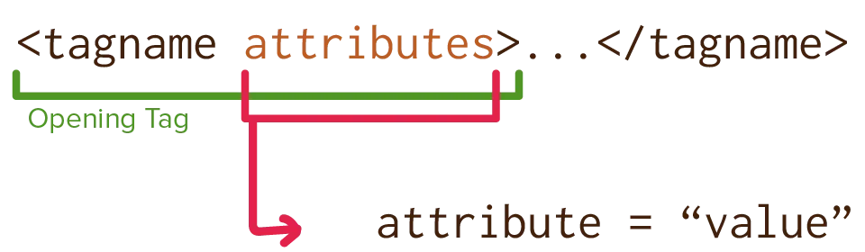

This course has moved from our biggest tags to the smallest ones. But even those are quite limited: you've only seen about ~20 tags up to this point, that's not enough to describe _all_ possible content!

So HTML allows us to go one step further. It allows us to add **attributes** to tags to make them even more specific.

Attributes are also necessary for those "void elements" I explained at the start. Elements that don't have a closing tag, so they must get their "content" from something else. You guessed it: void elements always use an attribute for that.

## Syntax

An attribute is always added to the _opening tag_. It follows the pattern `attribute="value"`.

Attributes must be lowercase and can't contain spaces. (To replace a space, a dash `-` is often added.)

The value can be surrounded by double quotes (`"`) or single quotes (`'`), and can contain anything. Double quotes are the standard and usually preferred.

Remember _semantics_! Use attributes to add more _meaning_ to tags. Give them names or values that most clearly describe what the content is supposed to _be_. (Use CSS later to describe what it's supposed to _look like_, or JavaScript to describe what is's supposed to _do_.)

Semantics, and naming things properly, are maybe the hardest things about programming. It takes some skill and experience to do this correctly each time, so don't worry about "perfect" HTML too much for now.



An image is a void element. The link to the image file is, therefore, set as an attribute:



## Minimized Attributes

Similar to void elements, we can have attributes that take no value. 

Why? Because these attributes only have a single possible value. They are "on/off" or "true/false". When false ... simply don't include the attribute. When true, only include the name (and no value).

These are called **minimized attributes**. See how the example below only says `disabled`, with no value. To enable that button again, simply remove that attribute.



A button can be active (enabled) or inactive (disabled). There's no other option here, so this is a minimized attribute.

<button disabled>Click me (you can't, I'm disabled)!</button>


Also similar to void elements, most versions of HTML allow specifying these as normal attributes too. You'd do `disabled="disabled"` in that case. But that's more typing than needed, so why do that? :p 

{}
In general, the HTML standard picks the option that takes the least amount of work. Tags are abbreviated, such as `p` for paragraph. Void elements and minimized attributes are used wherever possible.
{}

## Global Attributes

These attributes are available on all tags, by default.

### Class & ID

First, I want to give you the two most important attributes.

Attribute | Values | Description |
--------- | ------ | ----------- |
`class` | Anything | Puts the element into certain groups. (This can be used later to access this element specifically.) |
`id` | Anything | Provides a _unique_ ID for accessing this element (which it doesn't share with others). |

First of all, use classes and ids to add even more _meaning_ to your webpage. If elements are doing the same thing, put them in the same class. If you have a one-of-a-kind element on a page, give it a unique ID that describes it further.

Secondly, classes and IDs are how other languages (such as CSS and JavaScript) communicate with your HTML. As such, once you start styling your page, you'll automatically add classes all over the place.


<!-- Notice how the comment section is unique, so it gets an ID -->
<section id="comments">
  <!-- But comments can appear often, so they're a class -->
  

    <h2 class="comment-heading">User 140</h2>
    
Great website, good stuff.

  

  

    <h2 class="comment-heading">SweetyPants14</h2>
    
What an article! Changed my life!

  

</section>


### Other

Most of these have to do with accessibility: to allow somebody to navigate your page using keyboard, and to tell computers about the language and reading direction.

Attribute | Values | Description |
--------- | ------ | ----------- |
`accesskey` | Character | Specifies a key combination that can be used to access a certain element. |
`contenteditable` | `true` / `false` | If true, you can click inside the element and edit its content. |
`dir` | `ltr` / `rtl` | Specifies the reading direction of the text; left to right or right to left. |
`hidden` | | Hides an element completely. |
`lang`| A language code | Specifies the language of the element's content |
`spellcheck` | `true` / `false` | If true, the browser spell checks the element. Only applies to editable content. |
`tabindex` | Number | Allows a user to move through your page by pressing tab. This number determines the order in which it visits elements. |
`title` | Anything | A tooltip. If the user hovers over the element, this title will appear next to the cursor. |



Hover over me to get a tooltip.

  Try clicking inside this element. You should be able to edit it!



Don't forget that HTML is all about nesting and hierarchy. Don't set the `lang` attribute on _all_ your elements, for example.

Instead, set it once at the top (usually your `<html>` tag). Same for reading direction, and classes/IDs. Set attributes on the highest-level node, which automatically means it's true for its children.

## Data attributes

One very powerful feature of HTML is the ability to create **your own attributes**! You can save whatever information you want inside a tag, by inventing your own attributes.

There's only one rule: the attribute has to start with `data-`.



  This is a nice comment. Info about it is saved on the tag, using custom attributes. This allows me to remember and modify this state later, with other languages.



{}
Some time ago, I invented "hybrid" board games: games you play in real life, but with the assistance of some digital interface (my website or app). If you look at its source, you'll often find loads of special attributes on elements, to remember the state of the game. For example, if I have a button that scores you points, it should save _how many points_ in a made-up attribute like `data-score="5"`.
{}

There's one caveat: attribute values are always _strings_. They're pieces of text. So if you put a number in there, such as my `data-score` example, and read it back later ... it is suddenly a piece of text. This might not seem like an issue now, but once you start using JavaScript on your websites, it is crucial to first _convert_ your attributes to the type they should be.

It also means that you shouldn't use special characters or space in the attribute values. The computer might change it in weird ways, and it makes the HTML a bit hard to read.

If you need to put so much into one attribute ... split it into multiple!


<!-- Not great -->

<!-- Better -->



Knowing what attributes are, we can continue with the tags you've probably been waiting for: links and media (image/audio/video).