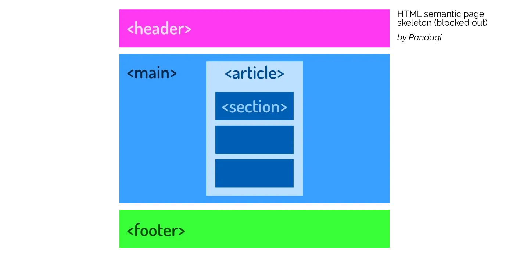

Last chapter, we learned about the first and biggest "structure" in every HTML document: head and body. Now let's go one step further, to the second largest subdivision you'll create.

The body of every page can be further divided into _blocks_. For example, a typical web page has ...

* A header (at the top, with the menu, logo, etcetera)
* The actual content
* Perhaps a sidebar
* Perhaps some remarks or notes _about_ the content
* A footer (at the bottom, with credits, copyright, more links, etcetera)

These are all different "blocks" or "sections" that, together, make up the website.

Thankfully, I've already taught you _semantics_. That means this chapter will be easy to understand, and you already know that it's important to use the _right_ tag for the _right_ type of block.

## Block vs Inline

An HTML element can be **block level** or **inline**.

* Block level means that it's supposed to stand on its own. Whenever there's a _big_ change in structure, use this type.
* Inline means that the element stays _in line_ with the text, or the other elements around it. Whenever there's only a _small_ change in structure, use this type.

For example, a _paragraph_ (`
`) is a block element, while that _emphasis_ tag (`<em>`) is inline.



This is a block element.

See, when we start a new one, it moves to a new line with empty space around it.

But an <em>inline element</em> just stays in line with the text!



## Block-level elements

Below is the list of big, semantic block-level elements. The image displays the general skeleton of a webpage, with the code for it in the example below. After that, each element is named and explained in a little more detail.


<header>Some navigation buttons.</header>
<main> 
    <article>
        <h1>Header</h1>
        <section>
            
This is the introduction

        </section>
        <section>
            
Paragraph, paragraph.

            
Paragraph, paragraph.

            
Paragraph, paragraph.

        </section>
        <section>
            
The summary and conclusion.

            

                A highly specific, unique section that has no semantic tag.
            

        </section>
        <aside>
            
Some final remarks and footnotes here.

        </aside>
    </article>
</main>
<footer>Some credits here.</footer>


### Main

For the main part of a webpage. There should be only _one_, and it should be reserved for the "meat" of the webpage. A good metric is to check if the content is _unique_. If all your pages have the same content inside your `<main>` tag, it shouldn't be in the main tag. It's probably a menu, or a header, or something else.

### Header

For the header of a block. (Could be the header of the whole webpage, or the header of a single _comment_.) Remember that a header, typically, contains details / metadata _about_ the content that follows.

### Footer

For the footer of a block. Usually contains more details which are important, but not important enough to put _before_ the content.

### Article

The name says it all: for an _article_. One piece of content, preferably text, filled with headings and paragraphs.

There can be multiple of these, of course, if the webpage is a _list_ of articles. Perhaps your homepage has a grid with many links to the most popular articles all over your website.

### Section

A slightly more generic tag for a part of the webpage that's separate from other parts. For example, we often talk of a "comment section" underneath articles. Obviously, you'd use a `<section>` tag for that.

### Aside

Defines a section that contains remarks or side notes. A general rule is: if you can _hide_ the section and it doesn't ruin the core of the webpage, then they're probably an `<aside>`.

### Details

Similar to `<aside>`, but goes even further. It's meant for a box that's hidden by default, but can be opened when the user clicks it. (Or a similar mechanic in which information is so unimportant that it's invisible by default, and the user must consciously search for it.)

### Summary

The name says it all: for a _summary_ of other content on the page. Typically meant as the _visible_ portion of a `
` block, which summarizes the hidden details.

### Div

Short for "division". This is by far the most _generic_ tag. It's used for grouping elements that don't have a better tag to describe them. It's especially common in designs that need a lot of styling/interactivity afterwards. The easiest way to target many different elements, is by constantly grouping them inside `
`s.

Otherwise, as you know by now, refrain from using it. Pick a more specific tag, if possible.

## Inline Elements

There's only one _generic_ inline tag. The other inline tags are discussed in the upcoming chapters, as they have very specific use cases. Because "inline" means you flow with the text, these tags aren't typically used for "grouping" stuff. 

{}
Remember the _emphasis_ tag: it's very specific and should only be applied to small pieces of content. If everything has emphasis, nothing has ;)
{}

### Span

The `` element groups the elements inside, but stays inline. I rarely use it, but there are certainly situations where it's the best thing you have. Situations where you need to group elements, but their relationship has no clear tag to describe it.

## Horizontal Rule

This is a special one. By default, the tag `
` just creates a horizontal line.

That's why many people use it for its _visual_. But that's bad, as you know by now. (There are many ways, easier and cleaner, to create such a line in CSS later.)

Instead, the tag simply means to _separate_ content. Place a horizontal rule between two pieces of content to signal that they are _different_.

{}
I maintain a website filled with fantasy short stories (in Dutch, though English translations are coming). Sometimes, there's a "scene break" within a chapter. It's very rare for a novel to actually add a _heading_ in those situations. 

Instead, I use a horizontal rule to indicate we're switching scenes. This is a fast and clean way to mark up my stories. Ereaders also like it. (Visually, it looks completely different, and there's no actual line visible.)
{}



This is the final paragraph of a scene.

Wow, an entirely new scene now!



## Conclusion

I'm slowly giving you the tools to mark up your content more and more specifically. We're moving from "big" to "small".

* First you separate head and body
* Then you divide the body into main, header, footer, side notes, etcetera
* And within each, you might go further with sections, breaks, or generic grouping

I highly recommend trying to structure your first web page now. Grab content from your favorite blog, or grab something you've written yourself, and create a clear HTML document for it.

Remember: it's not supposed to _look_ good at this moment. In fact, it probably looks awful. It's supposed to have a good _structure_ that _says what each element is_.

Now let's continue to the next, slightly smaller elements: paragraphs and headings.