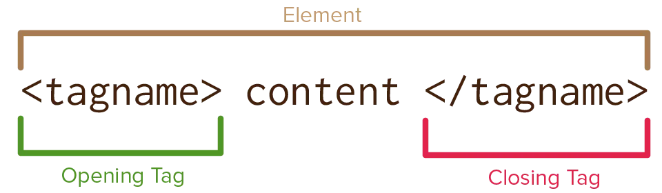
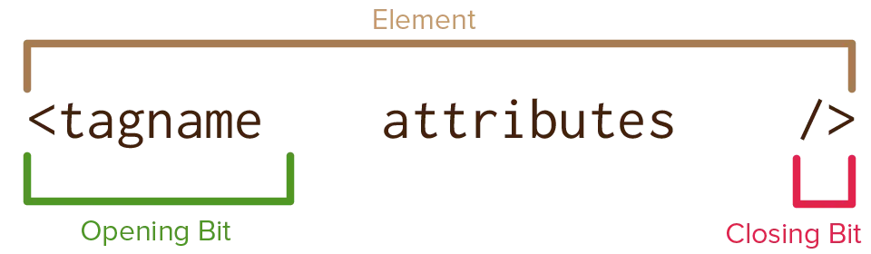

Earlier, I explained how HTML is a _markup_ language. It marks parts of your content as being _something_. Like you'd use a marker pen to highlight important parts of a textbook.

How does it achieve this? By using **tags**, which define **elements**. Tags usually come in pairs.

* An **opening tag** signals the start of an element (e.g. `
`)
* A **closing tag** signals that the element is now done (e.g. `
`)

That's it. That's 95% of HTML. 

The _type_ of tag is what gives the element meaning. If you use a `p` tag, you tell the computer that the following text is a _paragraph_. If you use a `h1` element, you tell the computer that the following text is a _heading_.

Try it! In the example below, I've added the raw content of a silly article. Use tags to structure it into *headings* and *paragraphs*.


Why should I learn HTML?
It's simple. It's fun. It's useful. It allows you to create websites, and who doesn't want to have a website?
Why should I NOT learn it?
It burdens you with knowledge. Others might perceive you as a wise being for knowing the power of HTML. They might look up to you for the rest of their life, and maybe you don't want that.
What's the best place to learn it?
Pandaqi Tutorials, obviously.


## Void elements

Some elements have no (textual) content. For example, an _image_ should point to a file, but doesn't need any text inside.

These are called "void elements" and they do **not** need a closing tag!



Here's an image from my website. Notice how it's just one tag.



In other (older) versions of HTML, these would be "self-closing tags". You were still allowed to omit the closing tag, but the opening tag had to end with `/>`.

Browsers are quite lenient. You might be able to use older or wrong syntax today, and it will help you out and display the webpage just fine. But I recommend that you **don't** rely on this: be precise and correct when coding, according to the latest standard.

<!---  --->

## Nesting tags

The idea of a _hierarchy_ (or structure) is that there are multiple levels. For example, within a paragraph, you might also have a link somewhere. A page might have different sections (a header, a sidebar, a comment section), each of which contain even more marked-up content.

Now you see why HTML works the way it does. Using "tags", it is _very easy_ to nest elements inside other elements. Tags clearly communicate when an element starts and ends. So, to nest tags, you simply place an element inside another element (before it closes).


<article>
  
This is a paragraph inside an article.

  
This is another paragraph. But watch out, it has <strong>bold text</strong> inside it!

</article>


As long as you properly open and close your element, you can put it anywhere you want. Often, the bigger element is called the "container", and the element inside the "content". I also like calling it an "outer element" with an "inner element" nested inside.

A common beginner's mistake is to close the _outer_ element while the _inner_ element is still open. 

For example: `
<strong>
</strong>`. The order is wrong here: first close the inner elements, then the outer ones. If you do this, the browser will _try_ to help you out, but often fail. Try it in the example above!

You can nest elements as much as you want. It's recommended, however, to not go too far. It's harder for you to read and understand, which leads to errors and wasted time. (It's also slower for the computer to display, although you need a _really_ deep nesting to feel the effects of this.)

## Conclusion

HTML only has three components. You've just learned the first and most important one. I'm naming the others as well, because it helps the learning process to get a complete overview at the start.

* **Tags** (opening and closing tag, which mark elements)
* Attributes
* Entities

We'll first explore the most vital tags and when to use them. Then we dive into attributes, and finish the course with entities.