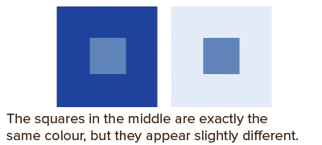
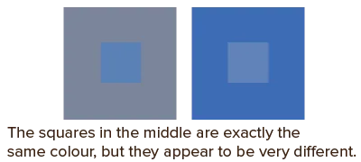

Colour is highly contextual. It may exude positive feelings in one context, but portray the opposite effect in another. Colours carry different meanings across different cultures and people.

For example, white text on a black background jumps out more than black text on a white background. Both are equally readable and "contrasted", in theory. Yet many people report they can easily read white pages with black text, but can't focus if the colors are reversed (white text on black).

Orange between yellow hues looks less bright than the same colour among red hues. Dark brown surrounded by dark green looks less saturated than when placed in a yellow environment. 

Certain colours can even change our perception of the size of design elements!

While these differences are subtle, they are important. Changing the surroundings of a colour is not going to change the hue, but rather change *perception* of saturation and brightness. Don't allow this to surprise you (at unfortunate moments). Use it to your advantage!

There are, however, no specific rules for how a colour will behave. Most of it is learned by just trying out different combinations and describing the effect they have on each other.

## Shifts in Brightness

Light colours surrounded by dark ones appear lighter. Dark colours surrounded by light ones appear darker.

A more noticeable, and annoying, concept is that of the **slight lightness difference**. If you have two colours with only a slight change in lightness, your brain is going nuts over if they are the same colour or not. 

To solve this, they usually appear more contrasted than they are. But ... with a subtle, light crisp at the edge. Your brain is like: "you know what? I'm just going to pretend there's a line separating these colors clearly" They appear luminous and unstable.

I forbid you to ever choose two colours that are nearly exact copies. It still happened? Place these elements in an environment with a *huge* difference in brightness to weaken the issue.

{}
These crispy edges can also appear when you put high brighness, high contrast colours together.
{}

And lastly, **darker** elements are affected more by surrounding elements. Probably because they don't emit much light _themselves_.

Say you create a row of squares with decreasing brightness from white to black, with the same difference in value between each of them. If you place this on a grey background, you will notice that the differences in value between the darker squares appears much greater than that of the white ones.

## Shifts in Saturation

Say we have a moderately saturated colour. If we place it on an almost unsaturated background it will appear to have a higher saturation. If we place it on a highly saturated background, it will appear dull.

This shift in Chroma comes with an extra effect: if the contrast is big enough, a change in **hue** might even be perceived.

## Why?

There are two main reasons colour behaves differently in different environments.

* Colour constancy
* The *afterimage* effect.

Color constancy is the phenomenon in which your eye reads two instances of the same colour as being the same colour, despite the fact that one instance is in light, and another is in shade. In other words, our mind determines whether the colour it sees is affected by its surroundings (light, shadow, reflection), and automatically compensates for it.

The afterimage effect states that looking at something for a few seconds (or longer) makes our visual receptors grow accustomed to it. Which means that, if you look away, you see the opposite colours appearing out of nowhere. As your eyes move around a design, even if only a little, they will automatically incorporate aspects of the other colours within their view.

Because of these properties, adding a darker colour to a design would create an **overall** darker effect, while adding a lighter one yields an **overall** lighter design. Even if these colors aren't the exact thing at which the viewer is looking.

This effect is known as optical mixing or the **Bezold effect**. 

Similarly, colours that don't contrast each other blend together and reduce their impact or function as accent colour.

## Colour Range

Knowing that colours appear light or dark relative to each other, we can talk a bit about the *colour range* of a project. Some need a huge range, most would actually buckle under the weight of such a huge range. 

_What do I mean with a huge range?_ Any colour scheme where almost all colors contrast in almost all ways. Different hues, different value, different saturation.

* Many _value_ differences are hard to pull off. Value is often kept very low (dark colours) or very high (light colours). Because anything in between, will not be able to contrast enough with anything else. As such, only use this when you're certain the midway colours don't need to contrast anything else.
* Many _saturation_ differences suffer the same issue. You've already learned that saturation works best in the midrange, and adding too little just drains the color entirely.
* Many _hue_ differences (but keeping colours close in the other two properties) create a vibrant effect that is soft at the same time.  This becomes even softer when analogous colours are used. 

As you see, there isn't actually an easy way to create colour schemes with a huge range. Most colours will be shades or tints. Most will stay constant in one or two properties. A highlight colour is called that way because it's the _only_ colour that jumps out and contrasts everything else.

A big range means lots of contrast and dynamics within a design, but also restlessness and chaos. A small range means little contrast or difference, but more calm and structure.

Pick the right option for your projects.

## Text over Images

Finding an elegant way to put text over images is often hard. An image contains *many* different colours. You can never find one colour that works well with all of them. 

Here's what you can do:

-   **Change the image.** You can overlay the image with a slightly opaque white or black rectangle to compress the range of colours to a range of near-neutrals. Then you can put any colour over it.
-   **Put the text in a box.** Simply putting the text in its own, perhaps slightly opaque, box also removes all the problems. The image is still visible around and underneath it, but the main focus is on the box and its content. A white or black box usually works, but you can use all sorts of matching colours this way.
-   **Gradients.** If the text is smaller than the image, you can use a gradient from white to transparent (or black to transparent) to only mask the part of the image you need to put the text over (and a bit around it, make it a smooth gradient).

## Conclusion

Any effects due to colour context are most apparent in colours that are either close or completely opposite in hue. Otherwise, hue is barely affected by context, but shifts in brightness and saturation will often occur.