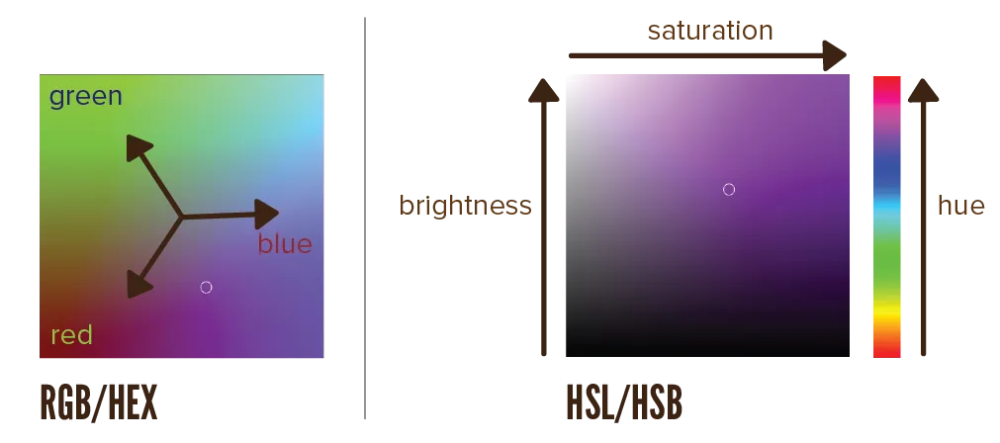

What actually *is* colour? I'm not trying to start a philosophical rambling here. But stop and think about it for a minute. Maybe it's because I'm a mathematician, but I think it's very important to start with the _definitions._ How could you ever understand color, if you never consider what it actually is?

If you are aware how people perceive and interpret colours, it is easier for you to identify the effect of colours, and to match them with each other.

## Light Waves

> Colours are light waves that we can see. 

Because there are light waves we _can't_ see, like UV-rays from the sun. The colour of a light wave is determined by its **wavelength**. Visible light is everything within a range of 400&ndash;700 nanometres. 

At the top of that range, light is red. At the bottom, light is violet. Above that 700, is the part that we call **infrared** (*under red*). If you go lower than 400, you'll find **ultraviolet** (*above violet*).

{}
The names infrared and ultraviolet come from the fact that a higher wavelength means a lower frequency. So frequency-wise, infrared is "below red" and ultraviolet "above violet".
{}

The colours at the ends of this spectrum are quite close to each other. That's why colours can be displayed in the famous **colour wheel**. That wheel is nothing more than the spectrum of visible light bend into a circle.

{}
It's interesting to think about. We could just as easily have lived in a world where colour, to us, did not have this property. The color at the end of the spectrum was 100% in contrast with the one at the start. This would've changed *everything* about colour theory.
{}

## The Eye

Our eyes interpret light waves and send them to our brain. That's how we see all the colours in the world. 

There are two different types of receptors in there:

-   **Rods**. About 125 million of them. They can't see colours, but make us able to see the difference between shades and tones of lights. They enable us to walk in dark places, and adjust our eyes to bright sunlight. They recognize light and motion.
-   **Cones**. Only 7 million of them. They are divided into three groups, namely **red, green** and **blue**. They evolved much later. One or two of these malfunction in colorblind people.

{}
Fun fact: we don't really see that many colours. For example, the mantis shrimp has 16 colour receptors, so you could say that animal sees the world in 16 dimensional colour. Something we can't even comprehend. It's like saying a creature lives in 5D.
{}

*But, I see more colours than just red, green and blue!* Yes, these cones work together to *blend* the three different main colours. Combining that with our enormous amount of rods makes us able to see roughly **10 million colours**. 

Due to differences in our eyes and brains, everybody perceives color a little differently.

How do you "control" 10 million colours? How do you work with that? Especially if everyone sees them slightly differently?

To create order in this chaos, numerous formats and definitions were invented for working with colour.

## Formats

Each format is preferred in a different industry or project type. Most software, however, has support for all of these.
They _can_ and _are_ therefore used interchangeably.

{}
When styling websites, you can input color using all these methods. Sometimes I have the exact HEX values, sometimes I want to create tints of a base colour by modifing the _saturation_, sometimes I want transparency. This website uses all these formats at different places.
{}

I recommend learning all of them and picking your own favourite for your purpose.

### RGB
Represents a colour by setting a value for the *red, green* and *blue* channels respectively. These values can range from 0 to 255.

Examples: 

* Red is `rgb(255,0,0)`
* Pink is `rgb(255,0,255)`
* Grey is `rgb(127,127,127)`

_Why 255?_ Computers work with bits that have two options: 0 and 1. 0-255 is a range of _256_ numbers, which is exactly 2 to the power of 8. This value simply turned out to be easy on computers, yet allow any colour you'd want to make. 

Sometimes, though, software simply uses a value between 0.0 and 1.0. To convert from the first to the latter syntax, you'd divide all components by 255.

### HEX
Also sets values for *red, green* and *blue*. But, it uses hexagonal notation, which means a 16-base number system. 

This simply means: the letters **A&ndash;F** are used for the numbers 10&ndash;16. This way, **FF** is 255.

Examples: 

* Red is `#FF0000`
* Pink is `#FF00FF`
* Grey is `#787878`

A variation on this is the "integer" syntax. Instead of using a crosshatch (`#`), use `0x` in front. This is just a _number_ and some languages like this more than the other syntaxes.

### HSL/HSB 
This alternative is more intuitive. It's popular among graphic designers, as it's easier to create different tones or variations on one color.

Why? It sets the three components *hue*, *saturation* and *lightness/brightness*. Hue follows the colour wheel, so it goes from 0 to 360. (Because 360 degrees is a full circle!) The others are percentages. Again, these can be 0-100, or 0.0 to 1.0.

I will go into greater detail about what all that means later in the course.

Examples: 

* Red is `hsl(0,100%,50%)`
* Pink is `hsl(300,100%,50%)`
* Grey is `hsl(0, 0%, 50%)`

### ALPHA
Any of these notiations can also have an **alpha** component at the end: RGBA, HEXA, HSLA

This doesn't change the colour itself, but the _opacity_ at which it is displayed. By default, colours use an opacity of 1.0. It is "full opacity". It means the colour is solid, pure, and overrides what's behind it.

If you lower this value (to anywhere between 0.0 and 1.0), the colour becomes more transparent. The background shines through. It becomes a blend of its own colour and what it's on.

I tended to _overuse_ this method when I was younger. Instead, prefer picking all colors yourself, by hand, to be solid. Here's why:

* Using transparency everywhere is way more intensive to calculate for computers.
* If you handpicked colors, you _know_ what they will look like. You have consistency and certainty.
* Blending of colours automatically makes the end result more "muddled". So unless you very tightly control the colours and transparency, the result will look like a gray mess.

All of this doesn't mean that you should throw **colour names** overboard. It is still useful to know at least the basic colour names (red, blue, pink, purple, orange, brown, etc.) and some of the advanced ones (maroon, olive, lime, navy, aqua, fuchsia, etc.).

*Why?* Say you're working on a project for a client. They won't say "give that colour some more saturation". They'll say 

* "I want that link to be more orangy"
* "A beige-like background would be great" 
* Er the even more vague "could you make it look more nature-like and sunny?" 

It's useful to know immediately what they mean. And to also communicate this back to the client in a way _they_ understand, like "This update, I made the links more orange and the background more aqua".

## The LAB Model

There's one remaining format: the LAB model. It isn't as intuitive or useful as the others, but it aims to solve one big problem.

This problem is the simple fact that colours have an inherent brightness. Red and yellow appear brighter than green or blue, even when you set it to the same _brightness_ within the HSL model. Red is simply a more agressive and attention-grabbing color to us---while green is calming, probably because of its relation with nature.

Therefore, when you're trying to pick colours with the same level of lightness, you might accidentally get colours with many different levels of lightness.

The LAB model solves this deficiency by keeping the perceived lightness of a colour constant. This allows you to easily pick colours with identical brightness and use colours across different media types. 

The first parameter stands for **lightness**, which you can set to a value between 0% (black) and 100% (white). 

The other two parameters, simply called **a** and **b**, represent all colours. The first is a slider ranging from green (*-a*) to magenta (*+a*), while the second is a slider ranging from blue (*-b*) to yellow (*+b*).

This model is often present in professional design software applications, such as Photoshop. More about that will be discussed later.