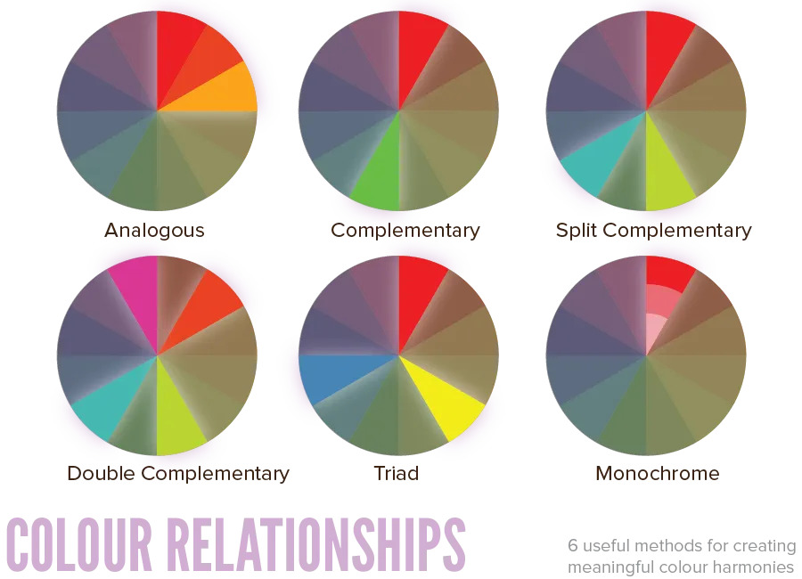

Finally, finally, you have all these principles under your belt that make harmonizing possible. In this chapter, we'll combine colors to get colour schemes.

The knowledge obtained from previous chapters should make these guidelines easy to follow and apply. That's why I started with that: this chapter can give you all the principles at once, without the need to interrupt itself to explain details.

I use a simplified colour wheel to represent certain ideas. They work for every colour in every circumstance, of course, and you should use a full color wheel (with all colors) in your project.

If this seems hard, don't worry. There are many online tools (and available color palettes) you can use instead. But I want to explain the theory behind it. Because copying a scheme found online, most likely means you spent a lot of time _searching_ to get a palette that _doesn't fit your project very well_. Time you could've spent _designing a palette that works 100% for your project_.

## Harmonizing Basics

Colour schemes have some unwritten rules. Which I am actually going to write down now, in this chapter 😉

**Rule 1:** Pick a maximum of three hues. More hues can easily make a design cluttered or too overwhelming. Even if the colours are picked out very carefully. As always: less is more.

**Rule 2:** Use a main colour scheme of *5 colours*. This means that at least two of the colours should be shades/tints/tones of one of the three main hues. You can try adding more colours, but usually five is enough. You'll have a background colour, text colour, headline/logo colour, and two colours for accents and highlights.

**Rule 3:** When working with maps or infographics---or, generally, any kind of data with a lowest point and highest point--it's best to use a *sequential palette*. Pick opposite colours for both ends. Now blend those colurs to get all values in the middle.

**Rule 4:** Keep enough contrast between shades and tints. They are created by keeping the hue the same, and changing the percentage of saturation or brightness. 

If you create a different shade or tint of your hue, make it at least 10% different from it. (Otherwise, it looks like you added a slightly different colour b accident, which is never good.) 

But don't move in steps greater than 60%, as you'll lose the connection with the original color.

**Rule 5:** Know your colour's meanings. Don't just pick a random colour to start from, but choose one or two base colours that represent what your design wants to say. You'll learn about this in the chapter on colour emotions.

**Rule 6:** Rules are guidelines. Start by using the rules, but fine-tune your scheme to solve any problems or add something extra. Using the rules you might get a colour scheme of five colours that matches perfectly. But if three of those look dull, or not like you wanted, just try something else.

## Colour Relationships

There are six typical ways in which colours are matched. All of these ...

* Start from a certain base colour, which you are free to choose.
* And base the rest of the whole colour scheme on that.

Don't start with one colour, add one that matches, then continue this technique on the _new_ colour. This might sometimes work, but it's certainly no guarantee. Keep to the base color.

In general,

* Analogous schemes are quiet, peaceful and harmonious. 
* Complementary schemes are exciting and playful. 
* Anything in between tries to balance these aspects.

### Analogous

Three colours right next to each other on the colour wheel. They are perceived as unified, but more varied than monochromatic schemes.

### Complementary

Two colours opposite of each other. When mixed together, they desaturate or neutralize each other. When positioned right next to each other, however, they increase intensity.

### Split Complementary

If the contrast from the complementary method is too intense, you can instead choose the colours directly left and right of that opposite colour.

### Double Complementary

If you want more variation, apply a double split complementary. You'll get four hues out of it that go well together, but it's still recommended to use only two or three of them as main colours and the others for highlights.

### Triad

The middle ground of all the previous methods. It has variation, three hues, and some contrast but not too much. It's perceived as strong, dynamic, and vibrant.

### Monochromatic

Different shades, tones and tints of one hue. Apply some of these, but don't make your whole colour scheme only one colour. Such schemes are percevied as unified and homogenous.

### Achromatic

There's also the *achromatic method*. This simply means that you only use white, black and greys for your design. With everything now being able to display or print colour, using it has fallen out of fashion. However, it can still be the perfect scheme for specific uses, like going for a vintage feel, a black-and-white photography portfolio, etcetera.

## Creating colour schemes

Knowing these relationships helps a great deal, but there's one last step to make. These guidelines only help you find your *hues*. This means you still need to set a *saturation* and *brightness* for each one.

**Rule 7:** Don't use contrasting/opposite colours with the same saturation or brightness.

**Rule 8:** With close colours on the wheel ( = 1&ndash;2 steps difference), try to keep one property the same, and change the other by a significant amount. (With properties, I mean *saturation* and *brightness*.) Changing both will often defeat the beauty of the original match, as you modify too much.

**Rule 9:** Often times, a transitional colour is added between two colours that are far apart on the colour wheel. Not only makes this the transition between the two less harsh, it automatically gives you an extra hue to play with.

**Rule 10:** Always play around with shades, tones and tints. Making that subtle change to a colour, adding that second lighter or darker version of the same hue, can make all the difference in the world.

However, as I said earlier, all these rules are great, but you can still make your own **custom schemes** which abandon all these theories. It takes more effort and trial-and-error. The pay-off is that you can get exactly what you want and a scheme that has maybe never been used before.

## What to do with Neutrals

Grayscale neutrals can be added to everything. They aren't part of your five colours unless your project really hinges on maintaing a neutral look.

You can always add black, white or greys to your design. They take over warmth or coolness from surrounding colours.

Warm neutrals offer some more colour, which means you should more cautious. Don't add more than two warm neutrals, and don't add total black or total white if you already have warm neutrals.

## Creating Mood with Palettes

These colour schemes---or palettes---are usually created based on mood or emotion. If you look online, you can find a "sunset palette" or a "birds singing palette" or "early morning coffee palette". They aren't called "I started with a red and used a double complementary to get this".

Try to view your schemes in the same light. Find colours, shades and tints that all convey the same _mood_. Preferably, you should be able to look at your palette and give it such a descriptive name that says how you feel about it.

These are some general ideas about palettes:

* Bright and highly saturated colours only work together if they _contrast_ each other. In that case, the design feels active, dynamic and energetic. 
* Highly **de**saturated tints are called a _muted palette_. They have a quite and calming feeling. Throw in a single satured color, and it becomes the clear highlight/accent for your piece.
* Designs that provide a sense of mystery or exclusivity, tend to have a dark overall feeling: low value. But don't make _all_ colors dark! Because remember, they only seem dark if contrasted with something else. So keep one or two brighter colors: high in value, but desatured to keep the mystery vibe.
* Natural colour palettes have an earthy feeling. They often include soft, muted colours, low in saturation. The primary components are: greens, browns, orange, yellow-ish colours.

## Online tools

Adobe has made a fine website which allows you to create colour schemes easily. You can draw inspiration from designs other people made or upload a photo to get its colour scheme: [Adobe Kuler](https://color.adobe.com/nl/)

Another website I've often recommended (and used) in the past is [Coolors.co](https://coolors.co)

Most graphical software has buttons near their color picker (or general color options) that immediately "pick a new color". They will apply these rules for you and give something back that's most likely useful.

If you're planning on overlaying two colors, especially if one of them is for _text_, make sure the contrast is good. Use an [online contrast checker](https://webaim.org/resources/contrastchecker/).