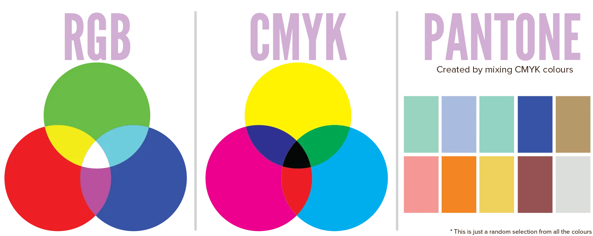

The three words from the title represent the three main colour systems in the world. Any software you work in, any ink you bought or dye you used when painting, uses one of these systems. There's no good or bad here. Each of them has its own advantages and disadvantages.

So let's see what they are and when it's best to use them.

## RGB

As seen earlier, the letters represent **red, green** and **blue**. These are, strictly speaking, the only colours our eyes can see. It's only logical that people based a system on this. This colour system is used for websites and many media formats intended for that purpose. 

{}
Such as `.png`, which means Portable Network Graphics. There is _no_ way to embed information from another colour system inside a png image. 

I once tried creating a simple website for converting PDFs and Layout Documents to grayscale, CMYK, etcetera. Until I realized many of my goals were just _impossible_. Because most of the online world only supports the RGB model.
{}

Colours are easy to create using this system. Red, green and blue are well-known colors. Mixing those gets you yellow, turqoise and pink/purple. All quite intuitive for most people.

This system is **additive**. Combining all colors (red, green and blue on top of each other) creates **pure white**. 

It is therefore a system based on light. Multiple colours on top of each other create lighter and lighter versions. You can only get _brighter_ by adding more colour!

This makes it ideal for computer **screens**. They start as _black_. Each pixel in your screen has three lights: red, green and blue. When multiple are on simultaneously, they create the illusion of a mixed color. And when all lights inside a pixel are on? Yes, that pixel is completely white.

## CMYK

The letters stand for **cyan, magenta, yellow** and **black**. Most software allows switching between RGB and CMYK. 

CMYK is slightly harder to use (for you and your computer), but it's what _physical_ media (such as printers) understand better. And it adds some other possibilities.

The system is **subtractive**. Combining all colors (cyan, magenta and yellow on top of each other) creates a solid **black**.

It is therefore a system based on ink. You start with a blank, white, light paper. And adding colours makes it darker and darker. You can only go _darker_ with this system!

This makes it ideal for any **printed media**. They start with a white paper and put their content on top of that.

Here's an example of the issues this system adds. There are two ways to create black (or shades of grey):

* Combining all the colors: cyan + magenta + yellow
* Using only the black value.

But these two will lead to a _different_ black! The first one is much _darker_. Because, remember, we can only get darker. So mixing all colours will be really dark. This is a **deep black**.

The other is called **pure black** and looks more like dark grey when printed.

I have self-published several books now. Greyscale pages are much cheaper than colour pages, obviously. So I used CMYK to control my black tones. Because when I used RGB, it would convert the black into a _deep_ black, and add all those colors to it. Which made my book suddenly twice as expensive!

*What does it matter which system you pick? Can't both create all colours?* Yes, they can. CMYK can still create the same set colours as RGB. But you only need to print a RGB document once, and see that the output looks _nothing_ like it did on your screen, to know the value of CMYK.

CMYK is simply a model of the way physical ink creates colour. RGB is how digital colours are created. Use the right tool and you will get consistent and intuitive end results.

## Pantone

The Pantone system is actually a system for naming colours for international and interdisciplinary use. They have indexed colours and given them names in the form of **PMS** . 

They didn't index all those 10 million colours, obviously, but rather a subset of 400 colours that look good within any design and across different media types.

The colours are therefore less *pure*, but more *soft*, or a blend of different colours. You won't find a pure 100% red here, because it doesn't look great on its own, and surely not with other colours.

And that's the reason they are loved by lots of designers. Because they allow you to create a very colourful composition without any colours clashing or the whole project becoming way too cluttered.

While you can do the same without the system, it is recommended you take a look at it. You'll be able to find beautiful colours you can match and use for your design.

## Are Black and White Colours?

Knowing about these systems, we can try to answer this question.

In RGB, white is created by adding red, green and blue together. So it's made out of colour, which means *yes* it is a colour. In print, white is created by not putting any colour on a white page, so *no* it is the absence of colour.

In CMYK, black is created by adding cyan, magenta and yellow together. So it's made out of colour, which means *yes* it is a colour. In the real world, objects are black because they absorb all light and don't send out any light waves, so *no* black is the absence of colour.

Most importantly, it doesn't matter. Pure black or pure white is _rare_. Shades of grey are, on the other hand, absolutely everywhere. They are an equally important part of your colour scheme. Once we look at colour more in-depth, you'll see just how much shades of grey influence everything.

## Colour Usage in Different Media

As explained, the reason for these different systems is the existence of different media: paper, canvas, computer screens, and more.

{}
Screens optically mix flecks of different light together when viewed from a distance. If you get _really close_ to your screen, you might be able to see the individual lights. They stop blending together. 

On the other hand, ink is transparent and mixing occurs as colours show *through* each other. If you get really close to a piece of paper, it's not like the ink suddenly separates into different pure colours.
{}

The way they create and display a colour is different, which can lead to inconsistencies across platforms. But you can soften the issue by also changing your _setup_.

In the previous chapter I explained different formats used to define a colour. These are used to tell the computer which one you want, or to define/explain what colorscheme you choose for a project. 

I made it look as though they could all display the exact same colours, but that's not really true. 

All of them can display the same *number* of colours, but the *range* of colours (which specific ones they can actually create) is different. This range is what we call a **colour space** or spectrum. 

They exist for two reasons:

* A natural byproduct of how colors are defined. (Defining them through RGB or HSL simply leads to different colours that are possible.)
* Again, medium and intention. A huge, glossy billboard you want to display in the city ... will likely require a very different range of colours than a small muted book cover. Or, a cheap screen might only be able do display a small range of colours. They compensate by stretching this colour space.

{}
Of course, there are many more colour spaces than these, but the ones I mentioned are the most common ones.
{}

We can use something called **metamerism** to solve all these problems. It's another fun property of light: the _appearance_ of colour changes based on its surroundings. So even though two colours might be the same, colours around it might make them seem different.

What we need, is a way to transform one colour space into another, using this property.

Introduce the **gamut**. These give us a way to translate between colour systems. 

On the computer, they are described within **ICC profiles**. Any graphical software should allow you to use them. Such a profile holds the range of colours within a colour space, its darkest and lightest tones, and how those colours are distributed (the distance between pairs of subsequent colours). 

I won't go into detail about how to use them, as it depends heavily on your software and project. I merely wanted to tell you they exist and why. If something doesn't look right when you print it, maybe you set the wrong ICC profile. If you feel like you can't get enough contrast in your colors, maybe your colour space is too limiting.

Most of the time, however, it's recommended to do your work in as large a space as possible. The step to transform the color space is only taken when outputting and testing the final design.