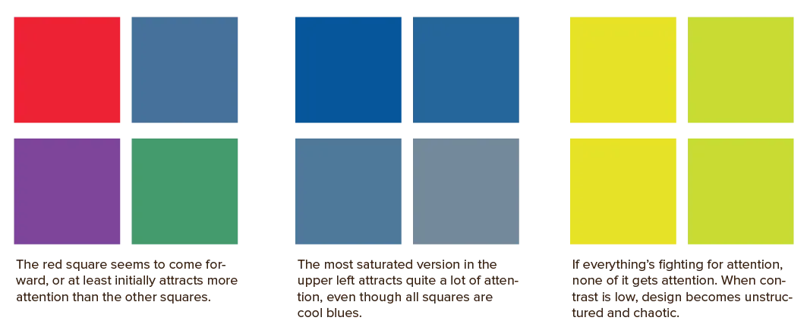
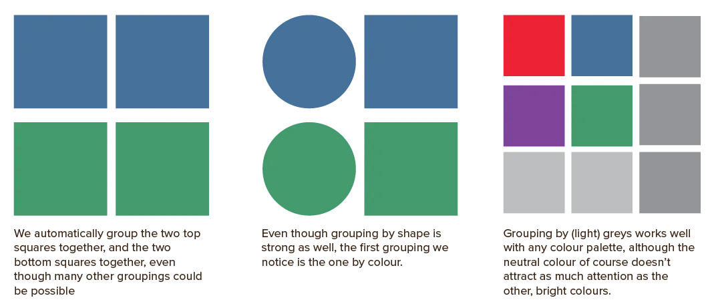

This course has mentioned nearly everything that has to do with pure colour theory. As I said at the start: it's meant as a supplementary course. Something that can help understand all the [other Visual design courses](/tutorials/visual).

Still, I wanted to add _some_ practical bit at the end. A bridge between all the theory you just learned and actually applying it to designs, whatever they may be.

## Colour Functionality
Colour can serve many functions. Do note, however, that colour shouldn’t be your only graphical differentiation between elements. A large part of the population is colorblind. They would not be able to use your design if you relied solely on colour to establish your hierarchy. 

Additionally, sometimes it's just easy to miss a (slight) change in color. Always use _multiple_ cues to signal what something represents in your design.

### Attracting Attention
First and foremost, colour can make design elements stand out or disappear. It can highlight elements or intentionally hide them. 

We’ve already seen how to do this: warm and saturated colours attract attention, while cool and muted palettes redirect attention elsewhere. And context and contrast play an important role there. 

Using colours with contrasting values tends to bring shapes into sharp focus. Combining colours that are close in value softens the distinction between elements.

In other words, use warm colours for foreground elements, and cooler colours for background elements. Create contrast between them.

### Grouping
Secondly, colour groups elements. Elements with the same colour are perceived as related, while elements with drastically different colours are perceived as distinct. Light grey is always a safe colour to use for grouping elements without competing with other colours.

One of the strongest methods of grouping is associating like shapes with like shapes. If a bunch of squares stands close to each other, we assume they form a single group. Similarly, we immediately associate shapes by colour. But _shape_ is stronger than _colour_.

### Convey a Mood or Message
Thirdly, colour conveys a mood, attitude or message. It creates an emotional, psychological and even physical response to a lifeless design. It sets the mood and reinforces the message. 

For example, light colours produce happy and pleasant responses, whereas darker colours produce quieter effects. 

A natural colour palette conveys a message of being one with nature and caring for the environment. A minimalistic grayscale palette conveys a message of simplicity and sleekness.

### Describe Reality or other Information
Colour is also used to precisely mimic how something looks in the real world. Or, if that is impossible, we do the opposite: codify artificial types of information. 

_What's that?_ Most designs have structure or information that does _not_ have any relationship to some clear physical object in the real world. For example, if you design a website with categories, you might assign a color to each category. After some usage, viewers associate the colours and categories. You've _coded_ specific information into a colour.

### Enhance Aesthetics
And last but not least, colours can be used just because they are beautiful. They create variety, give a feeling of depth, and just generally make a design more interesting and dynamic. It creates visual interest, even when the palette is subtle.

## Backgrounds
This colour choice arguably has the most impact on your design. Don't leave it until the last moment!

{}
I made this mistake when I just started out. I'd keep the default white/grey background most software uses until I was done with all my _interesting foreground elements_. Then I slapped a background on ... and oh no, the whole thing looked bad and it changed the whole mood of the design.
{}

The background is *the biggest element* which is _always around_. It takes up a lot of space, always. Setting a good background color, therefore, will change the whole feeling of the design.

At the same time, it has to stay in the background and go by unnoticed.

White is the dominant colour, especially for global or e-commerce websites, because people are used to reading from white pages. Slightly off-white or cream colours are also popular. They give a sense of nature or antiqueness and can be more comfortably read in low-light situations.

Dark backgrounds aren’t popular in print. On screens, "dark mode" has become quite common. Early research shows it leads to less strain on the eyes, but can also be harder to focus on.

Besides that, it's mostly used for stylistic purposes or designs about things that take place in the night.

Extremely bright backgrounds certainly make an impact, but more often than not a bad one. Therefore, reserve bright backgrounds to short parts---like a magazine cover or a splash page.