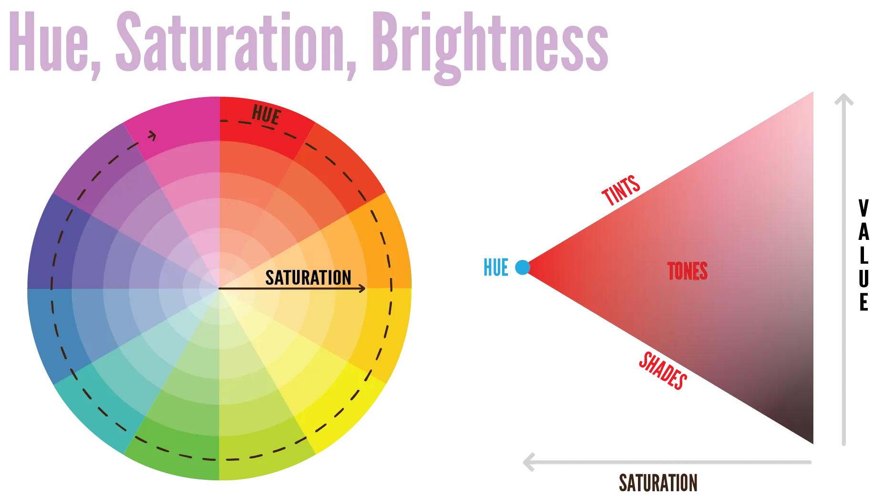

Individual colours are said to be three-dimensional. When you take a colour, like red, you can modify it in three different directions---to get bright red, dark red, soft red, red-pink, etcetera. Therefore, the best way to display this spectrum of a single colour is to use a triangle.

## Hue

> **Hue** = pure colour.

Remember that spectrum of visible light we talked about? Well, the hue scale follows exactly that.

At 0° you get the light with the lowest wavelength, which is **red**. At 360° you get the light with the highest wavelength, which is **violet**. 

A value between those 0&ndash;360 degrees will get you one of the intermediate colours.

This property is the most absolute of the three properties. No matter the saturation or brightness, a red hue stays a red colour. Neutral colours, such as grey, are achieved when the hue is not clearly visible, due to the settings for the _other_ two properties.

## Chroma / Saturation

> **Chroma** = how strong the influence of the pure colour ( = hue) is, compared to grey

What does this mean?

* A colour with high saturation has no added greys. It's the hue color and nothing else
* No saturation means all the hue is gone and it has become grey.
* Medium saturation, therefore, means the colour is a blend between its pure color and grey.

A value for this is usually set in percentages: 0% to 100%, or 0.0 to 1.0.

Usually, it's wise to stay around medium-high levels of saturation: 25%&ndash;75%. Full saturation is too bright, while no saturation just means the color is gone.

As mentioned before, the point of greatest saturation is not the same for each colour. Each has their own inherent level of lightness. This means the effects of low or high saturation aren't equally visible with every hue.

* Desaturated colours are restrained and sombre, while saturated colours are vibrant, intense, exciting and dynamic.
* Desaturated and light colours are seen as friendly, while desaturated and dark colours are seen as formal.  
* Saturated colours attract viewer's attention, but you should use desaturated colours when function and efficiency of the design are the priority. (The design should _be appealing to work with_ instead of _look appealing_.)

Don't combine many highly saturated colours, as they clash with one another more easily.

## Value / Lightness / Brightness

> **Value** = how bright the colour is

Brightness is usually set in percentages: 0% to 100%, or 0.0 to 1.0. 

* A brightness of 0% simply means it's black. Any color, without light, will just be black.
* A brightness of 100% simply means it's white. The same way the sun isn't actually white, but its waves are so bright that it overwhelms any colour.

Some colours naturally look brighter (*yellow*), while others naturally look darker (*purple*). Turning purple to full brightness, will still look darker than a yellow at low brightness.

Some properties

* Combine a low value and high value color for contrast
* Background is always low _saturation_, but value is either very high (like a white page) or very low (like an app / website in dark mode)
* High value colors are easy to combine if their saturation/hue is well-picked. Don't be afraid to do so. They create more vibrant and aesthetically pleasing designs.
* Different degrees of value provides a sense of motion and hierarchy in a design. It guides the viewer's eye into, through, and around a visual composition.
* Lastly, value can create the illusion of depth and space. Distant objects appear lighter in the real world: so brighten a color and it feels like it's further away, in the sky or at the horizon.

{}
This is a general psychology thing to remember. Human senses are finetuned to what is abnormal and extreme in our surroundings. So anything that is _bright and colorful_ automatically looks better to us. Sounds or music that is _loud_ also sounds better. 
{}

_What's the difference with saturation?_ This is a tough one to put into words. You just have to see for yourself. I think "contrast" is the best word here. If you place the same colour twice (next to each other), one full desaturated and one fully saturated, they won't contrast much. One version just looks active and the other dull. But do the same with _value_, and you'll get maximum contrast.

## Using this Knowledge

How can we use this knowledge? Three ways:

* It helps when creating different versions of the same (general base) colour
* It helps when creating colour schemes, combining multiple colours
* It helps understand what happens when you put colours in a certain context

All these subjects are discussed in the last remaining chapters. But, again, I like to start with the basic definitions as early as possible. Let's do that here.

These are about varying a **hue**. Either to get the exact colour you want or to create lighter and darker versions of your main colours.

Why? Because people think mostly in terms of hue. We usually think "hey, I want a BLUE here, let's play with the other two properties to find a colour that matches". Instead of "hey, I want a LOW VALUE colour here, let's play with the hue until I find something"

### Shades

Shades are darker versions of your hue. You get them by adding **black**: the more black you add, the darker the shade. (As you know now: this means **lowering value**.)

Shades are, as the name suggests, perfect for creating shadow effects. You can also use them as background colour, while the text is coloured in the pure hue. Shades seem to recede into the distance. Their general use, however, is to simulate black in a colourful manner, serving as a neutral.

### Tones

Tones are slightly different versions of your hue, making the colour look **more dull** or **softer**. They are created by adding **grey**: the more grey you add, the more the colour will fade and turn into actual grey. (As you know now: this means **lowering saturation**.)

Tones usually create a vintage, sophisticated or elegant feel. They are easy to use in designs because they are as neutral as a clear colour can get.

### Tints

Tints are lighter versions of your hue. You get them by adding **white**: the more white you add, the lighter the shade. (As you know now: this means **increasing value**.)

They are used to create highlights. Often called an "accent color".

They can also simulate white in a bit more colourful way and serve as a warm neutral. As opposed to shades, tints seem to pop out of the design, though in a weaker way than how warm/cool colours provide this sensation of depth.