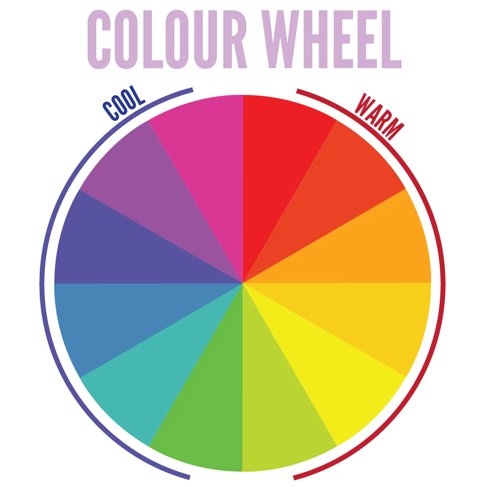
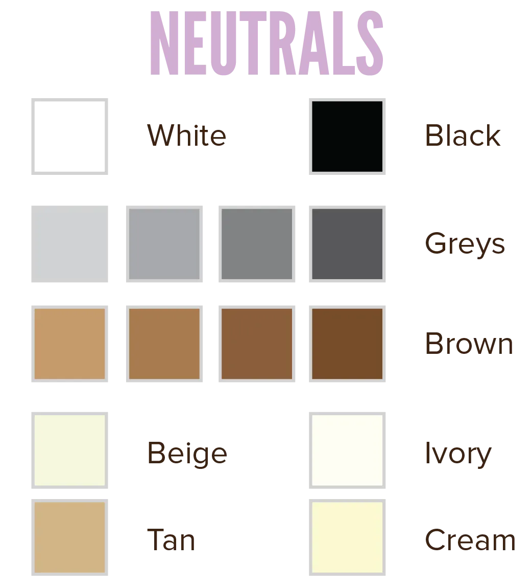

I present to you: the most overused graphic for teaching colour theory! Understanding the basic concepts is great. But realize that  almost none of the designs you see in real-life adhere to the colour wheel "rules" perfectly. 

It's a tool, not a definition. It neatly shows you different _principles_ and _guidelines_ you can use to match colours. But it's not required to use the wheel or the principles, like a law of nature.

## Primary, Secondary and Tertiary colours

The colour wheel has three *levels*.

-   **Primary:** Red, yellow, blue.
-   **Secondary:** Orange, green, purple. Created by combining primary colours.
-   **Tertiary:** Intermediate colours, created by combining primary with secondary colours.

No, this doesn't mean that one colour is somehow "better" or "more important" than the other. All spokes of the colour wheel are their own equally important colour category. They are called this way because of how the colours are created (by combining colors from the level above).

## Warm & Cool Colours

The colour wheel can be divided into two equal halves, each containing 6 consecutive colours. These halves then represent the **warm** and **cool** colours. This is a rough distinction to get a sense of mood and message.

-   **Warm:** The colours from red to light green. Red and yellow are usually seen as bringing the most energy. Warm colours pop at you, giving the appearance of being closer. They feel hot and communicate a feeling of warmth.
-   **Cool:** The rest of the colours, from dark green to purple-pink. Blue is usually seen as the most calm one. Cool colours recede, giving the appearance of being farther away. They remind us of nature and water, and communicate a feeling of calmness.

But these, again, aren't 100% true all the time. Context is very important here. Also remember metamerism: if you place a bright red next to a bright yellow, both will lose their warmth. If you place a bright red next to a dull green, it will seem even _more_ bright and warm. 

Next chapters will be about that.

{}
There is some debate as to whether green and purple/pink belong to warm or cool colours. The distinction I used above is the one I was taught, but I often use a pink or light-purple colour as a bright, warm colour. The bottom line? Don't follow these rules blindly, see for yourself.
{}

## Neutral Colours

Besides these colours with temperature, there's a group that isn't clearly warm nor cool. They can be added to any colour combination and will usually look good and provide enough contrast. 

They often serve as backdrop, or body text colour, and shouldn't draw attention to themselves. They are the **neutrals**, which are further split into two categories:

-   **Greyscale:** Black, white and all the greys are neutral colours. Depending on how bright your colour is, you can add one or multiple of these to it. A dark blue can have white and light greys on it, while a light blue is better off with black or dark greys.
    -   The colours *tan* and *ivory* are also often included here. They are a blend of grey with beige/brown, and look soft and dull. However, that makes them ideal for a subtle background colour.
-   **Warm neutrals:** These include all sorts of brown (even including some orange tints) and beige. They are called warm neutrals because they give off a warm, safe, cosy, natural feeling. Brown is basically a mix of all the colours, so it fits with everything while still having its own unique identity.
    -   I personally use warm neutrals a lot. Because they add a sense of nature and fullness to a design, while at the same time not interfering with the main colour scheme.

When you mix greys with a tiny bit of a cool color, you get something you _might_ call a "cool neutral" (to oppose the "warm neutrals"). But, obviously, as soon as a color is clearly warm or cool, it's not neutral anymore.

## How to Use the Colour Wheel

The colour wheel is ideal for creating _harmonies_ and showing _relations_ between colors. You'll see, when we get to that chapter.

It isn't all that useful, however, when explaining some of the core definitions for single colours. For that, we will use colour triangles in the next chapter!