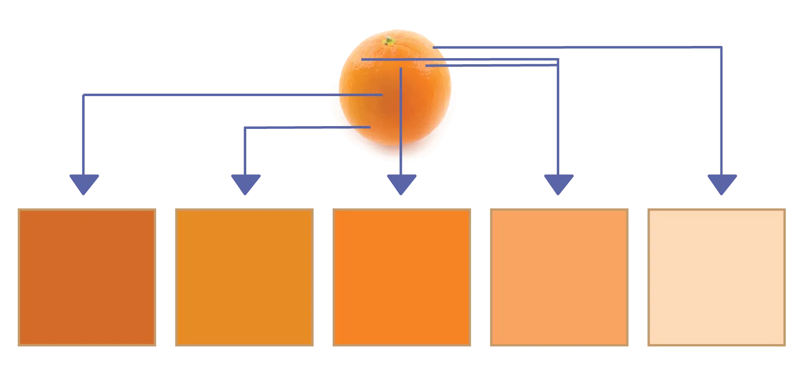
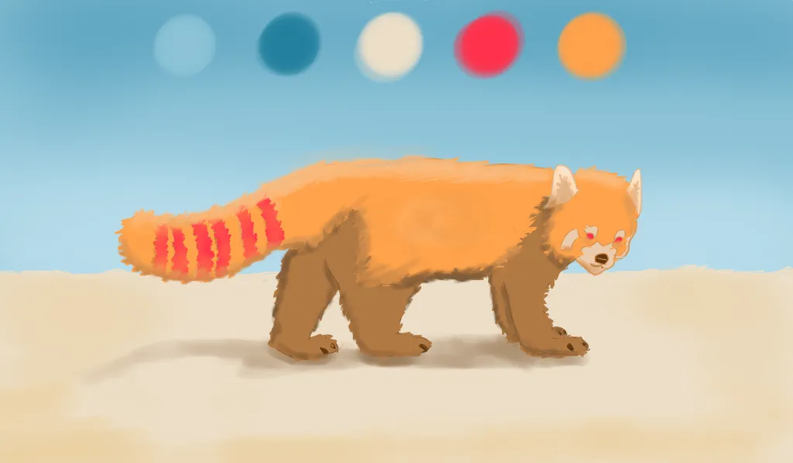

Most drawings these days are in colour. This doesn't really change much of your workflow or the principles behind the drawing, but it does require learning some colour theory, and how it interacts with shading your drawing.

I strongly suggest reading the [Colour Theory](/tutorials/visual/colour-theory) course. If you already have some knowledge of colour, read on! I won't use a lot of that colour theory here, but I do use basic concepts with which it helps to be familiar.

## Colour Shading

Usually a **colour palette** is established before any colouring starts. A set of 5 colours is usually recommended. 

In the center of the palette is the **base colour**. This is the average or expected colour of the object. For example, an orange has base colour orange, while a flower has base colour green. Yes, there are other colours there, but the base colour is the most common one.

To the left of this base colour are two **shading tones**. The lighter one is for soft edges or reflected shadows, while the darkest colour is used for full and cast shadow. Shading tones are acquired by lowering the *brightness* and *saturation* of the base colour.

To the right of this base colour are two **highlighting tones**. The lightest should be reserved for the actual spot where light hits an object, while the other should be used around it to smoothen the transition to base colour. Highlighting tones are acquired by raising the *brightness* and lowering the *saturation*.

Sometimes the hue of shadow tones is shifted to cooler colours (such as blue or purple), and the hue of highlighting tones to warmer colours (such as red or orange).

## Shading colors

As you see, shadows are rarely solid black or grey. The colour of the shadow depends on only one thing: the original colour at the point it hits. This original colour will darken.

Remember, lights can only add _light_. If a yellow light creates shadows, that doesn't suddenly make all the shadows _yellow_. Why would it? Shadow is the point where light _doesn't_ reach, so it's the one thing the light _will certainly not_ color.

{}
A cast shadow from a green object onto a brown floor, is a dark brown colour. Not dark green. The shadow is a result of light not reaching some spots of the floor, not the object's colour somehow interacting with it.
{}

Shadows are a darker version of the original color at that point. However, this original color _can_ obviously change. L

{}
Let's say a _different_ red light weakly shines on that brown floor from the other side. This means the floor will turn red-ish. Now, when a shadow happens, it will be a dark brown-red-ish colour instead.
{}

On the other hand, highlights _are_ a result of light. So if a yellow light hits the top of a green object, it _will_ mix the green and yellow. 



## How to mix colors

How do we mix colors A and B

Many people will go to their color wheel and simply rotate it to a color between A and B. This is _not correct_.

And it's easy to see why. Let's say you have a _bright blue_ object which receives a _bright orange_ light. With this technique, it would suddenly look _bright green_. Where did that come from? Is that natural? I don't think so.

Instead, view every shade using that color palette I described above. It can be more saturated ( = more pure color) or desatured ( = more towards grey).

When mixing, travel from colour A to colour B through this desaturation. As you mix in colour B more and more, colour A desaturated and only moves _slightly_ to colour B. Once you pass the 50% mark, B is more powerful then A, so you saturate again and are already almost completely colour B.

This way, two bright colours interacting, will result in a more saturated midtone. This looks natural and is easier to work with.

## Overall Use of Colour

Everything needs to be shaded. That means establishing such a colour palette for each object would seem ideal. Using many different colour schemes, however, turns your drawing into a mess.

Instead, establish a 5-colour palette for your *entire drawing*. These can be completely unrelated colours, as long as they look good together. Use those lighter and darker variations on each color for the highlights and shadows.

If you're drawing digitally, the computer can obviously immediately give you any color you want. I see no reason to _not_ use these great tools and color pickers. 

Only if you're looking for a more painterly / traditional style, do I recommend mixing colours on the computer as if they were real paint.

If you want a darker version, add black to the colour. If you want a lighter version, add white to the colour. If multiple objects in your scene are interacting, mix their colours to get the right highlights and reflected lights.

## Exercises

Give yourself a start and end colour. Now mix them to achieve a nice transition between them. Note that this can be done with any tools you like, such as colouring pencils, paint, or simulated using software on the computer.

{}
Exercise for practicing paint mixing.
{}