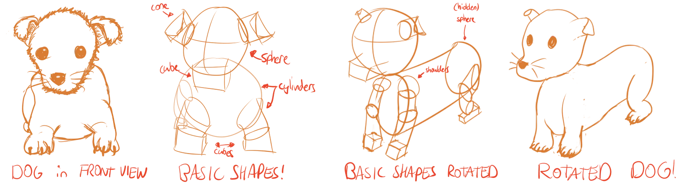
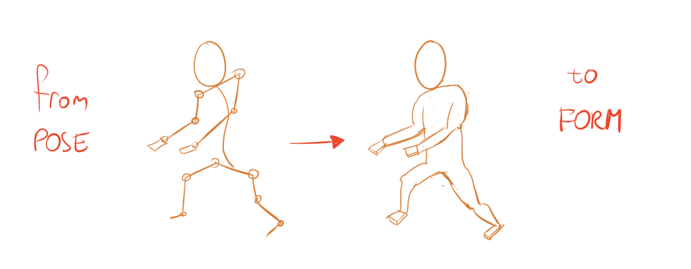
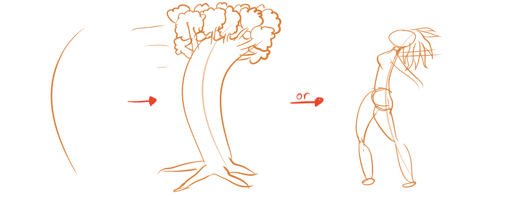
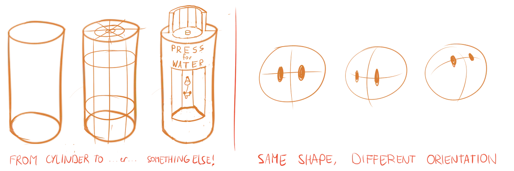
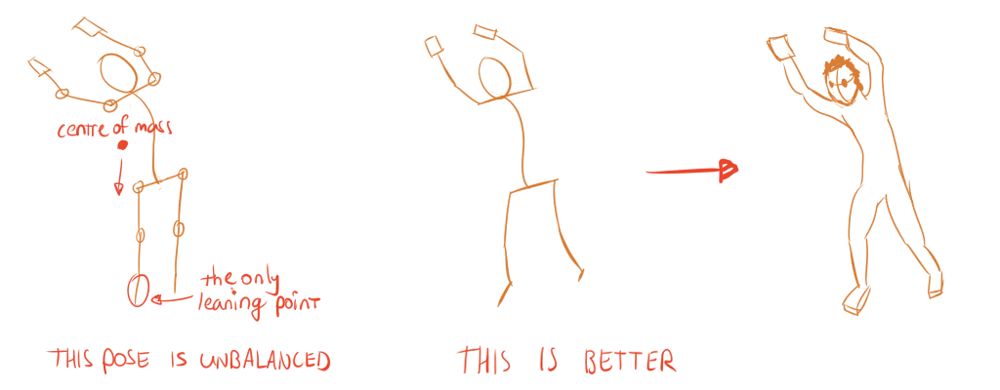

Now that you can draw the most important shapes, it's time to dig deeper into that **construction** method. I already told you that you *can* use basic shapes to construct *anything*. 

But how do you know which shapes to use and where to place them?

In general, look at your object and try to _recognize_ a common 3D shape. Such as a cube, sphere or cylinder. Those are taught in the upcoming chapters, and will rely on your skill foreshortening rectangles and circles.

Once you've build the object out of those shapes, the finishing touches are mostly connecting them and removing those helper lines.

When I refer to the actual three-dimensional construction of an object, I'll use the term **form** from now on.

When you see an object, you only see its outside, and not what is on the inside. This, however, is quite deceptive. How the object is constructed from the inside is what actually determines how it looks to our eyes. By learning to build your objects from the inside to the outside, you learn to understand its form, *and* you're able to draw it in any way you like.

> **Laws of Form #1:** Learn to recognize and draw the 3D basic shapes: cubes, circles, cylinders, pyramids and cones.

## Pose

An object with the same form can have multiple **poses**. A human can sit in many different poses, but it stays the same human with the exact same body. That human is able to do so because multiple parts of his body are connected at so-called *joints* (that can rotate freely, to some extent).

> **Laws of Form #2:** Find out where the joints are and how they connect two parts of the object

Joints have many types. For example,

* Hinge-like: such as the elbow that connects upper arm and lower arm
* Ball-like: such as our shoulder that can rotate in all directions
* Fixed: such as screwing a leg to a chair's sitting surface, it shouldn't move
* Slider: like a slider button on a mix panel, one object glides over the surface of the other

As you see, I use the word *pose* in a general sense. It doesn't only apply to humans or living things, but also to lifeless objects. For example, a building can be in different states as well (windows can be opened, curtains can be closed, a sign can hang from the front door).

By understanding where the joints are, you know where different basic shapes will connect. Additionally, you can draw the same thing in multiple states or "poses" by rotating/moving that joint and everything attached.

## Gesture & Rhythm

Most poses have a general action, direction or movement within them. This is called the *gesture* or *rhythm*. 

If you don't know where to start, try to create the basic gesture. This is often not more than one or a few loose lines pointing to a direction or overall shape.

{}
If you're drawing a human, a simple vertical curve already establishes that the human is standing up. If you're drawing a tree blowing in the wind, a simple curve that bends at the top establishes something to work from.
{} 

\> **Laws of Form #3:** Before anything else, loosely sketch the gesture of your object.

## Contour Lines

Basic shapes are quite static. A panda's upper body can be approximated with a cylinder---but it _isn't_ actually a cylinder! Once you laid out the basic shapes, it's time to modify them and add details to improve the realism of your drawing.

This is where the contour lines come in. Subdivide the basic shapes and place lines at regular intervals. This shows how the form flows. Most importantly, it allows you to _change_ the basic shape while keeping the perspective solid. (You can do it without contour lines, but then you're mostly guessing where the form of the basic shape is, in perspective.)

Don't worry, I'll go more in-depth in upcoming chapters.

\> **Laws of Form #4:** Modify basic shapes to increase realism. Use contour lines to aid this process.

## Balance

Last but not least, a quick tip. If an object is not falling over, it's *balanced*. Therefore, if you're drawing something that isn't moving/in action, you should make sure the balance is right. 

For example, say you're drawing two characters just standing on the sidewalk and talking. They are balanced, both feet firmly on the ground. It would look odd if one of them was leaning to one side, or if their foot seemed to hover off the ground, or their arms were extended as if they were trying to regain balance.

Gravity and balance are two of the main forces humans recognize and expect. So try to find out what your object leans on and where the center of mass is (approximately). Use this information to make the pose balanced. Or not, if you actually want something that is dynamic and full of action.

\> **Laws of Form #5:** If your object isn't falling over, make sure it's balanced. If your object actually *is* falling over, or you want a surrealistic effect, reduce balance on purpose.

