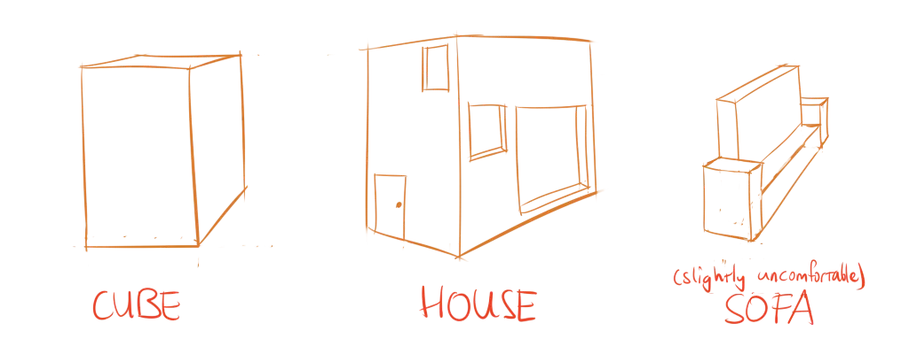

Things in our world tend to be very cube-like. Our buildings are approximately cubes, our vehicles are approximately cubes, our smartphones and computers are cubes, the list goes on and on. Fortunately, the cube is the easiest basic shape to draw in perspective!

## What's a Cube?

Technically, a cube is a three-dimensional square. But I will use it as a term for boxes of any size, just as I used *rectangle* for all shapes with four corners.

A cube is what happens when you add depth to a rectangle. You extend it in the z-direction by adding more foreshortened rectangles. We already saw this before in the "draw a house" exercise. 

Cubes can be found nearly everywhere. Even if something isn't a cube, you can _draw a cube around it_ to help you. They are often a good way to establish the overall form of objects before adding in the details.

## Cubes in Perspective

Because a cube is just a set of rectangles, we can use foreshortened rectangles to make it look nice in perspective. 

Because we can never see more than three sides of a cube---if you disagree, check for yourself---we only need (at most) three *vanishing points*. 

I already told you that parallel lines *converge* in perspective. They do so because they are supposed to *intersect* at those so-called vanishing points. They are nothing more than imaginary points somewhere in the distance where two parallel lines would eventually meet. You often don't even need to know their exact position, as an approximation is enough to create accurate cubes.

So, simply establish the vanishing points and draw lines from them. Ta da, you're done! For now, you can just pick any three points and see what happens.

As you can see in the image, if you choose your vanishing points too close to your object, you get a very distorted perspective. This often isn't realistic at all. 



The three vanishing points work best is they form a nice triangle. After you've chosen two vanishing points (which shouldn't be too close to each other), the third one should be at a roughly equal distance from both points.

{}
If you're wondering *why* parallel lines converge, think about looking down from a very high spot, such as a mountain. Below you can see the houses and maybe even people, but they are nothing more than dots to your eyes. Because they are so far away, their shapes converge towards a single point (from your point of view). More will be explained in the chapter on perspective.
{}

## Viewing Angles

You probably noticed that I said you needed *at most* three vanishing points. You can remove one vanishing point, which means that parallel lines in that direction simply stay parallel. In this case, you'll only see two sides of the cube. 

In fact, sometimes a cube even requires only a single vanishing point. To understand when or why this is the case, I need to talk about viewing angles.

There are three dimensions in which you can rotate, which I'll call *x*, *y* and *z*. You may also call them *width*, *height*, and *depth* if you like. 

Not only can we rotate other objects, we can also tilt our own head. By doing so we change the *viewing angle* at which we see the world.

There are three possible situations:

* When none of our viewing angles are aligned, we need three vanishing points.
* When one of our viewing angles aligns with one of the cube's angles, we have only two vanishing points.
* When all viewing angle align, there are no vanishing points. The cube has become a flat rectangle to our eyes. 

## Contour Lines

You already know how to divide rectangles. So contour lines on cubes is easypeasy!

Draw the contour lines for each individual rectangle shape, and you should be good.

_Why do you keep mentioning contour lines?_ Believe me, they are the best help you can get. When you start drawing, it feels like unnecessary extra work. But once you get into more complex objects, that are a godsend.

Just think about how often shapes in the real world are cubes ... with some changes. Maybe a cube with holes. A cube with certain parts extruded. If you want to accurately morph your cube into the actual shape you were looking for, you need the contour lines to show you *how* the surface wraps in perspective, and *where* you need to make your change.



## Drawing Through

This tip is applicable to all shapes, but commonly used with cubes. It helps drawing something _inside_ an object, or cutting a _hole_ into it.

The technique is called **drawing through**. 

Simply draw all your lines as if the object was transparent. Nothing more than a skeleton. Then erase the parts you're not supposed to see (because something is in front). Whatever is left, will automatically register to our eyes as being "open" or "inside"

## Exercises

These exercises will generally take a bit longer than the previous one. I still suggest you practice drawing your cubes very often. They are essential.

### Simple Cubes

Place four dots on the paper. Ensure two of them are on the same horizontal line, and the other two on the same vertical line. Connect them with lines to get a hugely distorted rectangle, which represents the top of the cube. Now draw the rest of the cube. Make sure the rest _fits_ with your random top!

{}
An exercise drawing random (simple) cubes.
{}

{}
This is kind of the reversed way of drawing a cube. First, you draw the division lines, and then you use them to create your foreshortened rectangles.
{}

### Advanced Cubes

Place one, two or three random vanishing points on the paper. Now draw the cube that results from them.

{}
Exercise for creating cubes from three vanishing points.
{}

### Connecting Cubes

Draw a random cube. Now divide all the sides. Connect a smaller cube to one of the subdivisions. 

This one takes some practice, but is extremely useful. Once you get better, start adding more and more cubes, and maybe even some variations.

