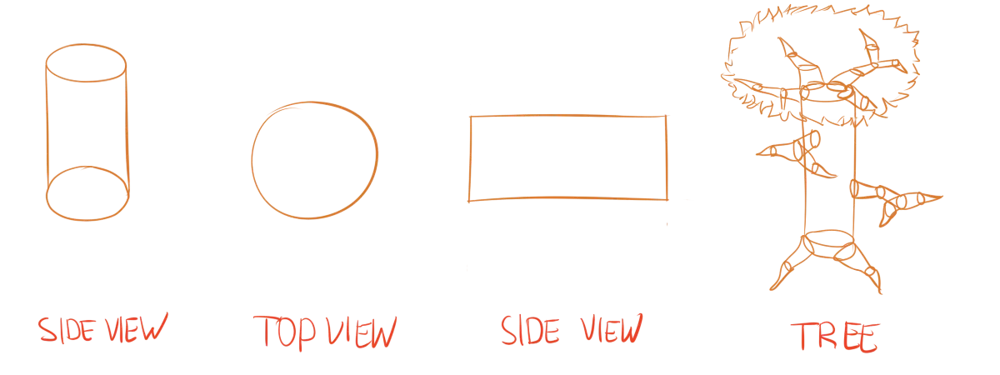
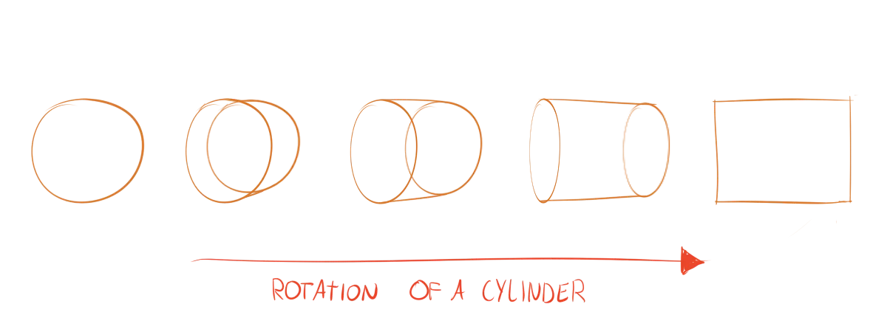
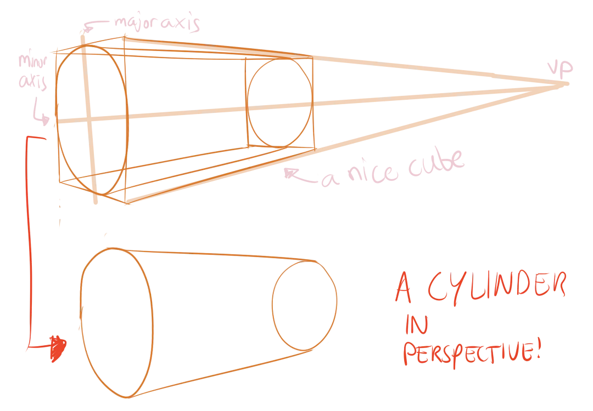
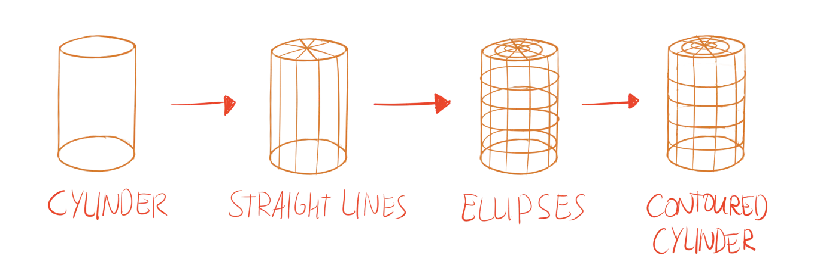

Let me tell you a secret. The favourite basic shape of the world is not the cube nor the sphere ... but a combination of both! The cylinder can be found everywhere. It's often an even better shape to approximate form than a cube. A tree trunk is a bunch of cylinders, as well as its branches. The human body is best approximated with a cylinder, as well as most animal spines. Really, they're everywhere.

## What's a Cylinder?

A cylinder is what happens when you add depth to a circle ( = extend a circle in the z-direction). The top and bottom sides are flat circles. In between those is a tube connecting them. It's basically a bunch of flat circles stacked on top of each other. This means:

* Use ellipses for the top/bottom
* Use straight lines for the part in between

{}
Yes, this means that a cylinder is just a circle in "perfect top-down view", and just a rectangle in "perfect side view".
{}

## Cylinders in Perspective

As usual, the straight lines should converge into the distance. This automatically means the side that is *furthest away* should be represented by the *smallest ellipse* (of the two). 

It's important to make a distinction here between the *size* of an ellipse and its *degree* (or *width*).

The side further away is smaller---we learned that from cubes and vanishing points. But, because of its different position, we're also looking at it *from a slightly different angle*! So the degree should change as well.

I hope the image clarifies this more.

## Putting Cylinders in Boxes

As usual, there's always the option of drawing a cube around it. Simply draw your cube like you normally would, nothing fancy, but make sure to *draw through* it. This means that you draw the lines at the back, which you normally don't see, as well. 

Now turn the front and back face into the top/bottom of a cylinder. Just draw an ellipse inside.

You've probably noticed that some of my ellipses are rotated. That's good, because it is very important! 

We've thus far only used vanishing points as guidelines for drawing rectangular shapes. But we can also use them for ellipses and circular shapes.

> Make sure that the *minor axis* of the ellipse converges at the same vanishing point as the parallel box lines.

## Contour Lines

The contour lines for the cylinder are somewhat unique. They have two different sets. 

* In the rectangular direction, we have nothing but straight lines. 
* In the other direction, we have nothing but smaller and smaller ellipes. 

Together, all these lines form a nice grid for you to see how the form of your cylinder works.

Like constructing spheres, it's important to change the degree of the ellipse when moving in three-dimensional space.

## Exercise

Not surprisingly, these exercises should also be done as often as possible. My university notebooks are filled with cylinders :p

### Simple Cylinders

Draw a cylinder in side view. (Not _perfect_ side view, but slightly angled or distorted.) This means that all you need is two ellipses parallel to each other, and two lines connecting them.

{}
A simple exercise to get comfortable drawing any cylinder.
{}

### Advanced Cylinders

Draw a cube. Use one, two or three vanishing points (whatever you like). Now draw the cylinder inside it. (If possible, use erase/hide the cube afterwards. So you can see how nice the perspective of the cylinder is now.)

{}
Advanced exercise, using cubes to create cylinders in perspective.
{}

### Cylinders with Connections

As usual, an exercise to combine all you've learned into something slightly more interesting than a basic shape.

Draw a cylinder. Add the contour lines. Now, at random spots, connect cubes or other cylinders to it. 

Make sure to follow those contour lines. Don't forget the rules of perspective on the shapes you connect to it! When in doubt, check the tree in the image at the start of this chapter: it makes heavy use of (distorted) cylinders.

