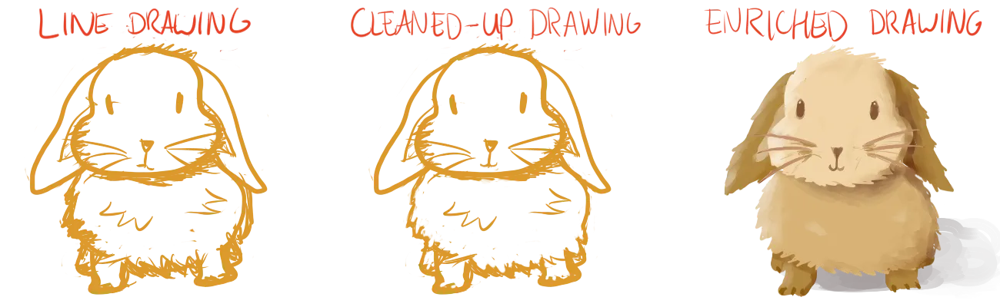

Congratulations on making it this far! You've learned many fundamentals that already enable you to draw anything.

* Create smooth, confident lines and curves
* Turn them into basic shapes in 2D
* Turn those into basic shapes in 3D
* Combine the basic shapes into anything
  
And yet ... your drawings still look unrealistic and maybe boring. The last phase of any drawing should, therefore, be used (in general) for three extra steps.

-   Perfecting every line and curve. Even the slightest alteration can have a big impact, so go over everything once again and check if all lines are how you want them to be.
-   Getting the overall perspective and proportions right. Not only every individual object must be good, the relationships between them also need to look realistic.
-   Filling in the shapes. You can fill every shape with a single uniform colour, but using texture and shading on top of that often really makes a drawing stand out.

Next chapters will discuss these huge topics. They are therefore slightly longer and more theoretical. I've narrowed them down quite a bit, but I really want you to understand *why* something is a certain way, and not just *how* you draw something in specific example cases.

After that, the course wraps up with some tips about imagination, creativity and the right mind-set for the drawing process. The conclusion will remind you of what you learned and provide other courses to further improve your graphical skills!

Let's get into the latter half of this course.