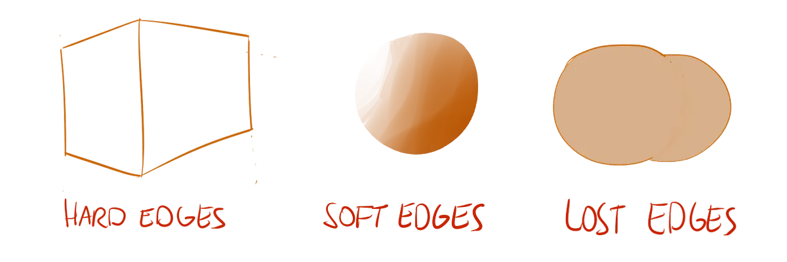
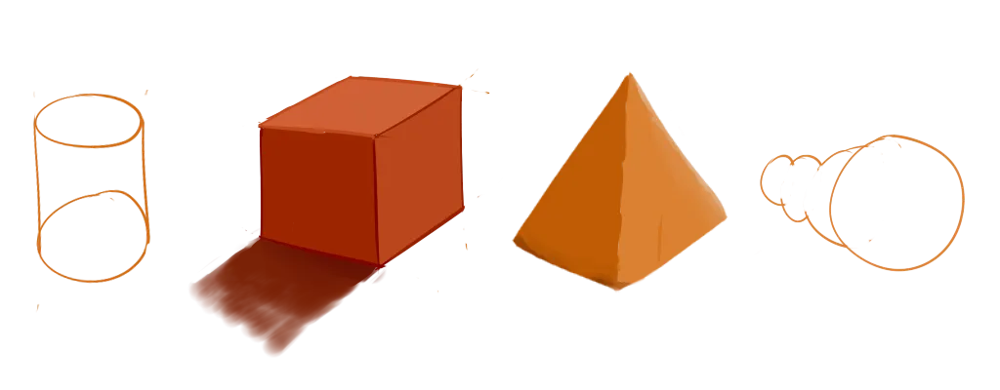

Now that we know lines are the basis of every drawing, we understand the biggest problem: knowing which lines you should draw and which you shouldn't draw. 

* *Should I draw lines at every spot the object changes colour/texture?* 
* *Or should I draw lines everywhere there's a change of shape?*
* *Or should I solely draw the outlines?* 

These questions have no definite answer, but a few approaches can be used.

## Hard, Soft and Lost Edges

We can identify three different types of edges: **hard edges**, **soft edges** and **lost edges**.

*Hard Edges* signal a sharp or sudden edge. For example, buildings often have lots of hard edges because of their "squaredness". Likewise, a line that separates one object from another is also hard, as you can't smoothly transition between two different objects.

*Soft Edges* signal a subtle, smooth or curved edge. For example, wrinkles in clothes are soft edges as you can't really create sharp folds in cloth.

*Lost Edges* are, well, edges that are lost. When two objects next to each other have (almost) the same colour, the edge between them disappears.

It's your job to determine the edges in your drawing and their type.

## Style

Even though the course has just started, we've already reached a topic that hugely influences the style of your drawing. Simple cartoons and comics, for example, usually have only hard edges. Realistic paintings, on the other hand, try to employ a lot of soft and lost edges for realism or artistic effect.

Besides personal choice, the purpose of the drawing also has an impact. If you're designing characters for a game, you can't use lost edges. The characters will be moving around and need to always stand out against any background. So you use hard edges. 

If you're creating a background drawing for a website, you'll want to use as little hard edges as possible, because it shouldn't scream for attention. It should be in the _background_.

In the end, you'll only learn to use edges well by experimenting and looking at art in the style you're after.

## A Different Approach

If this seems vague to you, another approach might be useful to know: *edges are lines shared by two shapes*.

When trying to find your edges, look for shapes that are colliding. If they are radically different, there's a good chance it's a hard edge. It they are similar, there's a good chance you should go for a soft or lost edge. Next chapter will be all about shapes and will hopefully clarify this statement of mine.

## Pointy Edges

It's important to understand that **hard edges** are not equal to **pointy edges**. Those are used for things such as spikes or knifes. You can't really draw such sharp points with one stroke, as the corners will be too smooth and gentle.

Instead, draw these points as two lines intersecting, and perhaps erase some of the thickness at the end.

{}
A technique for drawing really sharp / pointy / spiky edges
{}

## Exercises

An exercise to practice giving your lines more meaning. Look at the images below and draw each of them twice. The first time, copy the image exactly and identify the types of edges. The second time, change one edge to another type.

