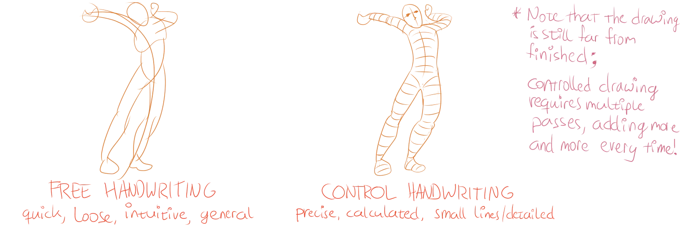

Most of this course has been rules and guidelines which are generally best to follow. This means all your drawings might look quite alike. This chapter will try to help you add imaginative pieces to your drawing, and to be creative with your methods, shapes and compositions.

Too many people think "nah, I'm just not creative" whenever presented with a task that requires even the slightest amount of creativity. 

While it is true that some people seem to have a knack for creativity and others don't, it's still the same process for every person. **It can be taught and practiced.** 

The only difference between creative people and so-called non-creative people, is that the first embrace their strange ideas, and are not afraid to "waste time" on experiments.

To help get a feeling for this, ask yourself the following questions before (or during) work on a drawing:

-   *Are there certain parts I find especially interesting?*
-   *What is the overall mood I'm trying to accomplish, and what style or arrangement helps with that?*
-   *What are all the different ways I know to draw that object or texture?*

Usually, from this point you start searching your mind for old ideas you've had once, and combining them with new ones. That's all creativity is: association on steroids.

Thoughts will often pop into your head that require further investigation. And you should do so! Doing a quick search on the internet, or through your possessions, usually reveals some kind of answer to the question---if you're open to it. 

Keep finding interesting and new things everywhere, until you have a clear picture of what you want. Of course, you shouldn't fix this decision. As you draw, let other thoughts take over if you have a feeling they're better.

To give an example, say I wanted to draw a warrior for my newest computer game. 

First question: *what is the style of the game/warrior?* 

I decide on a cartoony style that looks realistic enough. This means that I define a thick border around my warrior to make it easy to identify, yet draw every part to scale and add realistic shadows. I remember a game I thought looked great, and it had warriors, so I look up that style and copy what I like.

Second question: *what parts should be included?* 

Well, in my mind a warrior is a tall handsome guy, who has a thick armour, a large shield and a glimmering sword. But that doesn't fit my comical style! It's a game that doesn't take itself serious. So instead, I decide on a small posture, a crooked sword, and messy hair sticking through the helmet everywhere. 

Third question: *what to do with the shield and other clothing? What decorational elements to add?* 

I don't know, so I look up pictures of warriors. I try to combine multiple elements to fit with my own drawing. Whenever I see something that looks good, I investigate further. Maybe there's a name for it. Maybe it's a style, and if I know the name, I can look up way more references. If it still doesn't work, I just leave parts out or slightly change the shapes until it does feel right.

This process goes on and on. It combines memories and associations, with real-life references and existing work. Imagination needs something to work with. Association needs _something_ to associate with. But that something can be very small or strange, or maybe even completely unrelated.

## Finding your Handwriting

Creativity and imagination comes from how you tackle certain parts of a drawing, which in turn depends on your own style. 

I'll call this your **handwriting** from now on. 

When you first start out, you probably don't know what you want or like. And that's natural: your style needs time to develop and grow. Over time, I promise, you'll start to find out what type of line you like in particular, what set of symbols look beautiful when arranged in a certain way, etcetera. 

{}
For me, I like big bold letters and colors. I can appreciate finer details or subtler design, but it's not my own style. I've tried drawing and painting realistically many times, but it's just not something I enjoy, which means I don't put in the hours to get good at it. Instead, I created this course and use these principles to find a balance between a style that is simplistic and cartoony, but not too childish or bland.

But this wasn't always the case. I spent years trying different styles, wondering what I liked best.
{}

The best way to do so, is by experimenting a lot.

Nevertheless, two general types of handwriting are useful to develop.

-   **Free Handwriting:** Loose, fast and intuitive. When you quickly want to sketch something, for example, you use this free handwriting. In a few swift strokes, try to capture the overall action of your subject rather than correct proportions or accurate details. Drawing freely often is a good way to get a large scene on paper very quickly, or to sketch the idea or feeling of what you want to achieve.
-   **Controlledd Handwriting:** On the other end, there's very controlled drawing. Used when working on small areas, carefully and patiently refining the lines and rendering the tones of your subject. Controlled handwriting is evaluated and changed frequently, as to make sure every detail, proportion and shade is perfect.

In general, any drawing is a combination of these two handwritings. Although they are both concerned with lines and shades in the same way, you'll find them to be very different as you apply them. You'll see that most drawings need some parts drawn freely (such as textures or gestures), and some parts drawn controlled, for the best effect. 

> Controlled handwriting is similar for everyone, as the rules (e.g. perspective and shading) must be obeyed. But free handwriting really showcases your personal style and taste.

To help yourself consciously make the difference, employ a different grip for each handwriting. For controlled handwriting, use the grip you're used to, with your fingers near the pencil point. For free handwriting, place your grip around halfway up the pencil, to keep it loose and swinging.

## Experiment

Experimenting is one of the cornerstones of the drawing process. Whenever you're stuck, or just need a little extra something, the best idea is to just *experiment*. 

Try different tools, different paper, different grips, different symbols, different styles/handwritings (for example, by copying the style of a painter you particularly like)---whatever you can think of.

Think out of the box and everything becomes an amazing tool. Your eraser can be used to create highlights on an object. (I once learned a technique to sharpen the ends of pointy lines by erasing the tickness there!) Your hand can be used to smudge/wipe lines to achieve a gradual shading or texture effect. On the computer, lots of effects and layered blending can be applied. 

The possibilities are endless!

Usually, trying something new will compose a new idea, shed new light on your subject, or accidentally create a new way of drawing you can use for your next project. If it doesn't, it's still not wasted time. You've experimented and now know what you **don't** like.

## Tips & Tricks

If this all seems vague to you, don't worry. I have included some methods you could use to let your imagination run wild.

-   **Join Two Worlds.** The creative process is the act of joining two unrelated worlds. In drawing, that means combining at least two different ideas, which may have only a remote connection to each other, on the same piece of paper.
-   **Be Playful.** Adopt a playful attitude towards your drawing and yourself. Be loose, friendly and try to add a sense of humour. Don't worry about how your drawing will turn out, but get into the spirit of the moment. You don't have to know what the finished product should look like, or the exact process for getting there. Just keep drawing every idea that pops into your head until at a certain point you look up and you feel satisfied. In other words: go with the flow.
-   **Make the Familiar Strange.** A good way to get into imaginative drawing, is making something familiar and commonplace feel strange or out of place. This could mean drawing something from an unusual or obscured view, combining unrelated elements, changing the relative sizes of the elements, distorting, rearranging, or symbolizing.
-   **Draw in Sequence.** Doing a series of drawings with small changes in between each one creates a healthy environment for your imagination. Each drawing leads to further discoveries that can be applied to the next drawing, but you don't have to start from scratch every time.
-   **Employ Diverse Sources.** Visuals and non-visuals alike are rich sources of inspiration. Incorporate influences from art, photography, and television, as well as from poetry, literature, and music. Of course, don't copy work exactly or fill in every piece of the drawing with something already done by someone. If this seems difficult, try to incorporate the most powerful of sources: your own intimate and personal experiences.
-   **Explore Themes.** Over a (long) period of time, create drawings of similar settings, but with different style or theme. Paradoxically, when you narrow your focus this way, you widen the potential for discovery. You might find a style you really like or inspires you, or you might find a new combination of themes you haven't seen anywhere before.