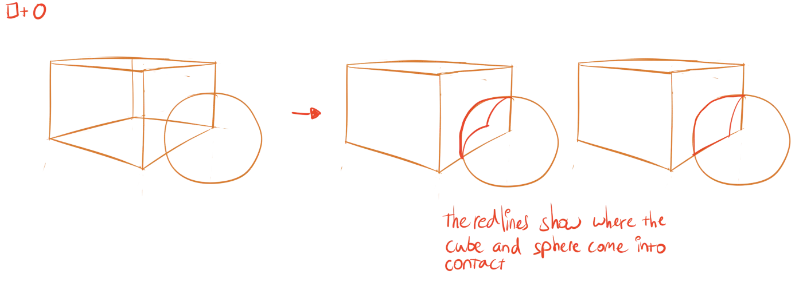

We are almost at the last phase of the drawing process: enrichment and detailing. But before we get there, we need to talk about the transition from those _basic shapes_ to _more complex and realistic shapes_.

A perfect cube or sphere is rarely found in the real world, especially not on their own. Certainly organic lifeforms will vary a lot.

Instead, every object is a combination of the basic shapes, with most of them modified or distorted. To understand how multiple basic shapes can be combined or transformed, it's important to practice with **intersections**.

Simply put, we're going to examine what happens when we add or subtract basic shapes from each other. By doing so, we learn three things: 

* How to draw basic shapes
* How to understand their form in three dimensional space
* And how to modify them to get what we want.

## Intersections

Draw a cube. Draw a sphere through it, anywhere you wat.

These two basic shapes are now intersecting, each hiding a part of the other at several points. This means that we can draw lines that show when the cube turns into the sphere, and vice versa. 

This is quite hard. It will take practice and I still struggle with this a lot. Know that you're not alone! But it's one of those skills that will really turn your drawings into something more consistent and professional.

Here are some tips:

* Use those contour lines! They _tell_ you where each shape is in 3D at specific points.
* Try to imagine these shapes as if they actually had depth. Make a mental picture.
* Now follow the contour lines and see where the shapes turn into one another.

Now that we know how the two shapes interact, we can subtract one from the other. We could cut a spherical hole in the cube, or take a cube-shaped hole out of the sphere. Because we know the construction of these basic shapes so well, it has suddenly become easier to create complex forms, by subtracting basic shapes from each other.

This might still sound vague or complicated to you. I'm afraid there's no way around it. You'll need to practice your intersections as often as you can, in order to understand how to get 3D objects on a 2D paper. 

But hey, once you get the hang of it, the possibilities are endless! All I can do now is give you some examples of intersections. Once you feel confident, try intersections with more than two shapes.

_How do I know if I'm right?_ It will look right. But there's a more consistent way to check this:

* Grab free 3D modeling software---like [Blender](https://www.blender.org/).
* Place your basic shapes in it, just like you had on your paper
* Use the "boolean" or "intersection" modifier on them
* It should give the correct end result. Use it to check if you were right.

## Holes

A very simplified version of those subtractions comes from **punching holes** in an object. 

You can try practicing these first, if general intersections are too hard. This technique is more limited in what it can do.

* Draw the shape of the hole (circle, square, triangle, whatever) in perspective on the object's surface.
* Now draw the same shape offset *into* the object, as if you were actually drilling a hole. 
* Remove the lines you shouldn't be able to see.

Congratulations, you've cut a hole in something.

## Organic Forms

Besides static or rigid shapes, many forms are fluid and flexible. A building will not bend when the wind blows against it, but a tree will. A ring won't change shape when you drop it, but a rubber band will. These organic forms are beautiful when executed the right way, but they're also the hardest to draw.

Fortunately, because they are organic, their form isn't that _precise_. For example, you could draw a rubber band with lots of curves and wobbly lines, and it would still look right. Because that's what it does: it curves and wobbles in unpredictable ways.

As such, once you know where each _part_ is---each _basic shape_ that makes the object---you can usually just combine them by drawing big loose curves around it.

_But how do I know where each basic shape is?_ By identifying the *forces* that act upon it. The most obvious one is gravity. Other common forces are wind or someone pushing against the object. 

Identify the direction of the force and the places where it hits the object. Now move the parts logically to their new position, and reconnect the basic shapes.

In the image, you see ellipses used to give something a solid and organic form. A common issue is that people draw something as if it were paper thin. They forget to give it depth. To make it bend at the edges because of that. Ellipses help give an object depth and thickness, but also show that the object is round and curved.

This skill comes down to practice and observing the world around you. I think the simplest exercise is to draw random "blobby shapes" and dropping them on top of each other. This forces them to interact with each other in all sorts of ways. Keep in mind that the forms should retain their thickness, even when they are stretched and distorted.

