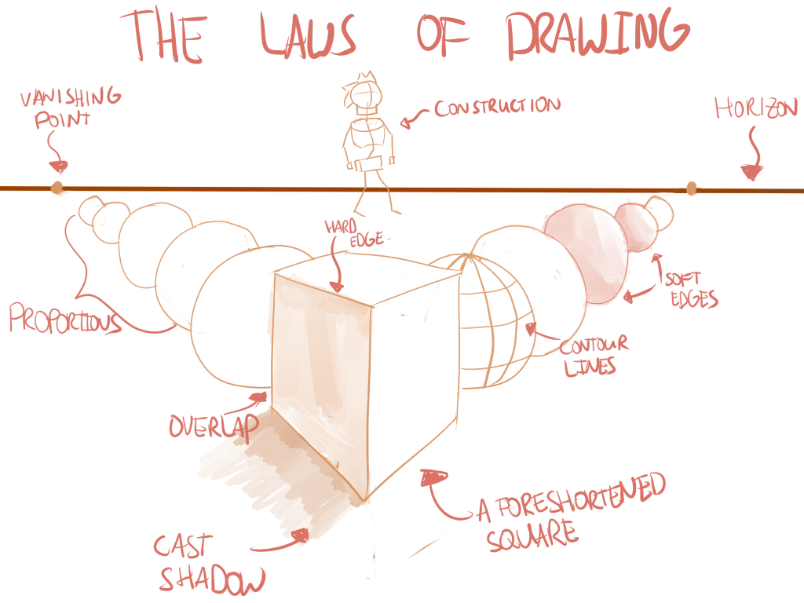

What makes a drawing good? Why is it that some people can draw a beautiful panda in ten minutes, while others struggle to draw a realistic box in an hour? 

Well, a drawing is regarded as "good" when it is able to convey the information it wants to convey! If you want to draw a panda as your company's logo, you obviously want that panda to be recognizable. In other words, you want people to see it and think: "Hey, that is one good looking panda! Wait, isn't that the company X logo?"

The keyword here is **realism**. You want your drawings to feel like "real enough" to make the viewer believe the information it holds. Like they are snapshots of a scene that is actually happening in front of the viewer's eyes. And in order to achieve this realism, we need to give our drawing *depth*. Our world is three dimensional, but our drawing has only two dimensions, which means we need some extra skill to create the illusion of that third dimension.

{}
Even 2D icons, or art for 2D games, uses some tricks and techniques to get depth 99% of the time. Look for it. Subtle shadows, gradients, offsets, extrusion, anything to make it more like 3D. More like the physical world we are most used to.
{}

For this, I have what I call the 9 Laws of Drawing:

-   **Contour Lines.** Imagine your lines as curves wrapping around the form of a 3D object, not simply as two dimensional stripes.
-   **Edges.** Use the right type of edge to portray what you want.
-   **Foreshortening**. Distort shapes to create the illusion that they aren't flat.
-   **Overlapping**. Overlap shapes to show one is closer to the viewer than the other.
-   **Construct.** Use basic 3D shapes to construct your objects in a logical and realistic way.
-   **Proportions**. Use size and proportional relationships to show the position and form of an object.
-   **Shading**. Use light and shadow to show the form of a 3D object.
-   **Perspective.** Use the elements of perspective, such as horizon lines, placement up or down the page, and vanishing points.
-   **Details.** Use details---such as texture, colouring or density---to enrich the drawing even more.

These laws aren't placed in any random order! They are ordered from basic to advanced, and structured in the same way as this whole course.

I'll start with teaching you to get simple lines and curves looking right. Then we continue to shapes, which leads to 3D objects, which leads to adding enrichment and details. Essentially, this already describes the whole *drawing process*. You've already learnt everything you need to know! 

Now all I need to do ... is show you how to do it.

