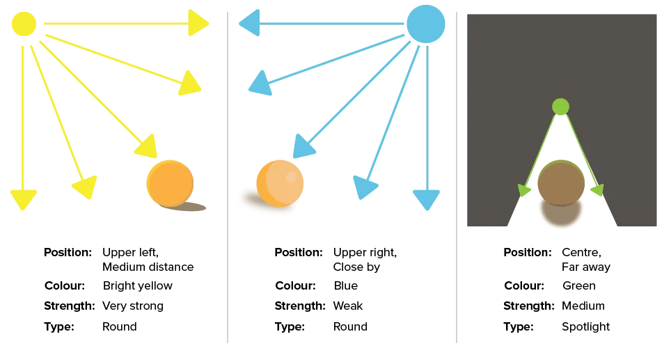
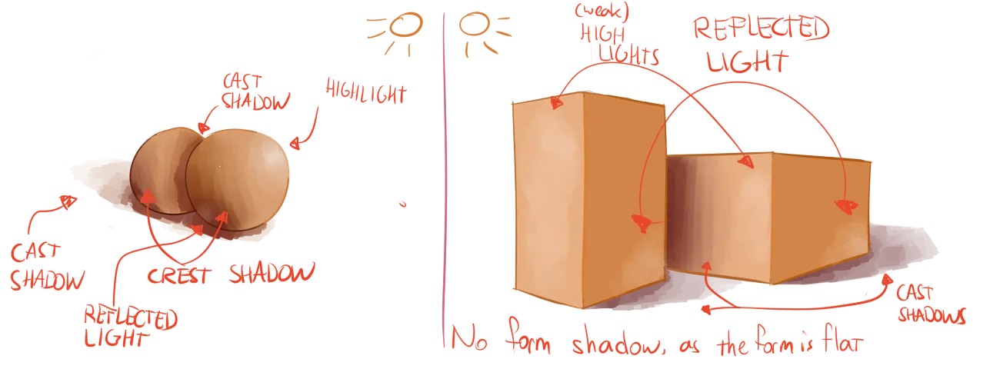
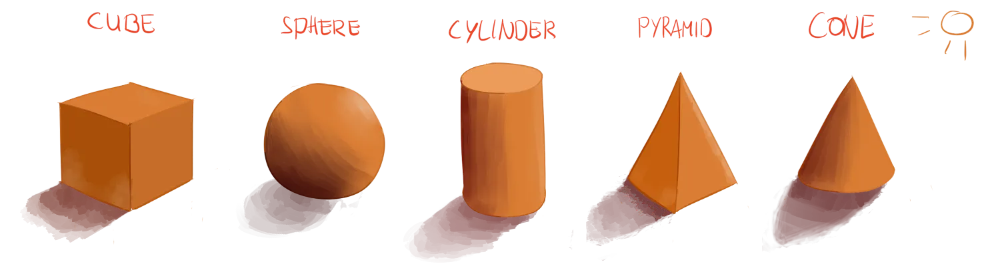

Without light we'd see, well, nothing. We wouldn't be able to distinguish between objects or even get a general sense of our surroundings. Light creates *shadows*---and shadows add contrast to the world around is. 

Therefore, to give your drawing more depth and realism, it's necessary to know where light is coming from and how it interacts with your objects. As we already saw with spheres at the beginning, shadows or highlights can show the curviness of an object without drawing the lines. But they can also be used to separate one object (or part of an object) from another.

When you look at a photograph of a single object, you can literally see where the shadows are. But, when you have to determine shadows yourself (because your drawing isn't from real life), it becomes tough.

To solve this problem, we need to understand (parts of) the theory behind lights and shadows. 

But don't think you need to calculate or measure all your decisions here. Our eyes and brains are hardwired to recognize light and shadow. It can be tough to let this intuition take over, but it should be your goal. At least use this hardwired ability to _recognize_ if your lights and shadows are correct.

## Light Sources

The first step is always: **establishing your light source**.

It's the main light that illuminates your scene. If there's more than a single light, the process I'm about to explain needs to be repeated for every source. 

> Lights can only make things *lighter*. 

Why do I bring attention to this? Because it's a common error, yet easy to avoid.

Let's say one light casts a certain shadow on the ground. Now a second light shines on the object from a different angle or distance. _The second light won't suddenly make that shadow darker._ A light doesn't add "darkness". It adds light! 

So, instead, if the second light is able to reach that shadow spot, the shadow will actually shrink and become lighter.

That's how you combine multiple sources. Don't darken shadows. Make the parts where light hits _lighter_---which makes the shadows the right darkness by contrast.

Every light source has four properties that are of interest to us:

-   **Position**: The placement of the light in the 3D world.
-   **Colour**: The colour of the light. Sunlight, for example, is actually near white, while old light bulbs are more yellowy.
-   **Strength**: How strong the light is. Sunlight is very strong, while a dimmed light (obviously) isn't.
-   **Type**: The type of light. The most common type is a *round light* or *point light*, which means light is emitted in all directions. But, for example, a *spot light* has a certain direction and shape in which it emits light.

It helps to mark the position of each light source on your paper with a large dot. Additionally, write down the properties of each light, in case you forget.

## The Four Types of Shading

Shadows are a direct *consequence* of light. Where there's light, there's shadow. These shadows inherently reveal spots where light *does* hit the object and illuminates it. 

I will group both shadows and lights under the term **shading**. Shadows and highlights, however, can take on different shapes, position and colour. To know what to do, a distinction is made between four shading types:

-   **Highlights**: The place where a light hits an object directly. It can't have shadow. Compared to the rest of the drawing, it's a bright highlight.
-   **Reflected Light**: When light hits an object, it's reflected. Usually, this means that a small and soft highlight appears on nearby objects. Very reflective materials produce much brighter reflected lights. They are often forgotten, but are actually very important in establishing the relationships between different objects in space.
-   **Crest Shadow** (or *form shadow*): Shadow on an object itself that marks its shape(s) or form. These are gradual, such as the shadow on the sphere that marks its roundness.
-   **Cast Shadow**: Shadow cast by an object on other objects. When you place something between an object and the light source, that something blocks the light and therefore casts a shadow on the object. The most obvious example is the shadow people leave on the ground on a sunny day. But, these can also be smaller, such as when used to make strands of hair stand out in a ball of fur.

The fact that light is reflected is actually the only reason we can see things. 

For instance, an orange absorbs all light waves, except for orange light waves. Those are reflected towards your eyes! And that's why we can _see_ an orange, and that's why it has the _colour_ it has. 

When shading your drawing, the reflected highlights are the hardest to get right, which is probably why many completely disregard them. Keep in mind that any object will, subtly, reflect light with its own colour and strength to nearby objects.

Crest shadows are somewhat equivalent to soft edges. The soft edges I've mentioned several times can only be seen because of the shadow they produce. And because they're soft, they produce smooth and gradual shadows.

Cast shadows, on the other hand, can be either sharp or smooth. Why this is the case, and how to figure out placement and size of shadows, is discussed in next chapter.

## Exercises

Shading the basic shapes! 

Draw any of the basic shapes (cube, sphere, cylinder, pyramid, cone), and go through all four shading types to add them. Just as basic shapes were the first step to creating complex forms, shading basic shapes is the first step to shading complex forms. You can start with rough shading and later try adding colour or more subtlety/complexity.

