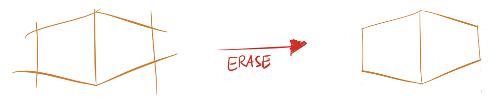

Everything you draw is essentially a line. It's not like you can create a three dimensional box by waving your pencil in the air. Because of that, it's only logical that your line making technique should be perfect. Yes, we all think "I know how to draw a line!" But in reality, most of us draw insecure and suboptimal lines. Improving this aspect will already make you _much better_ at drawing something---because everything starts with lines.

## Confident Lines

Many beginning artists are afraid to draw. They draw short, sketchy strokes which should, after a while, resemble the line they were after. Of course, using the eraser can tidy up some things, but the process is slow and never looks right. When you draw a line, you should be confident about it!

When you know what line you want to draw, perform a swift pencil stroke to do so. Don't worry if it doesn't turn out alright, you can just erase the whole line and try again. Using this method you'll see immediate improvements in the quality of your lines. And, after a while, you'll rarely draw a wrong line.

## Drawing from the Shoulder

Write your name on a piece of paper. When you're done, ask yourself the questions:

-   What parts of my body were involved in writing this?
-   Did I shift my position? Hunch my back? Tilt my head?

Odds are, you primarily used your wrist for the writing and leaned forward a bit. 

For handwriting, this is okay, as you're making small controlled motions which should just resemble some letters. 

When drawing, this stiffness makes it hard to create smooth and natural lines. The solution is: drawing from your shoulder!

{}
Animation showing how to draw from your shoulder.
{}

Don't lean on your hand or merely use your wrist. **Lock** your wrist and draw by rotating the **shoulder** (and elbow). 

At first, this feels out-of-control and unbalanced. A good way to combat this feeling is by having a correct posture: sitting upright and with both feet firmly on the ground. If you're constantly shifting position, you'll have to adjust your drawing technique every time. In the end, however, only practicing this drawing method a lot will make you accustomed to it.

Nevertheless, as illustrated by my handwriting example, you shouldn't *always* draw from your shoulder. 

* This type of drawing is great for medium to large curves and lines.
* Small details and finishing touches are best drawn from the wirst. It gives you more control and stability in the small range you have.

A good drawing will often be a combination of the two: large and loose strokes, combined with small and detailed ones.

## Extended Lines

Drawing a line the exact length you need, in one try, confidently, is hard. Fortunately, we have an eraser! 

When drawing lines, it's sometimes helpful to "overshoot" the line. Just draw the line longer than it has to be. Don't worry about this. Once you have the part you need---nice and confident---erase the parts you don't need.

## Line Thickness

Every pencil has one great tool built into it that most people overlook. By varying the amount of pressure you put on it, you get thinner and thicker lines. Instead of creating all your lines at the exact same size, you can use the thickness of the line to make the drawing more dynamic. As a rule of thumb, thick lines are often used to show something is closer to the viewer or in the shadows.

## Rotate the Page!

If you have trouble with a certain line or curve, simply rotate the page until it becomes easier for you. Most people naturally draw smoother and easier when they're moving the pencil *towards* them, instead of away from their body.

## Exercises

I recommend doing these exercises on a day to day basis. They can also be used as a warmup.

### Straight Lines

Let's start easy. Draw lines of any length and in any direction you want, as long as they are (mostly) straight. If you find your lines curving or having bumps in them, keep practicing! Nevertheless, keep your arm loose and focus on drawing smooth and fast lines.

{}
Exercise for drawing lines that are as straight as possible.
{}

### Curved Lines

Place dots at random positions on the paper. Now, connect all the dots by drawing a curved line through all of them. Make sure you don't take any sharp turns! Keep everything smooth and go through ever dot exactly.

{}
Exercise for drawing curved lines in any way.
{}

### Copying Lines

Draw a random line. Now, copy the exact same line. Continue trying to copy it until it looks almost identical.

{}
Exercise for copying any existing line.
{}

### Doodle!

This is the creative one. Doodle anything you like, it doesn't have to resemble anything or be pretty. Below is an example of something I just randomly doodled.

