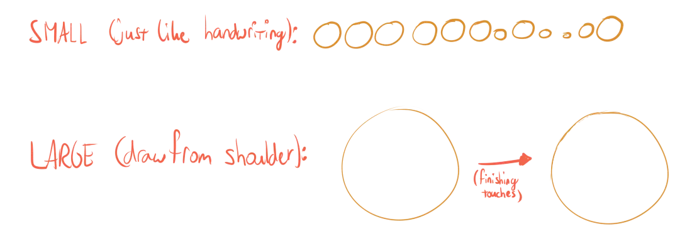
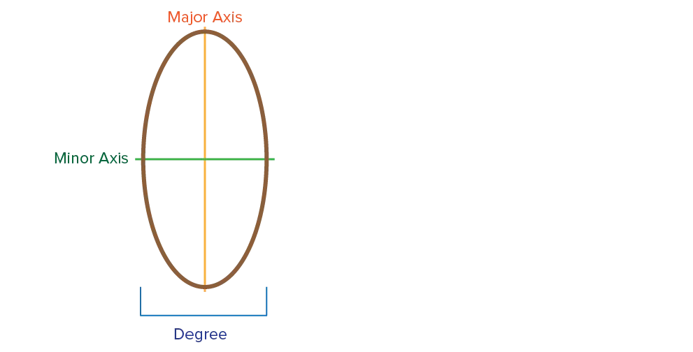
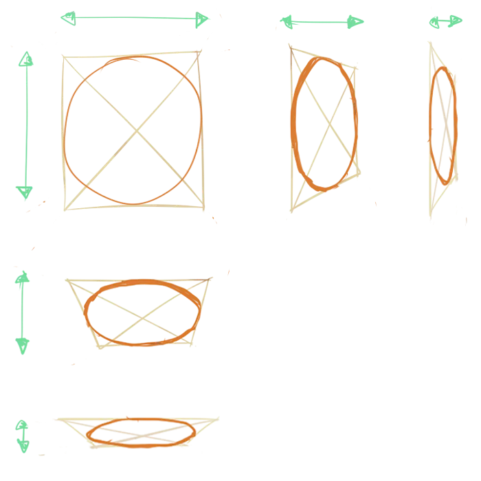

I called this chapter ovals---not circles---because drawing perfect circles is rarely required in a drawing. Just as with rectangles, you'll encounter distorted and modified ovals when trying to draw 3D.

## Circles

A perfect circle takes time to get right, even when drawing from the shoulder. Small circles are okay, but if you need large ones it's best to just 

* Draw a quick and loose oval
* Use the eraser later (and small strokes) to adjust it

Organic shapes that *seem* circular (such as the head) are often slightly stretched circles or egg-like shapes. Try to look closely at your object to see how it actually looks.

## Ellipses

Ellipses are *incredibly* important when drawing. And the annoying thing is that they're the hardest to get right. 

Ellipses represent *foreshortened circles*. Below is some basic theory to define ellipses.

The degree is named that way for a good reason. It represents the angle at which we look at the circle. For example, a large degree means the ellipse is a circle, and we're looking at it in perfect side view. A small degree means we're looking at an angle and see a hugely foreshortened circle.

A great tip is to draw the circle *within a rectangle*. Then foreshorten the rectangle (using our knowledge from last chapter). Notice how the circle becomes an ellipse with decreasing degree.

## Contour Lines

Like rectangles, we can subdivide our ovals into multiple parts. Again, the easiest way to accomplish this is by drawing a rectangle around it and subdividing *that*. 

The point where they intersect is the midpoint of the oval. You should end up with a circle with 8 equally big parts.

{}
How to subdivide a circle for contour lines.
{}

{}
These don't look equal _from our drawing perspective_. But they are correctly drawn, in perspective, if the parts were equal _in 3D_.
{}

_Great, now I can draw pies._ Of course, we can do more with this.

These contour lines can easily create the visual illusion of depth and form. I call this the **umbrella method**.

Draw a subdivided circle underneath your object. Now draw straight strokes from the subdivision lines to the object.

This reveals where contour lines should be on your object. (Don't worry, we'll take a closer look at contour lines in later chapters, when we're actually working with 3D objects) An easy way to practice and use this, is with an umbrella.

{}
How to use simple divided ellipses to define more complex contour lines.
{}

## Exercises

Again, simple exercises I suggest you do daily. Or whenever you have some time to kill. I practiced these when sitting in a boring lecture---so I basically practiced these all day while at university.

### Ovals

Draw ovals at different sizes. They don't have to be perfect. Try to keep the ovals smooth, and especially try to end the line exactly where you started.

{}
An exercise to get an understanding for drawing ovals.
{}

### Circles & Ellipses

Last exercise was a loose on. With this exercise you try to draw perfect circles and ellipses at all angles/sizes.

{}
A more advanced exercise trying to foreshorten and clean up your ellipses.
{}

### Tracing Shapes

Simply draw any of the shapes from the previous exercises. Now, trace over that exact shape again and again, trying to match it perfectly. Start slow, but aim to trace your shapes as fast as possible.

{}
An exercise to get more consistent with your curves and elliptical shapes.
{}

### Combine

Draw anything that combines all the previously discussed shapes. Especially useful, I think, is to draw ovals inside rectangles, or vice versa.

{}
Making it a habit to use _rectangles_ to help with getting nice _ellipses_.
{}
