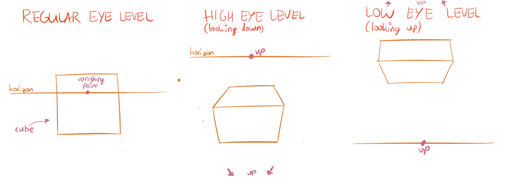
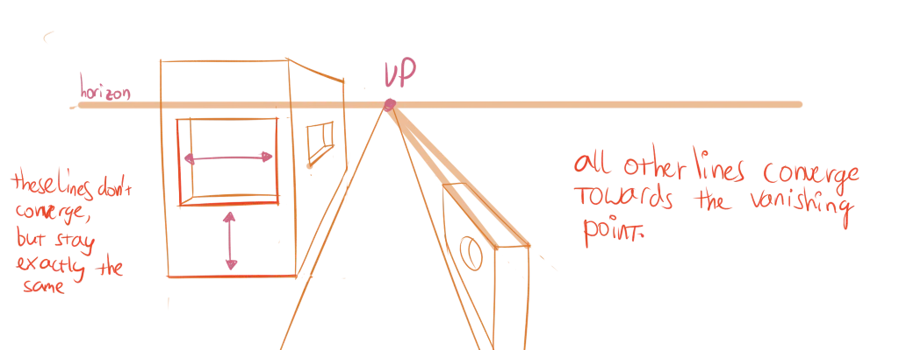
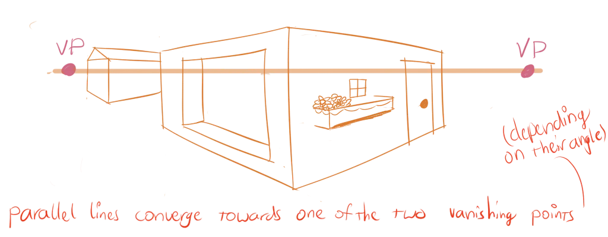
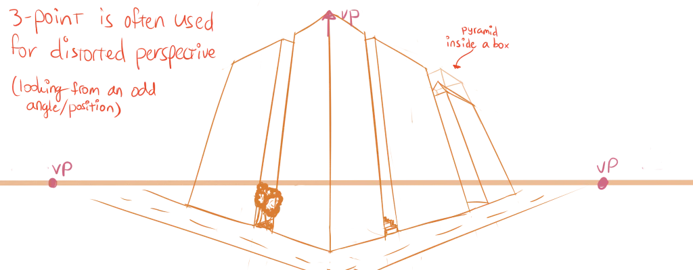
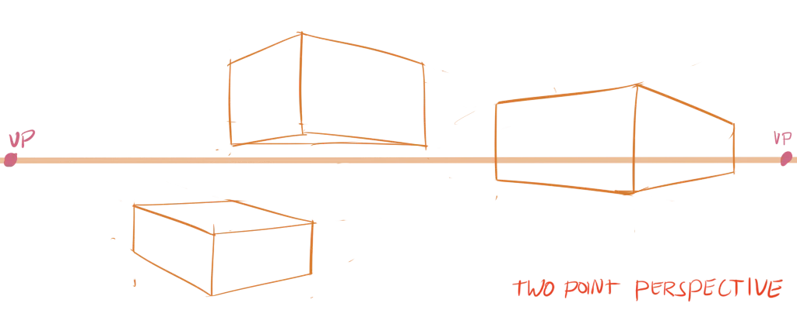

You've already drawn many things in perspective. You've learned how to use **vanishing points** to keep cubes in perspective. And how any other object can be put inside a cube for easy perspective. 

If you want to draw more than one object, however, the perspective needs to be coherent. Two cubes right next to each other can't use completely different vanishing points, no matter how well-drawn. Additionally, the vanishing points an object uses can't be too close to each other or at wrong angles, as this creates an unrealistic, distorted perspective.

To make it easy to set up correct perspective for a complete drawing, a few rules have been invented.

## Horizons

Let's say you're standing in the desert, with nothing but (flat) sand in front of you. How then, is it possible that you can't see a tree standing six kilometres in front of you? I mean, there's nothing standing in the way to block your sight! Why do you only see sand?

Well, that's because the earth isn't flat, but spherical. After about five kilometres, the surface of the earth has curved away and out of our sight. The place where this happens, is what we call the **horizon**: the line separating ground and sky. 

In most scenes though, there will be many objects standing in the way---such as trees, buildings or people---which make the horizon less clear. Nevertheless, it's still there, and it tells us something important about our view.

{}
Of course, you can use a horizon that's not horizontal. But that's a stylistic choice that only applies in specific cases. Most of the time, don't fight human intuition.
{}

The horizon is linked directly to the **eye level**. When you draw something, you're viewing the scene from a particular eye level, which simply means the place where your eyes are. 

* A low eye level means you see things from below
* A high eye level means you watch things from above. 

All you need is a **well-placed horizon** to communicate this eye level.

## One, Two and Three Point Perspective

In theory, you could have as many vanishing points as you want. But one, two or three are usually the best way to go. With that, you can create a simple "grid" in which your drawing takes place.

* Setup your horizon and vanishing points before you start.
* Draw light "guidelines" from all
* Remember that vanishing points are where lines _converge_ (or _vanish_). So, the guidelines will not be parallel, they will grow apart more and more as they get further.

### One-Point Perspective

One vanishing point is placed on the horizon line. Useful for very open scenes, such as a railway or landscape. 

Okay, this determines what to do with angled lines, but what about perfectly horizontal and vertical lines? A new rule comes into play:

> **Parallel perspective property**: Lines parallel or perpendicular to the horizon always stay the same.

This is also true for two-point perspective.

### Two-Point Perspective

Two vanishing points are used, both placed at a different point on the horizon line. Useful for when you look at the side or corner of an object.

### Three-Point Perspective

The same as two-point perspective, but with an extra vanishing point added somewhere above or below the horizon. 

Useful for when you view something from a very low or high eye level. The rule about vertical lines staying the same isn't applicable anymore. (This third vanishing point causes a more distorted perspective where you lose that property.) Instead, they converge towards the third vanishing point.

## An Important Note

You might have noticed that this way of creating perspective is ideal for cubes. Those have only parallel lines, so converging and creating the grid is easy!

But that's not true for any other shape.  Some more advanced methods, such as four, five or six point perspective exist that turn your drawing into a sphere. But these still rely on the existence of parallel lines.

Instead, I want you to remember that we put lots of basic shapes inside boxes to make it easier to draw them. If you can draw a cube in perspective, you can draw anything in perspective! 

Simply place the object inside a cube that matches the vanishing points. Subdivide the cube, if needed, to get the correct placement and proportions for what's within. Afterwards, remove the cube and the perspective should be perfect.

Lastly, vanishing points can be---and often will be---off-paper. In that case, draw arrows indicating the general placement of the vanishing point, and use those. If you work digitally, you can of course draw things _outside_ the canvas you'll be exporting, and this isn't an issue.

## Exercises

Draw something using one, two, or three-point perspective. Establish your horizon, establish your vanishing point(s), and draw random cubes that follow the guides you set out.

