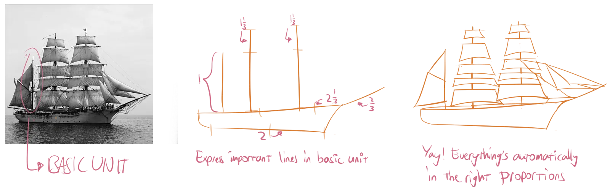
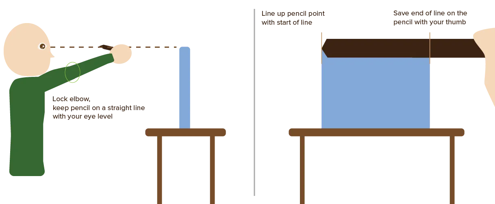
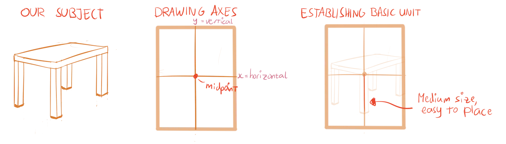
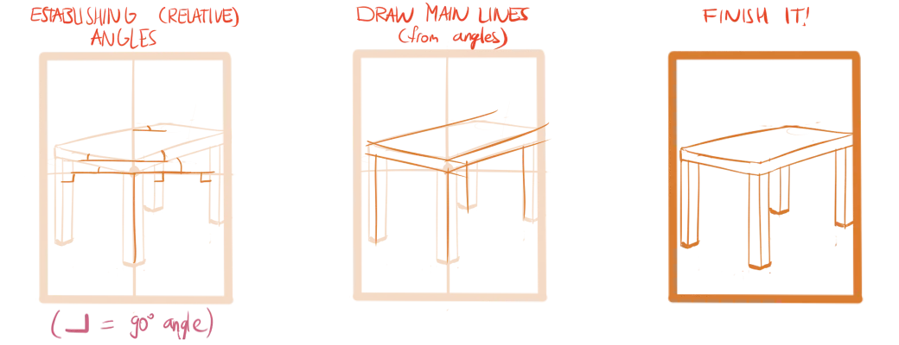
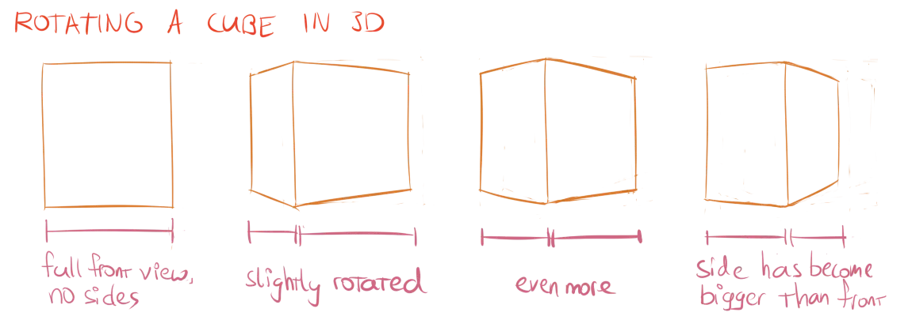
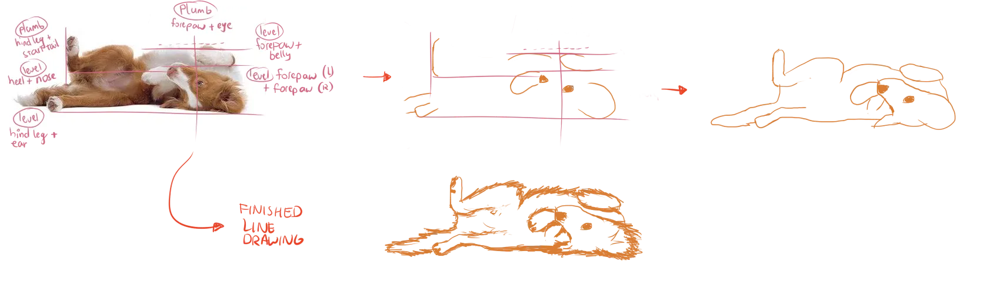

Proportions are perhaps the second most important part of drawing. Because, once you know _where_ you want to draw a line, you need to know _how large_ the line should be. Proportions matter on such a small scale, but also on a large scale, as the perspective or relationship between objects in a composition.

Often, beginner's drawings look wrong because of mistakes in proportions. For example, people see a human body and then try to draw it on paper, but the arms and legs are way too long or short. Or people forget that objects further away look much smaller. 

An eye trained to see proportions helps a great deal. And you will develop that over time. But the quick and consistent solution is actually just (loosely) *measuring* things.

Note that the tips and tricks laid out here are mostly useful when you're drawing from real life or something you can actually see. If you're drawing from imagination, I encourage you to use reference photographs, and apply these methods to those.

## The Basic Unit

When measuring, we want to prevent ourselves from thinking in words like centimetres or inches. We want to use the visual side of our brain, instead of the logical side. 

We only care about determine proportions *in relation to each other*. 

The first line we draw has to be an educated guess. From that moment on, we can measure every part of the drawing relative to the existing line(s). We like to call this the **basic unit**.

To apply the method, find a medium-sized, prominent line within your drawing. Draw this line on the paper at (approximately) the right position and at a size you choose yourself. 

Don't pick a size too large or small. Hence, _medium-sized_. Otherwise the rest of the drawing won't fit. 

From now on, this line is your basic unit. Use it as a reference for everything else that you draw.

How? Determine how often your basic unit fits into what you want to draw *in the real world* (not in your drawing). This ratio between the size of two lines in the real world is what we call a **proportion**. Maybe your basic unit was a doorframe. The leg of a chair is 1/3 the height of the doorframe. That's the _proportion_ (or _proportional relationship_) between these two objects.

This proportion should stay the same in your drawing. If your basic unit is half the length of another line in the real world, it should be half the length of that other line in your drawing.

## Pencil Measuring

How do you quickly measure things? Through **pencil measuring**. 

* Pick up your pencil
* Stretch your arm and lock your elbow
* Hold the pencil in front of you at eye level, in the direction of the real-world shape you want to draw.
* Line up the pencil with what you want to draw. (Place the pencil point over the start of the real-word shape you want to draw.)
* Use your thumb to mark the _end_ of the real-world shape on your pencil.

There's your measurement! Compare it to the length of your basic unit. (It might be useful to draw the basic unit twice, once in the real drawing and once on some sketch paper next to you, for easy comparing.)

Ultimately, the result of this process should be something like: "this line is roughly two and a half times as long as my basic unit".

## The Midpoint Method

Questions may arise now, such as:

-   *How do I choose a suitable placement and scale for my basic unit?*
-   *How do I measure the right angles for my lines?*

Well, there's a solution for that: the **midpoint method**!

Before you start a drawing, actually get yourself a ruler and measure the paper you're going to work on. Draw a horizontal line and vertical line through the centre. We'll call these your axes. (The horizontal line is like an x-axis, and the vertical line like an y-axis.)

Now get rid of the ruler.

The point where these lines intersect is the **midpoint**. It's often not where you expect it. Objects in perspective often mess with our sense of balance and place the midpoint somewhere else in our minds. 

If you have a dot on paper that clearly states the midpoint, you can use that as a good reference for where you should place objects in the centre of your view. Additionally, it's wise to choose a basic unit very close to it.

A second advantage? You now have two axes with right angles ( = 90 degrees). 

> When you want to find the angle of a line, estimate it against the closest axis. 

Again, it helps to keep the pencil in front of your eyes. Hold it horizontally or vertically, whatever axis fits best, and check the angle the real-world line makes against your pencil. Copy that angle (roughly) to the drawing.

## Measuring Methods

Knowing these methods will solve most of your problems. To finish things, I'll give some last guidelines.

### Foreshorten

The more you see the end view of something, the less you see of its sides. If you view a cube from perfect front view, you only see one face and no other sides at all. But if you view a cube at a slight angle, you'll see parts of lots of sides. 

_All_ objects in perspective have some foreshortening and distortion, which subtly influence the proportions. 

The important thing is that you **draw what you see**, instead of **what you think should be true**. 

Measure lengths when in doubt. Assume foreshortening happens when in doubt. Instead of thinking: "well this shape is pretty much a cube, so all faces will be equally sized"

### Measure Critically (sometimes)

Most of the methods I described are not really precise. They are estimations and guesses, but come close enough to be just right for your drawing. 

A drawing should _not_ be a perfect copy of the real world. We have _photographs_ for that. Instead, the variation, the human "error", the style applied, that's what makes drawings different and wonderful in their own ways. These rough measurements are much _quicker_ to do, yet lead to _better_ results.

There are situations, of course, where accuracy is essential. When creating a blueprint for a house, you don't want the architect to guess where everything should be. The tips from this chapter _do not apply there_. You'd use a ruler, you'd use precise measurements from the computer, you'd calculate through everything at least five times to be sure.

### Intensify

You can consciously distort proportions to get an effect.

By drawing the wrong proportion, you can show your feelings towards that certain object, or change how much attention it gets. A visibly enlarged object seems to be more important, while a shrunk object seems shy and unimportant.

### Plumb & Level

A more general way to achieve the right proportions, is the **Plumb and Level** method. 

By holding your pencil either vertically or horizontally, you can find lines that align with other lines. Put another way, you can find pieces of your drawing that should end up sitting on the same imaginary line as another piece, making it easier to get your proportions right. 

{} 
A person's thumb and big toe might line up (vertically). Or their shoulders might line up (horizontally).
{}

It helps with sizing _and placement_ of seemingly unrelated objects all over the drawing. It also provides clues to the action of the pose. If, instead, a person's thumb and knee cap line up horizontally, you know they're not standing up straight.

