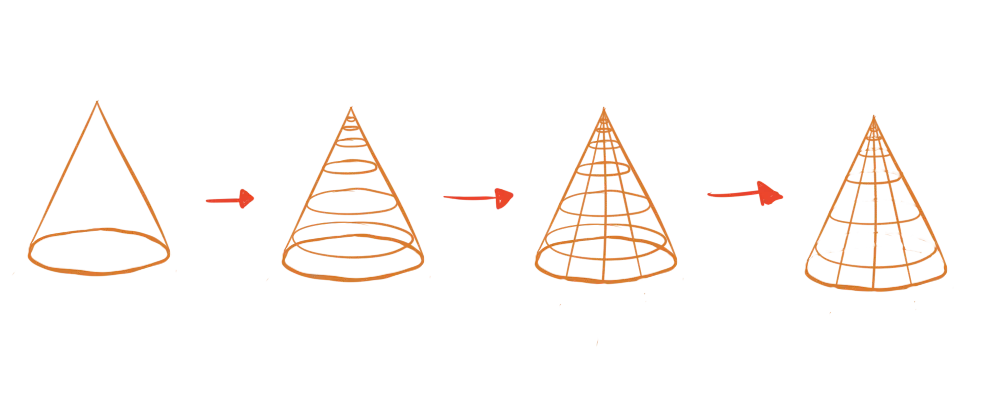
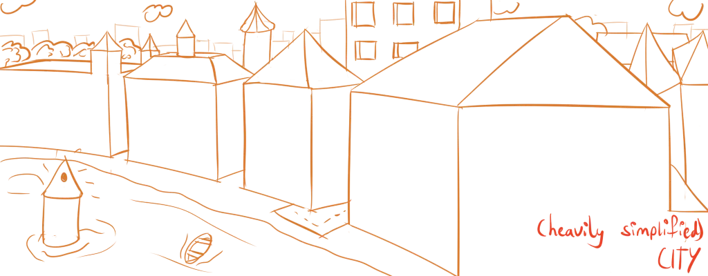

We've discussed the most important forms of all: cubes, spheres and cylinders. It's time to look at the last two basic shapes, which are simpler and less common. Nevertheless, they certainly have their place in the world of drawing.

## Pyramids

A pyramid is a cube, but with one side collapsed into a single point. Therefore, to draw a pyramid, is to draw a cube and then replace one side for its midpoint. Again and again, the concept of dividing rectangles comes into play.

Of course, pyramids don't necessarily have to have equally large sides. You can pick any point on a any side and use it as the pyramid's sharp point. But any point other then the midpoint will be hard to find (in perspective) and probably look weird anyway.

## Pyramid Contour Lines

A pyramid's contour lines are rather simple. The bottom of the pyramid (the *base*) is just a rectangle, so subdivide that. Now draw straight lines from that grid to the one pointy end of the pyramid. Yes, this means that all those contour lines _converge_ there. (The other contour lines are simply parallel to the base.)



## Cones

A cone is a cylinder, but with one of the circular sides collapsed into a single point. Just like the pyramid, drawing a cone means drawing a cylinder and then replacing one side by a single point.

## Cones Contour Lines

Again, regard the bottom of the cone as the *base*. The contour lines are ellipses parallel to the base. Make sure to slightly change the degree with every new ellipse, as you look at them from a slightly different angle.



## Where do I find Pyramids and Cones?

Pyramids are often found next to cubes, as the nice pointy top makes things look finished and polished. For example, most houses have pyramid-like roofs.

Cones are often found next to cylinders, for the same reason. For example, a cylindrical building (such as a tower) will have a cone as a roof.

But more often than not, these shapes are found in the tiny details. You'll rarely find objects that are largely pyramids or cones, but you'll often find that the smaller shapes in a drawing are best approximated with these basic shapes.

## Exercises

Because pyramids and cones can be directly created out of cubes and cylinders, I don't have any new fundamental exercises to give. When you do any of the other exercises---and end up with a cube or cylinder---you can simply take the next step and transform it into a pyramid or cone.

### Drawing Cities

Obviously, drawing a city scene is a fun way to practice cubes + pyramids and cylinders + cones. It doesn't have to be pretty, creative or detailed. Just try to get lots of different buildings on the paper with proper perspective.

