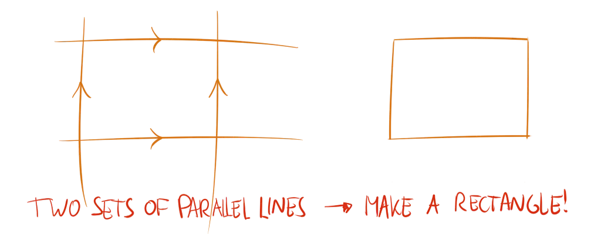
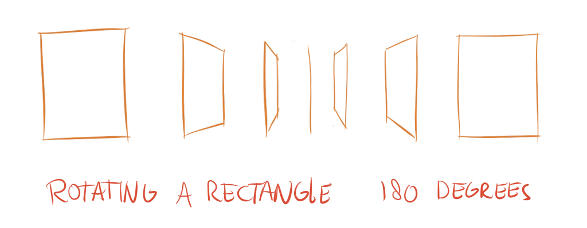

The obvious first basic shape: the rectangle. I will use this name to refer to any shape that has four edges, to keep terminology simple.

## A Standard Rectangle

Drawing a regular rectangle is simple. Draw two vertical lines next to each other, and two horizontal lines underneath each other, and voila. Again, the overshooting technique I taught you is useful to get smooth lines.

## Rectangles in Perspective

How often do you see such perfect rectangles in real life? Not often. 

Only when you look at rectangular objects in perfect side view do you actually see a rectangle. If you look at objects from an angle, the shapes will be distorted due to perspective. 

This is called *foreshortening*. 

Points that are further away seem smaller, while poins that are closer seem larger. So, unless the four corners of the rectangle are at exactly the same distance (from the viewer), they will move around and create perspective.

In a regular rectangle, the vertical lines are parallel to each other (they have the same direction), and the horizontal lines are parallel as well. 

When foreshortened, **(at least) one pair of parallel lines converges**. Converging means they move towards each other. As you follow the lines, they get closer and closer. The points where they are closer are "further away" from the viewer.

And that's how you get a rectangle in perspective, with a 2D drawing.

## Contour Lines

The first law of drawing talked about contour lines. We will finally start using them! 

Contour lines are the lines wrapping around an object that showcase the three-dimensional form. With rectangles, it might seem obvious that the contour lines are just more parallel lines within the rectangle. 

In perspective, however, it's hard to find where everything should be. With a foreshortened rectangle, for example, where is the _center_? 

To solve this, use a method called *dividing rectangles*.

Draw the two main diagonals. (Top left to bottom right, top right to bottom left.) Where they intersect is the **center** in perspective!

Repeat this process as many times as you want to subdivide the rectangle into smaller ones. This way, you get an exact location for where everything is on the rectangle, even in perspective. It works for any shape.

{}
Animation showing how to divide rectangles to find contour lines
{}

## Exercises

The exercises for this are simple ones I recommend you try to do every day as a warm-up.



### Any Rectangle

Draw rectangles at different sizes. Try to create a square once in a while. If you feel adventurous, try to draw rotated rectangles as well.

{}
Exercise to get get comfortable with drawing any rectangle.
{}

### Perspective Rectangles

Draw a random foreshortened rectangle and subdivide it once.

{}
Exercise to foreshorten rectangles and subdivide to find contour lines in perspective.
{}

### Houses

Draw houses or churches, just like you used to do when you were young
(probably). Try to use subdivision and foreshortening to add windows or other details.

{}
Advanced exercise for rectangles, drawing a house and adding details.
{}