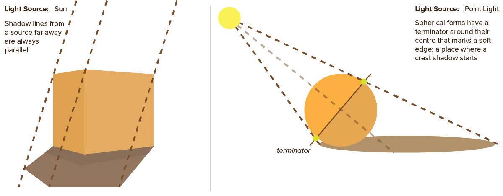
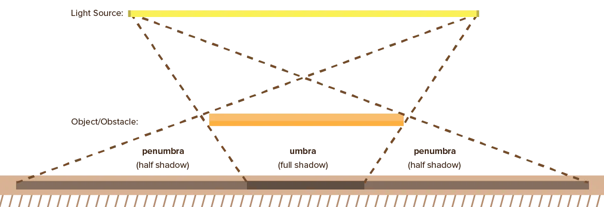
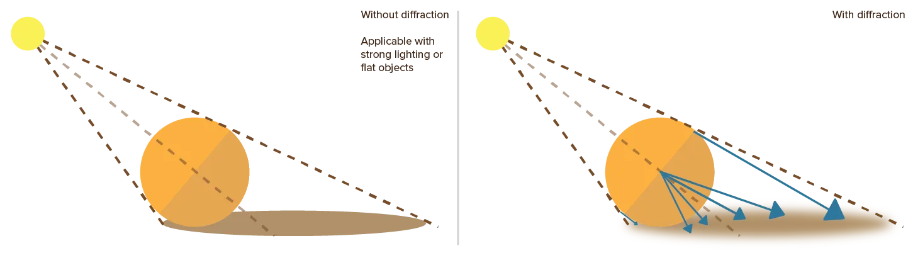
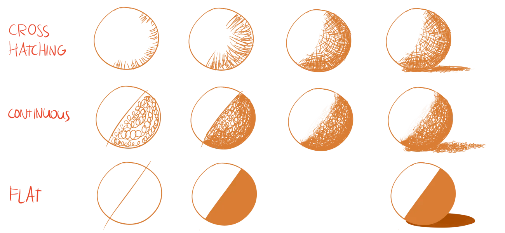
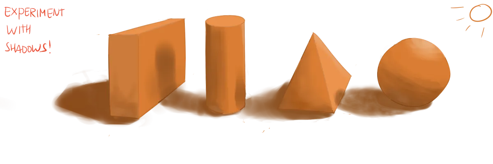

As previous chapter explained, shadows _reveal_ light and form. Any light results in shadows elsewhere. Without them, the light would have no effect, and we wouldn't be able to see the world as clearly as we do.

This only works if you place the right shadows with the right intensity ( = darkness). This chapter will try to give you an intuition for that.

It's not necessary to formally establish the shadows for each and every object. These are just _tools_ when you're in doubt or your intuition/guess doesn't look right. Especially small objects and background objects can get away with just a large swath of shadow applied based on your intuition.

## Shadow Lines

You can calculate shadows using **shadow lines**. They work like this:

* Start from your light source
* Draw straight lines that barely touch the edges of objects, until they are stopped by something.
* The area between these lines now represents the *cast shadow*. In that area, light waves are obstructed by your object.
* Additionally, the points where these lines hit the edges mark the possible place of a *crest shadow*.

Other crest shadows can't easily be found. You need to know the 3D shape and texture of the object well. If you've figured out the places of soft edges, all you need to do is shade the side opposite to the light.

Remember that light waves will always move in a straight line forever, unless there's a reason to change direction (such as reflection). Every light source can therefore be simulated using simple straight lines. I think a good example of this is the fluorescent tube:

{}
Instead of a rectangular tube, you could apply the same principle to a round light by drawing shadow lines from its sides. Shadow lines are everywhere!
{}

## Diffraction

One may now ask the question: *why are real-life cast shadows often soft and smooth?* 

And you'd have a point. Our shadow lines clearly show that no light could ever reach the cast shadow part! Which means it should be equally shaded, right? 

Well, it's because of another property of light, called **diffraction**.

Diffraction is the ability of light waves to bend around obstacles or through openings. When an object is sufficiently smooth around the edges, its cast shadow will be smooth as well. A few light waves bend towards the cast shadow and make it soft. A few other light waves are _reflected_ off the environment and make it even softer.

In drawing, you'll see that shadows often look most realistic when smooth. As most objects aren't perfectly straight and most environments have multiple objects that emit or reflect light.

However, cast shadows can still be hard and crisp. This happens when there's one _really strong and bright_ light that overrules everything. It's also more likely if there is _nothing else to reflect the light_.

{}
If you draw a scene under moonlight, the shadows will be smooth. But on a bright sunny summer day the shadows are sharp. If you look at photographs from desert, you'll also see sharp shadows, _even when the sun is not that bright_. Because there is simply nothing else that could deflect or bend light to create softer shadows.
{}

## Actual Shading Methods

Knowing all this, you might wonder: *once I know my shadows, what do I do? Just fill them with solid black or grey?* 

Well, you could, but it's not recommended.

There are three main methods for adding shading,

-   **Crosshatching**: Often used for light or uneven shadows. By continually crossing sets of 5-10 parallel lines over each other, you acquire darker and darker tones. Make sure to follow the contour lines of the object, otherwise it looks weird. (If an object curves to the left, don't crosshatch lines going completely against that flow.)
-   **Continuous**: Using circular motions, go over the whole area until all of it's filled with the same tone. Often used to acquire full shadows in big areas. But by staying at a certain spot longer, you can add a slight texture or smoothness in your shadows.
-   **Flat**: In flat shading, all shadow areas have hard edges, and are filled with the same (often relatively light) shadow tone. This type of shading is unrealistic, but looks nice, and is very popular in cartoon and other simple imagery.

As you can see, creating gradual shadows is done by simply going over darker areas with your pencil more often. 

*But what if my drawing's in colour? How do I know how dark things should be?* Don't fret, next chapter will be all about colour and tone! In this chapter, I merely wanted to explain the placement, size and general properties of blocks of shadow in your drawing.

## Tips & Tricks

Some tricks to use on your shading to enrich your drawing.

-   **Map Areas of Light & Dark**. On your first shading pass, map every shaded or highlighted area---as if they were territories on a map. Initially assign definite borders to your shadows, and later soften and modify some of these borders.
-   **Merge Shadow Shapes.** If multiple shadow shapes overlap, it's best to merge them into one shadow shape. This simplifies the drawing, while keeping a good structure. If necessary, viewers will fill in the tiny details themselves automatically.
-   **Contrast and Compare Tones.** Tones appear light or dark in relation to each other. In a drawing with only dark blue colours, one orange line will seem very bright. In a drawing with yellow lines everywhere, the orange line will seem to be darker. Determine your brightest highlight and your darkest shadow, and ensure they have enough _contrast_. Otherwise, both of them won't stand out and the drawing still lacks depth.
-   **Design with Light.** As stated earlier, shadows and highlights can be used to create patterns or textures in otherwise flat objects. It's impossible to draw every single strand of hair on someone's head, but you can add the most apparent shadows and highlights to show the texture of the hair.
-   **Intensify mood.** You can add a deeper and more emotional quality to your drawings by use of striking lighting or unusual cast shadows. Don't overdo it though---otherwise your drawing will be unrecognizable.

## Exercises

Continuing on the previous exercise, we're going to step up our game a little. 

Instead of drawing and shading a single object, draw many basic shapes overlapping. This means extra cast shadows and reflected lights come into play.

Use only one light source and two basic shapes the first few tries. Once you're comfortable with that, scale the number of sources and objects.

