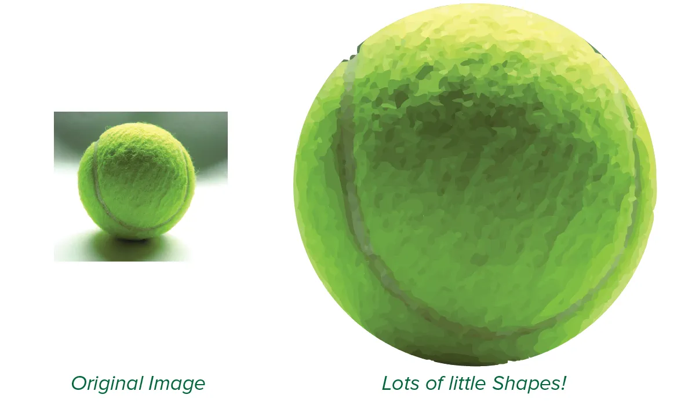
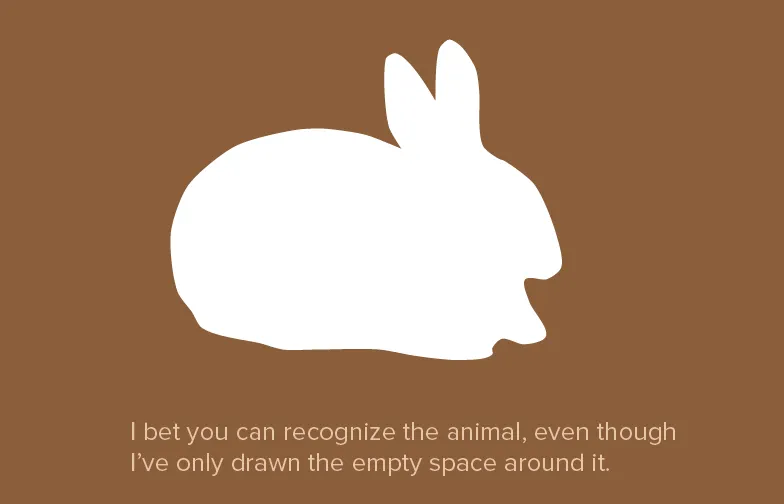
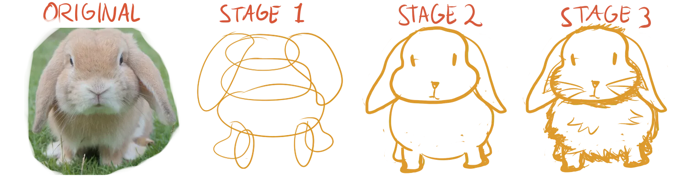
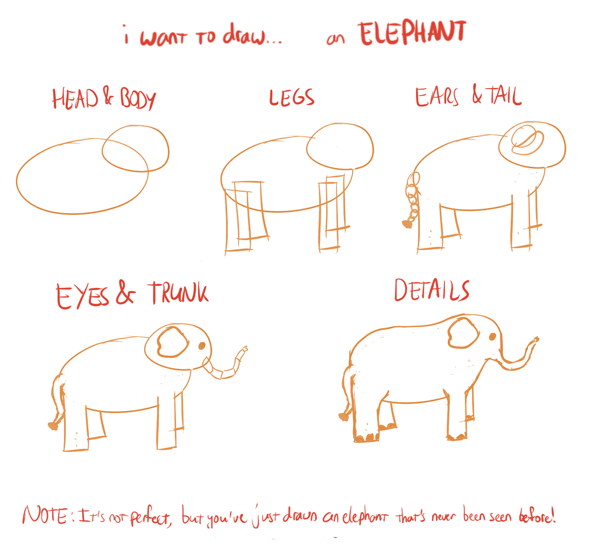

When multiple lines intersect to create a closed area, we call it a *shape*. When you look at an image closely, you'll see that it's nothing more than a bunch of shapes forming a visual illusion. I'm not talking about objects or parts of objects, I'm only talking about pieces of a drawing that are visually different. A shadow, for example, is a shape as well, just as a highlight.

## Drawing from Real Life

If you (only) want to draw from real life, we're already almost done here. I only need to explain a few things about shapes and techniques, and you're good to go. (You can draw confident lines. You can pick the right lines for the job. Everything is a shape made from lines. Done!)

I, however, think you want to be able to draw anything, not copy objects in front of you. The rest of the course is focussed on achieving that goal: drawing anything you can imagine.

Let's talk about two common methods for drawing from real life: **contouring** and **block-in**.

### Contouring

This sounds the simplest, but actually is the hardest. I can explain it with a few sentences. It might take years before you can look at something and immediately identify the contours. 

Contouring simply means that you copy every shape you see directly to the paper. You don't need to know the structure behind the objects in your picture or how shading works. The individual lines you draw don't _mean_ anything. You see the shape in front of you and you copy it. Only once you've added all the shapes, will the drawing turn out like the real life object.

{}
Animation demonstrating the method of contouring, for drawing an object from real life.
{}

### Block-in

This method is a simplification of the contouring method. How? By reversing it.

Instead of drawing objects shape by shape, you draw the shapes around it (at the edges of the paper) where *nothing happens*. When done carefully, this eventually reveals the shapes you were trying to draw. The more often you refine your blocks, the smoother your shapes will be.

{}
Animation demonstrating the block-in method of drawing an object from real life.
{}

## Positive & Negative Shapes

The block-in method revealed an important principle. Any drawing is a set of so-called *positive* and *negative* shapes, balancing each other. 

When you hold your pencil up in the air before your eyes, you see a pencil shape (obviously). Your focus is on the pencil, which is why it's called a positive shape. There is, however, something else you also (unconsciously) see: the space around the pencil. This space is mostly ignored by your brain, as it is blurred and empty, and therefore a negative shape.

Many people focus on drawing by trying to get the _positive_ shapes right. They get all the attention! But if you're stuck, or you can't find a clear positive shape to use, it helps by focussing on the negative space instead. Mark all the space you certainly _don't_ want to use or that should _not_ be filled. That's why these are also sometimes called **trapped shapes**.

As you can see, positive shapes are surrounded by negative shapes. Objects are surrounded by empty spaces without any object. When it comes to drawing, both of these shapes are important.

## The Four Rules of Shape

It's possible that "just draw the shapes as you see them" is a bit overwhelming. I will therefore list the four rules of shape, which are always a good starting point.

1.  **Start Large**. Draw large shapes first, then smaller shapes. Start with a general outline of each object, or maybe even a general outline of multiple objects at the same time. Squinting your eyes or rotating the image can help notice the largest of forms and shapes.
1.  **Enrich**. Distinguish between those major shapes by adding details and shading. Look for shapes that enrich what you already have, such as highlights, shadows, reflections, patterns, or textures. All of these are also shapes by themselves, although not always as obvious or simple as you think shapes to be.
1.  **Connect.** Tie shapes together to simplify the drawing, and make your life easier. You might think this adds to the confusion, but it actually greatly reduces it. Instead of adding all sorts of small scribbly lines and subtle tone differences, everything is unified and the viewer automatically interprets it the right way.
1.  **Think "Negative"**. When you see a trapped shape, draw it. Trapped shapes inherently reveal the positive shapes.

Note that points 2&ndash;4 are in no particular order. As illustrated with the drawing below, you can apply them in any way you like.

## Imaginative Drawing

You're surely eager to know how you can draw anything that pops into your head. For this, the only "method" available is called **construction**. 

Everything can be constructed out of basic shapes. A laptop is nothing more than a rectangle with some details. A roll of biscuits is a cylinder. A light bulb is a sphere/ball with a smaller cylinder at the bottom.

By deconstructing your idea into basic shapes, you get a clear path to drawing it.

Because basic shapes are easy to learn and to draw, like *rectangles* and *ovals*. I'll also include some variations on those, like *ellipses*, *trapezoids*, *egg-like shapes*, and more. Next chapters will tell you all about those!

## Exercises

After such a general and abstract chapter, there aren't really exercises to be done. All I can say is: if you have the time, find an interesting object, and try drawing it using the methods I provided. Especially try to see and draw the negative shapes. Go wild!