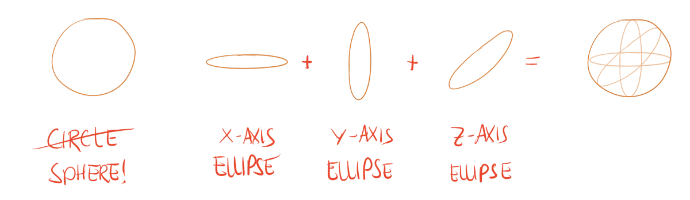
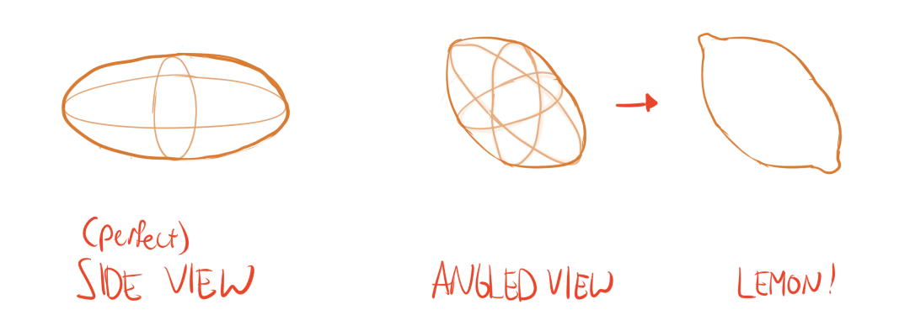
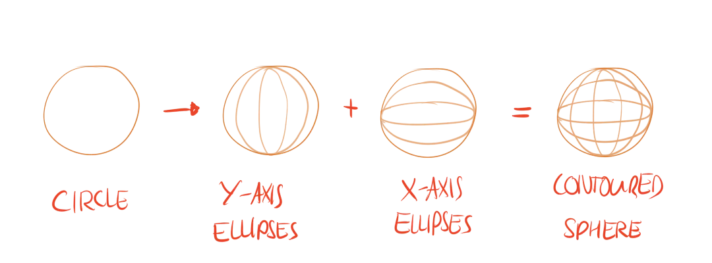

I explained how many drawings are cube-like. This mostly refers to (human-made) _objects_. Anything in nature, any living being, is more organic and will be more **like a sphere**.

Drawing a sphere, however, might be one of the hardest things to do for beginning artists. It's a combination of two hard things:

* Drawing a perfect circle
* Foreshortening it correctly to get contour lines and form

Fortunately, I've already explained how circles and ellipses work. You should have some practice by now! Which should make things a lot easier.

## What's a Sphere?

A sphere is just a ball. Earth is a sphere, just as a wheel, orange or tennis ball. 

Technically, a sphere is what happens when you add together three different circles---one in each main direction. (The *x*, *y*, and *z* axes, remember?) 

Even though spheres look *exactly the same* from any angle, it's important to understand how they are *constructed*. Otherwise you can only draw balls and nothing else using this shape.

## Special Spheres?

Yes, special spheres. The sphere is a three-dimensional circle, which means it is equally large in all dimensions. 

But, what if we want to stretch or shrink the sphere in certain directions? (Think of a kiwi or an egg.) Then we'd get a *spheroid*!

These may seem difficult at first, as they *do* change their shape when you look from different angles. That's why I keep talking about construction: it helps you in difficult drawing times. 

Draw the three ellipses that make up this spheroid. Then connect the ends with a nice curve.

{}
As you see in the picture, spheroids take on a shape *similar to* the ellipse in perspective. The main difference in most of the cases, is that this ellipse has much longer flat sides.
{}

Try to smoothly draw through the corners. You don't want "pointy" ends to the ellipse. I made this mistake for a _long_ time, wondering why all my ellipses looked weird and ugly. It was because I drew them more like eyes :p

## Contour Lines

Because spheres (usually) don't have hard edges, using the contour lines of a sphere is often the only way to show its three dimensional form. (The other alternative is using shading as a soft edge, but more on that later.) 

Additionally, contour lines can be used to establish the direction in which the circle is rotated. This is useful, for instance, when drawing a head looking in a certain direction.

To draw the contour lines, draw multiple ellipses of decreasing degree along the *x* and *y* axis. These divide the shape, just like with rectangles, but this time we're using curves instead of diagonals. 

For a standard sphere, these ellipses would be pointed in the vertical and horizontal direction. If your sphere is rotated, these "constructive ellipses" turn with it.

{}
The *x* and *y* axis are always perpendicular. Your ellipses should be as well.
{}

## Exercises

Just like the cube, try to do these as often as you can.

### Simple Spheres

Draw a sphere. Add contour lines to it.

{}
Basic exercise to understand basic spheres.
{}

### Special Spheres

Draw a spheroid. Having trouble? Start with perfect side view, as it's much easier to do. Slowly rotate and foreshorten, in small steps. Try to get each step right before taking a bigger one.

{}
Advanced exercise to draw spheroids.
{}

### Orienting Spheres

Draw a sphere. Use the contour lines to make it *face* the direction you want. If you want, add simple eyes (and nose) to make it into a face. (This also helps to check if you were correct.)

{}
Exercise for rotating / orienting your spheres.
{}