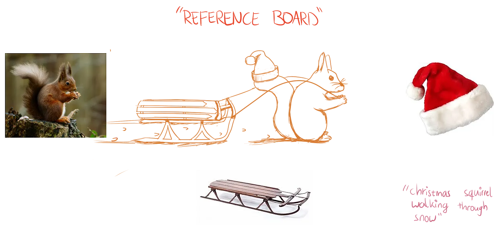
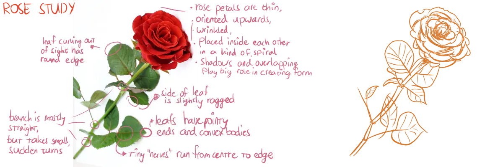
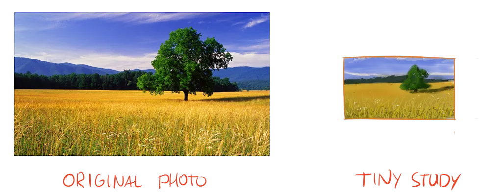

I've shown you how to construct anything out of basic shapes and forms. I've shown you how to add realism and enrichment to your drawings. Nevertheless, I'm guessing you still can't just draw anything that pops into your head. 

Somehow, imagining and picturing "dragon" in your head is different from actually getting it on the paper. Humans just can't memorize every single detail their eyes have ever seen, nor create an equally detailed and complex image from imagination.

## Finding References

Some people think it's bad to use references and look at what other artists have done.

It's actually one of the first steps in any project---and you are doing yourself a huge disservice by ignoring it. 

Why make your life harder? Why draw a dragon from the top of your head, when there are thousands of examples that _show_ proportions and shapes that work for dragons?

So gather *references*, as much and as often as you can. Those can be anything that helps or inspires you, such as photographs, other drawings, other objects, maybe even books or music.

The most common practice, however, is drawing from photographs. Especially when working on the computer or drawing from imagination, I always start by looking for pictures that resemble what I want or that show certain parts that I'm thinking of including. 

The obvious caveat here is that you're inclined to just trace the image. This reduces your creativity and interpretation to a level near zero. It also means you still can't draw from imagination: you can only imagine references, then 100% copy those :p

While starting out as an artist, this can be a good way to get a feeling for the whole drawing process. But I strongly discourage this practice later on. 

Look at photographs for inspiration. To remind yourself what something looks like. To solve some technical problems (with for example shading or perspective). To see which specific shapes combine to form something like an eye or a foot. Don't trace or copy anythin directly.

## "Steal like an Artist"

A great way for beginners to get started, is to copy and emulate other artists, be it their general style or their actual drawings. There's a lot to learn from the "masters". It is far easier than having to come up with something all by yourself. 

_But that is stealing! Where's the creativity in that?_

Printing someone else's painting and selling that, is stealing. Grabbing someone else's work and pretending it's your own, or putting it directly into your own, is stealing.

Anything else isn't. In fact, it's the backbone of where human thoughts, ideas and inspiration come from. We look at the world around us, learn from it, and get inspired. 

Every thought has probably already been thought by someone else. Your great idea was probably also the great idea of someone two hundred years ago who just didn't have the time to execute it.

Even if you _try_ to 100% copy someone's work or style, you will probably fail, due to lack of experience and the incredible precision/skill that's involved.

So get inspired. Gather references. Follow artists you like. Look at the elements of their style and copy those to your own style.

You will become a more well-rounded and skillful artist _much faster_. Which also means you can stop looking at other artist's work more and more as time goes on, because you are strong enough on your own.

## Performing Studies

A *study* simply means you find a reference and try to copy it. The objective is not to get a beautiful drawing you can use for something, but to _become better at drawing_. 

Forget everything you (think you) know about something. Instead, inspect every line, curve, shape or texture in your reference. Write down your findings and comments, write down what you tried and what didn't work. At the end of a study, you should know all about how to draw a specific thing in the best way possible.

This knowledge is obviously useful if you want to draw this thing later (for real).

But the real benefit is that you start to *see* the world in a way that allows you to draw it. Most visual ideas have general truths to them, whatever the style. And the more general truths you know, the more you can extend them to drawing anything from imagination. These can be simple yet extremely useful findings, such that hair always has pointy ends.

Another method is something called a *tiny study*. Look at a reference and copy it---but in a much smaller frame. This forces you to identify the main shapes, colours and composition in your reference. It also speeds up the study of large landscapes.

Whenever you don't know what to do anymore with your project, do a study or two. Next chapters will look at more ways to acquire the right mind-set that allows you to draw anything you think of. And how to not get stuck in a project.