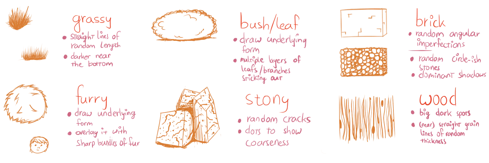

With great lines and shading, you can now draw amazing objects. But only if they are smooth and solid! Nearly all things in the world have a visible **texture**, so what should we do with those?

Well, just ignoring them would be the *last* thing to do. Instead, you need to find a way to *simulate* the textures, a way to create the visual illusion that the drawing has texture. I say visual illusion, because it's impossible to perfectly copy a texture (and extremely time-consuming). 

We want to find types and patterns of strokes to *simulate* the texture we want. To create a shortcut that gives any viewer the idea of the right texture, without having to draw every single strand of hair, or every tiny hole or bump in a block of wood.

## Some Possible Methods

Unfortunately, there are no hard and fast rules for all textures. All I can do is give you general guidelines. Most of the time, studying some reference gives a feeling for how a certain texture should work out in a drawing. Next chapter will discuss that.

### Articulate & Suggest

First, find out the general shapes of your texture. Try to get those on paper as perfectly as you can. Then, to fill in the rest of the texture, find a type of stroke that *suggests* the texture. 

It shouldn't be perfect, just enough to give the viewer the feeling that a certain texture is in place. In fact, the most common issue is that people draw texture _too_ perfect and symmetrical. 

When they draw a block of wood, they distribute the roughness _evenly_, with the lines evenly spaced out and at the same size. But the whole idea of texture is that it's varied, and organic, and plays with light in unpredictable ways.

Instead, I like these techniques:

* Grouping: group your strokes or "texture areas" together, leave some space between the groups.
* Contrast: do one pass using very big and loosely drawn strokes, then another pass for contrast using small and more detailed strokes. The _contrast_ here is crucial: don't make these passes too similar.
* Edge detection: mostly add texture to the _edge_ or _outline_ of an object. It's simple but effective. Because humans mostly recognize what objects are by looking at the _edges_, by comparing it with the environment and objects around it.

In general, **imperfection is key**. In real-life, all objects have at least slightly different textures. Copying the exact same texture for all objects makes your drawing look very unnatural. This is one of the easiest signs of the amateur artist: they just copy-paste a texture or pattern everywhere, instead of drawing it again with variatio. Even if the texture itself looks _great_, the copy-pasting immediately makes it look _bad and lazy_.

Try to repeat the overall pattern of the texture, yet vary it (slightly) every time you do so.



### Sense the Stroke

If you have the object in front of you, or you have a very good imagination, it's of course always possible to just feel the texture of the object. Where does it have bumps? Where does it feel rough? At the end of this chapter, I'll provide more concrete workflows for when you know what your texture is.

### Contrast & Unify

As I explained earlier, humans understand the world through comparing. To make a texture stand out, contrast it with another one. For example, if everything in the drawing has furry textures it will probably look like a mess, but if you alternate between furry creatures and grassy landscape, the drawing will look really soft.

Alternatively, to combine objects and strengthen relationships between them, use textural strokes going through both objects. Essentially, this applies the same texture to both objects as if it were one.

### Texture in Perspective

One thing that people often forget with textures, is that they also change at different angles or distances. To make sure your textural strokes match the current perspective, 

* Draw some perspective lines from your vanishing points through the texture
* Align parts of the texture with them. 

If that's not possible or too much work, simply try to get a feel for how your texture would wrap around the object. And how it would change if you view it from a distance.

## Texture Drawing in Practice

Here I'd like to go over creating six very common types of textures. Not only can this help you directly (in case you needed this exact type of texture), but it also provides more insight into the world of texture drawing. I encourage you to practice drawing each of these textures at least once.

The image at the start of the chapter displays most of these.



### Smooth

The texture of smooth objects can only be conveyed through shading. It should be soft and gradual. 

Additionally, this means it's impossible to have spots of sudden darkness or brightness. Everything is smooth. In real life, such objects are scarce though.

### Coarse

Coarse objects follow the same rules as smooth ones, but also have certain spots ("dimples") of darkness/brightness all over the texture. Random short lines here and there can also help. Overall, coarse textures are darker, as less light is reflected toward your eyes.

### Wood

With wood, we need to make a distinction between *flat texture* and *spatial texture*. 

* Flat texture: lines that are on top of an object's surface. 
* Spatial texture: small grooves and bumps (with actual depth) that change the look and shading of the object. 

With wood, we have both!

First draw some dark and light grain lines on your wood. Place random dots at different sizes over your texture. Make sure you don't overdo it and don't place them too "perfectly". This is your flat texture.

Now add shading to the largest grain lines. These lines have spatial texture, which means that they have small highlights at one side (where light hits), and small shadows at the other (where light doesn't hit).

Finally add shading *on top of the details* like you would with a smooth or coarse object (depending on your type of wood). On the computer, this can easily be done by putting it on a new layer and lowering the opacity. With your hand, you just need to add lighter and more careful shading in areas with details.

### Fur

Fur is messy. You should allow it to be that way. 

First give your object its base tone by crosshatching it entirely. 

In darker areas, add shading by means of more and more crosshatching. In lighter areas, do the same but with a light colour. If you're not working on computer, you can add fur highlights by erasing random strokes of the texture.

Fur is the only texture where shades and highlights almost always overlap. Different hairs go in all directions, which means that different coloured strokes can all overlap. On top of that, the contour of the object is changed as well with this texture. Instead of a straight contour line, draw random strokes over it sticking out at all places.

### Stone

Stones are the same as a smooth/coarse texture (again, depending on the type of stone). 

Start with a stony base colour and shade it as usual. Then, add *cracks* to the stone. These are quite thick, sharp and random lines (just as with the wood grain). 

But, even more so than with wood, these are spatial textures. They need highlights and shadows to make them pop out. Additionally, you can add random dark and light dots to indicate even more bumpiness or bits of stone chipped off.

### Reflective

Reflective shapes combine two textures: their own and the ones around them.

First, draw what is being reflected on the object, using the same colours and shadows. Remember that reflective shapes don't magically add new shadows, they simply reflect back what they see. Also remember that there's a horizon out there that it should reflect, which means that a reflective shape never has parts that show nothing.

Now shade the object as if it were smooth and add its own colour to the mix. Reflective coarse textures are also possible, but they heavily distort their reflections, which means you can go wild.