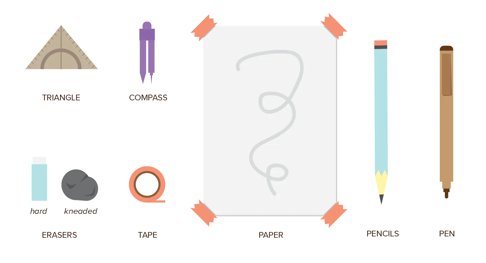

We can't draw with just our finger. Let's get some tools set up. These days, there are two distinct ways to draw: 

* Plain old pencil and paper (the traditional way)
* Using a computer and drawing tablet (the digital way)

Whatever way you choose, the exact same principles apply. I would go so far as to say that digital painting has numerous advantages over the traditional method. Quick undo, quick new canvases, line smoothing, some effects are built-in or easier to accomplish. 

I recommend trying both methods. They force you to approach a drawing in a different way, use the properties of the medium to your advantage, which is very educational.

## The Tools of the Trade

### Traditional

For traditional drawing, I recommend these tools:

-   **Paper**, preferably a few stacked on top of each other.
-   **Pencils**, with different levels of thickness (and sharpened points, of course).
-   **Erasers** of different sizes. Use proper erasers that don't smudge the paper after you've used them once.
-   **Pen**, either regular or felt (tip).
-   **Tape**, to make sure your paper doesn't move as you draw.
-   **Triangle**, to be sure about your edges and straight lines.
-   **Compass**, to make precise circles.

Additionally, it helps to get a piece of see-through plastic that you can paint on with markers. This way, you can look at objects and directly copy them on the plastic, and later copy those to the actual drawing (paper).

### Digital

For digital drawing, I recommend a tablet with its own screen, but which isn't its own computer.

What does that mean? When I got serious about drawing and graphic design, I bought a Surface Pro. That's a drawing tablet and computer in one. The result? If one component fails, they all fail. You pay a lot of money to get something that will break down or cause issues much sooner, and is harder to replace.

You probably already have a decent computer. Buy a tablet you can plug into that. But buy one with its own screen, so you can _look at the tablet_ while drawing, instead of _at the computer_ (which is endlessly confusing).

## The Talk of the Trade

I tried my best to keep fancy terminology out of this course. But there will always be core concepts that benefit from clear names to identify them. 

I must say, however, that not all these names are fixed. Most artists prefer their own version of a concept and have given different names to the same principle. When that's the case, I will mention it. 

It also means: if you can find a better way to memorize or understand the technique, use it!

The next chapter will provide an overview of the main terms and principles (the "Laws of Drawing"). I do this to show you where we're headed and to already make you familiar with the terminology.

All chapters after that will explain each law in detail.

Don't try to read and memorize it. Do the exercises ad practice it! Remember, only 20% of your skill comes from reading tutorials, the other 80% comes from practicing and training.

At the end of the course, you should be able to draw anything, be it from real life or imagination. How you fill in the details or make your drawing unique, is completely up to you---I'm only here to get you started.

## Some good habits

Before we fly into the world of drawing, it's useful to acquire a few new habits.

**Sign your drawings**: every time you finish a drawing, quickly write down the *title*, *date*, and your *signature* somewhere in the corner. This allows you to keep track of your progress as an artist. Additionally, if you feel like it, leave comments at the back about what was difficult, or what you like or don't like about it in particular. You might think you're wasting your time, but you'll love yourself for doing it consistently later on.

**Keep your tools in good shape**: keep your tools clean and stored in a safe place that is easy to reach. Obviously, dirty or broken tools hinder your drawing process. Tools that are hard to reach might make it difficult to motivate yourself to start a drawing.

**Organize**: keep all your drawings stored together in some sort of map. This way, you can easily look through them to see how far you've come. Or use them as reference when you're in doubt about how to execute some idea.

Learning to draw is actually about two things: 

* To *see* the world in a different way
* And to *draw* what's on your mind. 

Both require lots of time and practice to evolve and strengthen. It took me _years_ of designing before my brain had some intuitive understanding of colors, space, communicating visually, and I didn't have to make every decision in a conscious way.

This might make it difficult to stay motivated. That's is why I encourage looking at your _progress_ regularly. And doing many drawings without worrying if they are any good.
