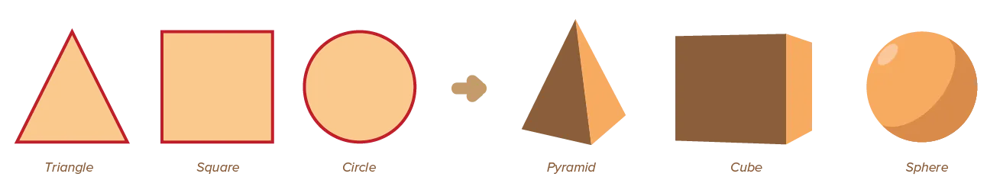

Stepping up our game, we add another dimension. Shapes had two dimensions: width and height. Now we arrive at the biggest elements with as much as three dimensions.

> **Form** = a collection of shapes creating the illusion that an object is 3D. That it has _mass_ or _volume_. We say is has width, height and _depth_.

When considering form this way, I obviously talk about 2D designs. If you design an actual 3D project, you don't need multiple shapes to fake perspective and mass. You actually _have_ 3D!

Form is what happens when multiple shapes come together in an elegant way to create a bigger element with more dimensions.

Creating this illusion of three-dimensional space is a very important aspect of any design. It's also what most beginners completely overlook. They draw something as they see it, fill it with one color, and think they're done. The professional designer will know where to add shadow, highlights, perspective, and other elements that help create the illusion of form.

Form creates a sense of depth, realism and naturalness. Adding that third dimension makes some elements seem to pop out of your design, and some to recede. Adding depth adds a texture and dynamic quality to a design, even though the page is still flat.

## Types of Forms

As stated in the introduction, forms can be real or illusory. 

* Real form contains actual volume or physical weight, and are three-dimensional objects such as sculpture, architecture, and packaging.
* Illusory two-dimensional forms are merely perceptual. They give the illusion of three-dimensional space through several graphic conventions.

Because this is a course on graphic design, displayed on a web page, I will focus on the latter.

## Basic Forms

We could construct any shape out of basic shapes. The same is still true for form: we can use basic forms to establish any form. These basic forms are direct extensions of the basic shapes: squares becomes cubes, circles become spheres, triangles become pyramids.

## Projections

When we convert a three-dimensional form into two-dimensional shapes, it's called **projecting** onto a flat surface.

Several common projection types are ...

-   **Isometric:** Easiest of projection methods. All three visible surfaces of a form have equal emphasis. All axes are simultaneously rotated away 30 degrees from the picture plane and kept at the same angle, all lines are equally foreshortened, and the angle between lines is consistent.
-   **Axonometric:** An axonometric (*plan oblique*) means forms are viewed from a skewed direction. This reveals more
    than one of its sides in the same picture plane. To achieve this, axes are rotated 45 degrees.
-   **Linear Perspective:** Realistic perspective, but also the hardest to do. It simulates optical distortions, making near objects appear  large as far objects become small. The angle at which objects recede reflects the position of the viewer. Parallel lines converge in the distance or at the horizon.

{}
If you want to learn how to _draw_ realistic perspective, I suggest you read the corresponding chapters from the [Drawing](../../drawing/) course
{}

Isometric and axonometric projections depict volume without making elements recede into space. The result is often more abstract and impersonal. Additionally, all vertical lines remain vertical and all parallel lines remain parallel. This isn't realistic, so why use this?

* It's easier to draw, but people still understand the spatial meaning
* It allows revealing multiple sides of an object, no matter where the camera is positioned. Useful if your design _has_ to show form or information in all cases.

Of course, you can project 3D to 2D _any way you like_. Circular projections, Non-Euclidian projections, you name it. But the once above are most common and easiest to understand.

## Principles of Depth

Aside from those projections, there are visual cues that signal the viewer that depth is present in a design. These can---and should---be combined with projections, but can also be used outside of them. 

{}
You can make a bunch or circles seem to have depth simply by adding shadow behind them. No need to create a perspective, no matter that the rest of the design is completely flat.
{}

The visual cues suggesting three-dimensional objects are:

-   **Overlapping:** The object that is being overlapped seems farther away than the object that is overlapping it.
-   **Size:** Smaller objects are perceived to be farther away.
-   **Height:** The object higher up the page is perceived to be farther away.
-   **Texture:** When a surface texture varies in density, areas of greater density are perceived to be farther away than areas of lesser density.
-   **Shading:** Shaded areas are perceived farthest away from the light source, and light areas as closest.
-   **Atmospheric Perspective:** Objects that are bluer and blurrier are perceived to be farther away. Alternatively, if some components of the design are *extremely* close to the viewer---but not the main point of attention---you can blur them to make the design easier to look at.

Of all these cues, *overlapping*, *size*, and *shading* are by far the most important. In the real world, the surfaces of a form curving away from the light appear darker than surfaces facing towards it. This effect suggest the rounding of a two-dimensional shape into a three-dimensional form.

Although shading seems like a difficult and elaborate process, light and shadow can be expressed in many different and simple ways. I don't use the word "trick" easily, but I must admit there are many "small tricks" in graphic design for simulating form.

As I stated in the introduction, these tricks are often what differentiate the "simplistic amateur design" from the "professional well-rounded design". It's all about pretending a few lines on paper have actual _form_, and _depth_, and _mean more_.

Therefore, next chapters will be about those tricks to try. Let's start with *light*.

## Conclusion

Remember how I mentioned three components at the start? Visual elements, visual properties and visual principles?

This concludes the chapters on _visual elements_! Yes, we're already done. That's what happens when you explain the basic shapes ... and everything is created from those.

(Think about it: are we missing any element? What can you _not_ create using a point, line or shape?)

The tricks I mentioned above are all about changing _properties_ of existing elements. That's the section you should read next.