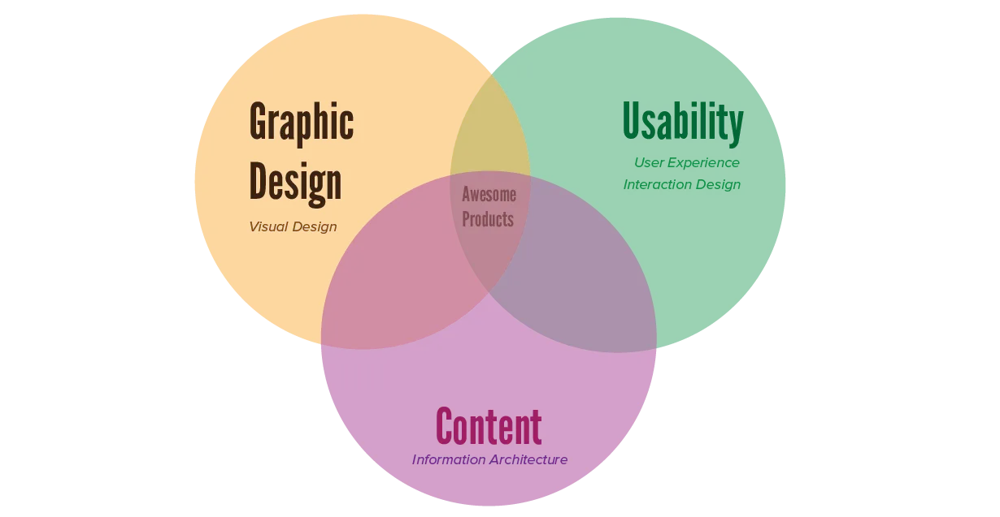

Design has always been a large part of our lives. Whatever product you make, you want it to be both beautiful and simple to use / understand. Even stories need a form of visual design---good typography---if they want to be succesful. 

Because design is always present in any and every project, I think *everybody* benefits from knowing the basic principles underpinning the skill.

## The Two Fields

There is, however, an important distinction between two fields of design: **graphic design** and **usability (design)**. 

* Graphic Design is about how a product looks and feels, be it a photograph, or webpage, or an actual real-world object. It's mostly about _looks_.
* Usability is how a product works, sells and interacts with its users. It's mostly about _function_.

This course mostly considers the first one: *graphic design*. Simple ideas about what looks good (to our human eyes) and what is visually pleasant (to those same human eyes).

But, these two fields are closely related and influence each other all the time. Creating well-designed products will always be a combination of applying principles from both fields. To make a design *usable*, everything has to be *visually clear*. To make a design _look good_, every part needs to be at the right place and communicate the right function.

## The Two Purposes

Why do I explain this? Because these two fields directly translate to the two _purposes_ that EVERY design has.

-   **Aesthetics:** You want a design to convey a sense of beauty. It needs to leave a positive impression, make somebody feel positive emotions, make people happier and impressed by looking at the design.
-   **Functionality:** You want a design to convey information of any kind. People need to be able to understand things from a quick glance at your design. And they need to learn about your product, company, mission, or story by looking at the design.

The best designs are able to **achieve both**. But you'll notice they are not easily combined. Some elements of a design increase beauty but decrease usability, while other elements are very practical and efficient but don't look so good. Keep this distinction in mind. Decide which of the purposes is most important for your design before you begin.

## What this course is not

Obviously, there are even _more_ fields related to visual skills. These receiveded their own course:

* [Colour Theory](../../colour-theory/)
* [Typography](../../typography/)
* [Drawing](../../drawing/)

I highly recommend reading those as well, at some point. This course is about general principles. The course on drawing, for example, teaches how to _actually_ put the lines you want on paper, how to _actually_ apply the color or perspective you think you need.

Good luck becoming a designer!

{}
This course, with all three sections combined, is quite long. Don't let it frighten you. It's because I try to break everything down into the absolute smallest parts, so chapters can be quite short. Also don't try to memorize everything. View this course as a first step and use it as a "reference" once you start doing actual projects.
{}