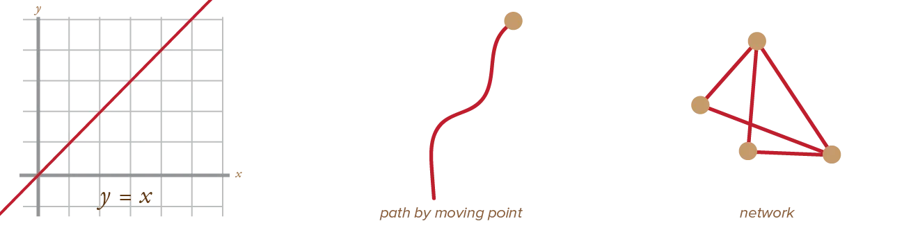
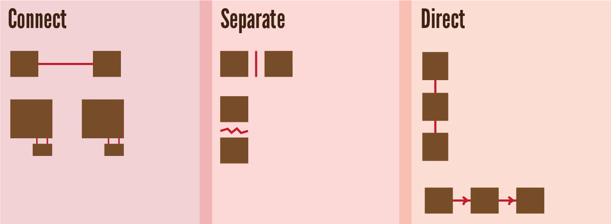
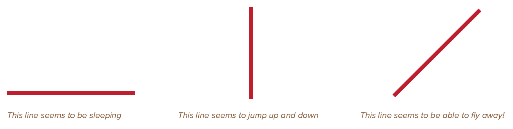
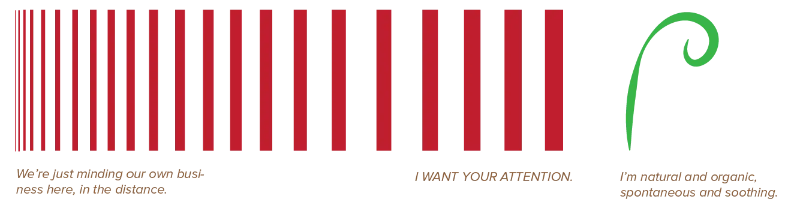
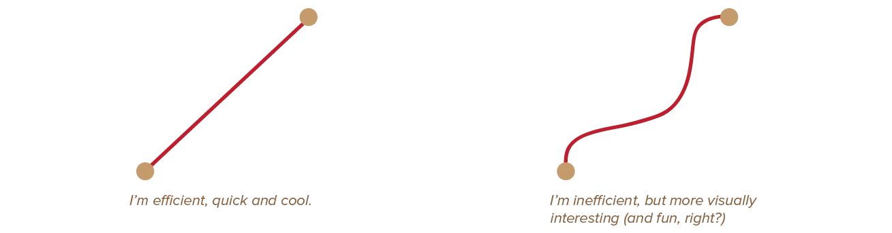
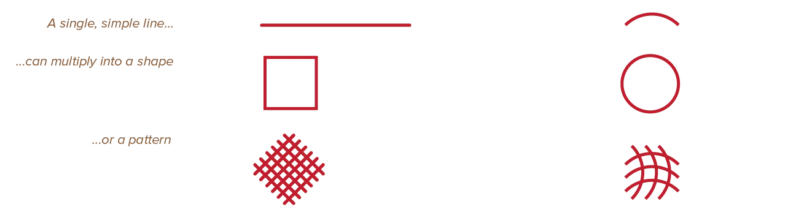
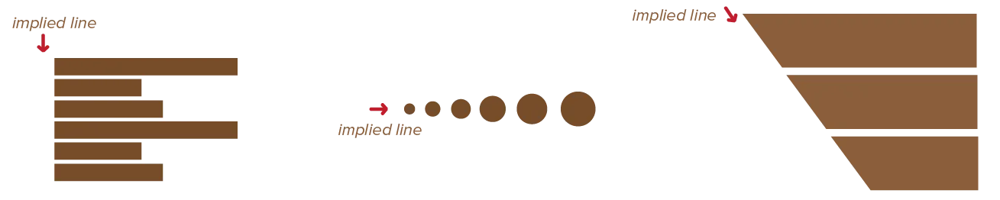

In a mathematical sense, a line is an infinite series of points next to each other. Where points had _no_ area at all, lines have length, but no breadth.

In the case of design, however, lines have more flexible definitions. 

* A line can be the path between a start and end point. 
* A line can curve, change thickness, and even have gaps.
* A line is the path created by a moving point.

> **Line** = a series of points, creating something with length but no breadth, implying strong motion

## Individual Lines

Lines, on their own, can fulfil many functions. The most important are:

-   **Connect**: When a line is smooth and easy, the eye follows it subconsciously. We can group multiple elements together by drawing smooth and natural lines between them.
-   **Separate**: On the other hand, when a line is rough and irregular, it impedes movement. By adding rough lines (or lines that go against the general direction) between elements, we can show there is no connection. This way, lines create boundaries and edges between multiple shapes.
-   **Direct**: Because lines are automatically followed by viewers, they are the easiest way to direct attention to something. Or to establish an order in which a design should be observed.

Additionally, each line brings energy and emotion with it, whether you want it or not. What feeling is that? It mostly depends on *direction*, *thickness* and *path*.

## Direction

**Horizontal Lines** are stable, calm, and serene. They rest on the paper, balanced.

**Vertical Lines** are more exciting, active, and powerful. They are defying the earth's gravity, and imply energy or reaching towards heights or heavens.

**Diagonal Lines** are even more dynamic, and imply motion or tension. Because of this, they also give a feeling of depth.

As you can see, as opposed to static points, lines are inherently dynamic gestures.

## Thickness

**Thin Lines** are soft and restrained. They are subtle and seem to recede in the distance.

**Bold Lines** communicate strength and power. They grab attention and seem to come forward in space.

Lines with **varying thickness** (such as drawn with a brush) convey more fluid and undisciplined messages. Something more organic, informal, free flowing. As opposed to perfect or mechanical lines that convey precision and disciplined messages.

## Path

**Straight Lines** are mechanical, formal and cold. They are simple, effective and efficient, but have more negative or unnatural feelings associated with them.

**Curvilinear Lines** are natural, approachable and comforting. They are harder to incorporate without creating total chaos, but you get more warmth and likeability in return.

Path is the most important factor in determining the quality and character of a line.

## Combining Lines

We know what lines do on their own. What happens when you combine them? They create shapes and geometry.

Without lines, the triangle, square and circle wouldn't exist. When lines multiply, they can describe planes, shapes, volumes, and textures.

Because of this quality, lines also serve as the edges of objects. They mark the contours of elements and can leave positive marks or negative gaps.

All of this might sound obvious. But it's good to realize this consciously. When you draw a triangle in a design, you are also drawing three straight lines. And now you know what message / feeling that automatically conveys.

## Implying Lines

Lines are perhaps at their strongest when they're invisible. By aligning and shaping elements in a certain way, we *imply* a line. There's no visual mark, but our eyes recognize the pattern and pretend there's a line. 

This creates unity and cohesion. It also engages the viewer with the design and makes them more interested. 

Because things line up, it's easier to find relationships between elements and understand the groups of information. On the other hand, the viewer has to explore and find these implied lines himself, making the design come to life. 

{} 
In typography, characters group into lines of text. The lines are grouped into columns, because they all start from the same horizontal position. You can clearly see the lines, even though they aren't explicitly drawn.
{}

This is a very important topic and will be discussed further in later chapters.