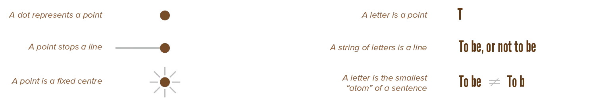
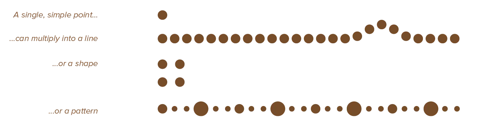

The smallest possible visual element is a *point*. In the mathematical sense, a point indicates a precise location, but can't be seen or felt. It's a pair of `(x,y)` coordinates without area or mass. It's also the smallest unit of measurement. One point is equal to 1/72 of an inch, and we use it to describe font size and thickness of paper stock.

Graphically, however, it must take on some sort of shape. (Otherwise you obviously can't see it, so it's not a part of graphical design!) 

> Point = any element within a design that stands alone with a recognizable center.

{}
In a field of text, every letter may be considered a point. Or the center of a closed square may be considered a point.
{}

Even though a point is the smallest *possible* element, it doesn't necessarily have to be tiniest thing in a design. Usually, points take form as dots or small circles. 

Because of these characteristics, points are the best way to 

* Indicate single data points 
* Individual and independent information.

The real power of points, however, appears when you use a group of them to create something bigger. A series of points creates a line. A mass of points can create shape, form, texture, tone, and pattern.

Points don't have a direction. They simultaneously radiate inward and outward. Points are therefore, by themselves, perceived as static and balanced. 

* If you want your design to be calm, relaxed and harmonious, points are the way to go. 
* If you want a more interesting or exciting design, opt for other elements.

A good example of this stasis is the fact that in typography, the point is a period. The definitive end of a line! 

The point stops movement and gives you a break.