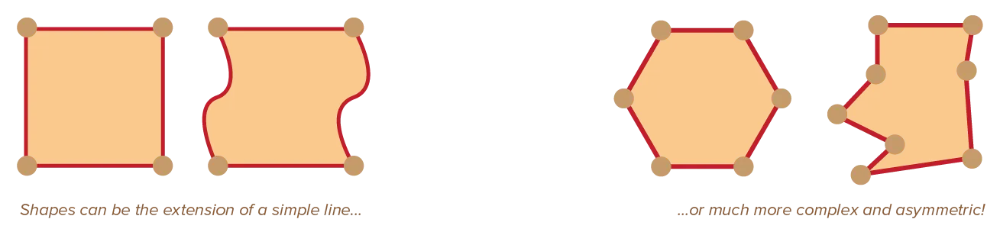
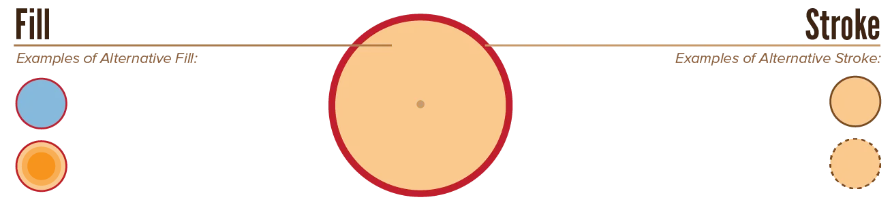
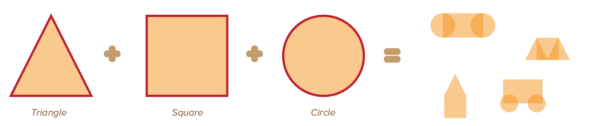
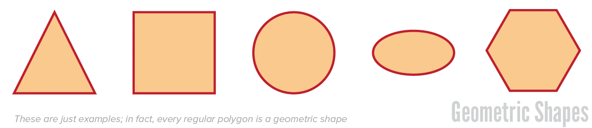
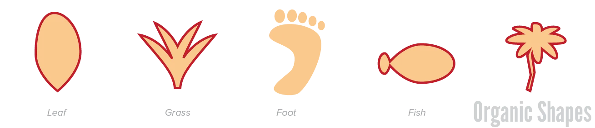
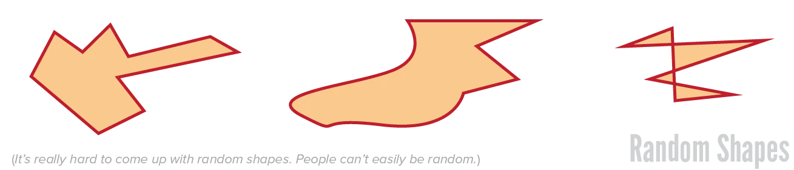
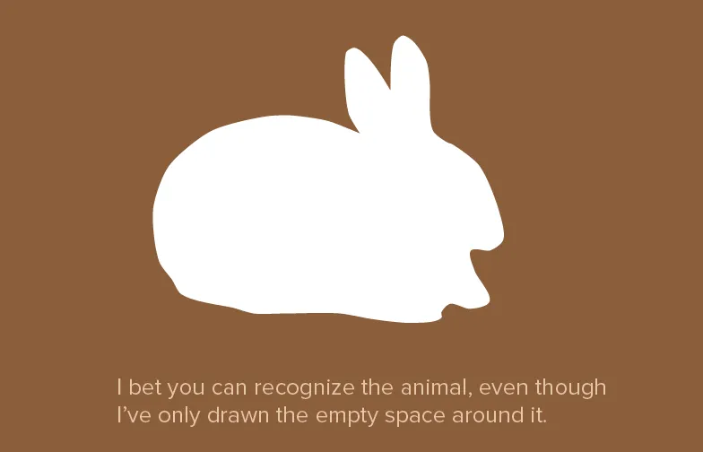

What have we learned so far? A point was just any single thing, no area. A line has length, but no breadth. What's the next logical step?

Something with both length _and_ breadth. Something that has area! This gets us the simplest of all shapes: a rectangle.

And if we allow more variation, we can get a general definition for shapes.

> **Shape** = any area enclosed by lines

A square is the result of four lines closing off an area. Circles are the result of one large, sweeping curve closing itself. Again, these lines don't necessarily need to be drawn, but can also be implied.

Whereas a point had zero dimensions, and a line had one (*length*), shapes have two: *width* and *height*. 

Similarly, we could change only _one_ thing about lines: the **line quality**.

But now we can change _two_ properties: **line** and **fill**

{}
Other words for line are stroke, outline or border.
{}

For example, shapes can be transparent but have a solid border. Or they can be filled with texture but have no visible outline. 

This means that shapes are more complex and attention-grabbing than lines or points. It also means they have similar characteristics:

* Flat and horizontal shapes are stable
* Vertical and diagonal shapes are more active. 
* Triangles point towards something and imply motion
* Circles are static and peaceful.

In general, the line and fill should _match_ well, to achieve a good-looking design.

While our definition of shape is already quite broad, you should try to understand it in an even broader sense. 

In typography, for example, a field of text is also a plane (built from points and lines). Even though letters are very complex lines, and enclose complex shapes themselves, they---combined together---form a single texture that fills a shape.

## Basic Shapes

All shapes can be created out of the basic shapes: **triangle**, **square** and **circle**. 

No matter how complex, any shape can be derived from those in some way or another. 

That's why we only look in-depth at the properties of the basic shapes. Because they automatically transfer to any composition. 

Another advantage of this viewpoint, is that you learn to simplify complex shapes. And simpler is always better in the world of design. There is no point adding visual marks to a design if the same message could be conveyed without it.

## Three Types of Shapes

In general, a shape is either *geometrical*, *organic* or *random*. To which group they belong determines their inherent message and feeling. A soft, curvilinear shape may appear warm and welcoming, whereas a sharp, angular shape may appear cold and threatening.

### Geometrical

Based on mathematical formulas. Their contours are always regularized, angular, or hard edges. We are most familiar with these shapes because they are the first shapes we tend to encounter when we are small children.

Straight lines and angular corners create rectilinear, geometric shapes. Circles, squares, triangles, and rectangles are mathematically precise, with straight lines and consistent profiles. 

As you can see, circles and ellipses are also geometric shapes, because they are symmetric and defined by a formula. (But we do call them *soft* geometric shapes.)

### Organic

Created or derived from nature and living organisms. These shapes are used more freely than geometric shapes, and are usually irregular and soft. A natural or organic shape *can* be regular, but that doesn't happen too often. Too much irregularity, on the other hand, tends to convert designs into total chaos quite quickly.

Even in nature, there is a balance between patterns and variation. That's what makes organic things look ... organic and nice, instead of like a mess. 

{}
Even though every petal of a flower will not be defined by an identical precise formula, their general shape will be 99% the same.
{}

Curvilinear lines typically create these amorphous, organic shapes.

{}
You might have noticed that the three "basic shapes" are all part of the geometric group. So shouldn't every possible shape be in that group? Well, once you combine shapes, they don't stay in the same group. Take pixel art, for example. Everything is built from rectangles---pixels. At the same time, games with pixel art can have lots of beautiful, organic shapes and nature environments.
{}

### Random

Created from invention or imagination. There is no sense of order, resemblance, or relationship to the other categories of shape. They will borrow subtle characteristics from both categories. But whether these random shapes work out and what feeling they convey is up to you to determine. Random shapes are often heavily abstracted shapes, used for icons, branding or stylizations.

## Positive & Negative Shapes

We've looked at **adding** a shape to the composition.

But there's an important process that happens automatically at the same time. Whenever we add a shape, we actually add two shapes! 

When we place a rectangle in the centre of a page ... all the empty space around it also has some shape. 

Every time you add something to the composition, you create more and more complex **empty spaces**. 

* Positive shapes are the ones you add yourself
* Negative shapes are the ones created automatically in the "empty space" around those.

Naturally, many humans feel like only positive shapes matter. But I think negative shapes are actually _more important_. Most designs have more white space, more parts that are background or without content. It follows that their shape determines more about your design, than that of positive shapes.

A better word for negative shape is simply **space**. The very definition of that word is: "that which has nothing in it". 

This isn't exactly true for our negative shapes, as it often contains the background or elements that just don't attract much attention. But, because our eye (at first glance) perceives the negative space as empty, space is a good word to use.

How then, do we shape the negative space as well? To some extent, this is accomplished automatically. Organic circles will automatically create soft and curved negative shapes. Geometrical squares create angular negative shapes. As such, fortunately, picking good positive shapes will lead to good negative shapes.

If you're still stuck, you can turn it around. Design the _negative_ space, simply by placing completely white/transparent shapes. It might even be interesting to start there: first block out all the parts of the design you're _not allowed to use_, and then try to add the positive shapes inside whatever remains.

