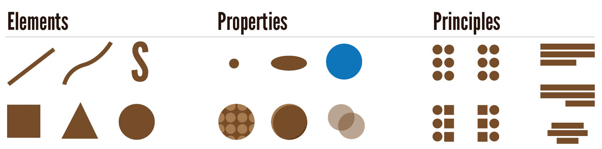

Every design has the same starting point. No matter what you're doing, you need to have a *purpose* for your design. Whether you're designing assets for a game, or designing a software's interface, or creating expressive paintings---you'll always have a purpose your design should fulfil.

Most of the time, this purpose will be a message you want to send. Even when you're just drawing a fantasy character for a game, you want that particular design to send a certain message.

{}
The hero of the game should send messages related to that: strong, heroic, muscular, powerful, important, and so on. As opposed to a minor background character, which should recede in the composition and make itself look small.
{}

Similarly, as I write this course, I think about the best way to present the information I want you to understand.

* Should I use images? 
* What sections and subsections should I use? 
* What colours should I use on the website for this course? 
* How long should I make chapters?
* Which words and sentences do I use to make the information easiest to scan and parse?

> Visual design is all about identifying the message you want to send, and then using the best visuals to send that specific message.

Let me stress once more that fifty percent of visual design is a direct result of usability design. Usually, if you focus on making your product as simple, effective and efficient as possible, its visuals will automatically take shape. Only part of the purpose of visual design is "beautifying" something, the other part is the important structuring and messaging of information.

## The 3 Basic Components

Now you, hopefully, understand why this course was broken into three sections. It's because graphic design is a _huge_ topic and I needed a few big categories to help structure it. As I wrote, the three "components" of graphic design showed themselves as the best solution. Because they start as small as possible, then follow up on each other, until you're at huge global principles about design.

I'm talking about these three components.

-   **Elements:** The actual visual marks made on the page. Examples are dots, lines, and squares.
-   **Properties:** The properties of those visual marks. We can alter these to change their meaning and effect. Examples are colour, texture, and line thickness.
-   **Principles:** Principles, rules and guidelines about how best to combine everything. Examples are alignment, proximity, and balance.

This course follows the order in which I presented these components, as every new component builds on the previous one(s). 

By splitting the whole field into such basic units, I hope to make it easily accessible to anyone. After this course, you can pick your own software or materials, and perhaps specialize further.

You should be able to do so quickly because you've learnt the *general fundamentals* of design. You didn't waste time learning what button does what in a specific software, or how to install Photoshop.

{}
Of course, on this website I can only show you two-dimensional (computer) designs. And I can't let you touch and look around actual three-dimensional objects. But all the same principles and guidelines still apply to those!
{}

## Tools & Software

Nevertheless, you need _some_ software or tools to start with. 

In general, the industry uses the Adobe products.

-   **Illustrator** (vector graphics): Software that allows you to easily create simple, clean illustrations on the computer.
-   **InDesign** (layout): designing layout and editorial pieces.
-   **Photoshop** (everything else): Perhaps the most popular software on earth. It's a good choice if you plan on using a lot of photographs and imagery in your design.

However, these are expensive, both for your wallet and your computer. A cheaper alternative that is, in my view, _better_ is the **Affinity** line.

* Affinity Designer
* Affinity Publisher
* Affinity Photo

And all of these have free alternatives as well.

* Inkscape
* Word (not really free, of course, but most people have this)
* GIMP, Paint.NET, Krita

But don't think you need fancy tools or expensive equipment. You can practice and learn all these skills with pen and paper. Even the default Paint app if you want! Good design is 95% skill and experience, 5% the tools (or budget) to execute it.