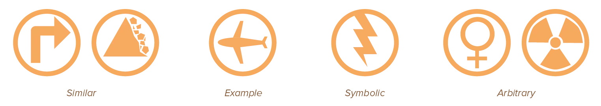

This course talked about mimicking the real world, quite often. Designs are appealing and clear, if they use human nature and physical principles we understand, instead of working against it. At the same time, I never really talked about _realism_. 

Designs are not _photographs_. They _are_ not the real world.

Instead, the whole point of design is to simplify and streamline a small part of the real world. Only capture the good parts, leave out the annoying parts. Only mimick what you need for your information, but simplify the colours, the fonts, the shapes.

A photograph of a landscape is beautiful. But it's really hard to clearly communicate a piece of text by taking pictures of trees and mountains.

In other words, every design is _abstracted_ to some degree.

The most prominent example is, of course, the *icon* or *symbol*. A simple picture that should represent something bigger, whether viewed at small or large sizes. You'll often have to find a way to simplify something into an understandable graphical element, yet still allow people to see or feel the relationship.

## Levels of Abstraction

Everything in a design is abstracted in some way, but the degree to which this happens differs. The level of abstraction ranges from low to high. 

* A low level of abstraction means a very objective design---showing all the details, the nuance, the realism---but also full and overwhelming design
* A high level of abstraction means a very subjective design---changing the details, the real properties, and what is important---but also simple and memorable design.

At the lowest level of abstraction is the photographic image. It captures something exactly as it is in real life, in all its complexity and diversity. Displaying an image is very objective, as you haven't removed things from the picture, or turned the objects into symbols. (But imagine a design built from hundreds of real-life photographs. It's hard to make that not overwhelming or messy.)

Medium level of abstraction is a recognizable form based on reality, expressed using signs and symbols. Letters, numbers, and words are in this level. We (as a society) invented words and language, but they are still _real_ and _used_ in the real world.

At the highest level of abstraction are (some) pictograms and icons. They don't bear any resemblance to actual things. They are usually made up by the designer and subsequently linked with a certain word, principle, or action.

By deconstructing your message into many abstract entities, you increase the likelihood that people will easily remember and parse your design. Conversely, it reduces realism and increases subjectivity, as you decide completely what to include and how to display it to your audience. People might understand or remember your design ... but they won't (intuitively) like it and feel it lacks a soul.

Abstracted designs have a greater chance to be liked by some, yet hated by others, based on preference. Abstraction helps express opinions and things other than information, but make sure your design doesn't turn too much into a piece of art. Balance, balance, balace.

## Icons and Symbols

It's highly recommended to practice inventing icons and using them everywhere you can. Both in two-dimensional and three-dimensional design. 

Icons are _the_ example of the point of graphic design. They are a visual shorthand for a much larger piece of information. They are the perfect thing to practice conveying information in a solely visual way.

{}
Everybody knows how to find the *off-button* on any device, based on an extremely simple made up icon created out of two lines.
{}

We identify four types of iconic representation:

-   **Similar:** Visually identical or highly similar to an action, object, or concept. Most effective for simple actions or concepts, less effective when complexity increases. (Example: a simple tree to represent a forest.)
-   **Example:** Uses images of things that exemplify or are commonly associated with an action, object, or concept. Particularly effective for complex matters. (Example: a traffic light glowing green to represent "you are allowed to go")
-   **Symbolic:** Uses images that represent an action, concept, or object at a higher level of abstraction. Effective when things involve well-established and easily recognizable objects. (Example: many games use a _gear_ sign to indicate settings or configuration. A gear itself has nothing to do with that. But it's an easy icon to recognize and this link has been well-established.)
-   **Arbitrary:** Uses images that bear little resemblance---the relationship has to be *learned* by the user. Should only be used when developing unique new cross-platform, cross-cultural or industry standards that will be used for long periods of time.

Generally, icons should be labelled at one point within the design (at least), and share the same visual motif.

