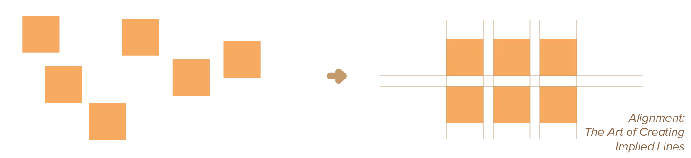
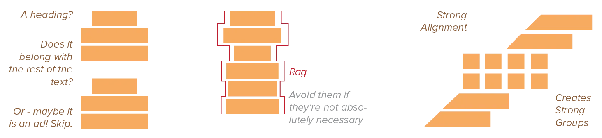
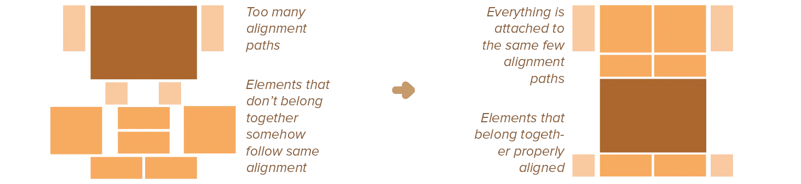

Following contrast, alignment is the strongest principle. It does the same as contrast, but reversed and more general. 

> Elements that are aligned seem to belong together.

Even when such an alignment spans across the whole width of a design, or across many elements. Instead of contrasting properties, we're trying to establish hierarchy and increase aesthetics by making elements share a common alignment.

## The Purpose of Alignment

The main purpose of alignment is to bring order to chaos. As a result, because humans like order, alignment makes a piece of design more visually interesting. 

Elements that share the same alignment are immediately recognized as having something in common. Elements on a different alignment path are recognized as belonging to a different group. 

By using several common alignment paths, we create *unity* within a desig. This leads to cohesiveness.. You don't want your design to feel like it's three different designs mashed together.

This is where the _grid_ shines, of course. Use the lines of the grid for aligning elements. Same line if same group, different line if different group.

## How to Create Alignment

There are two types: **edge alignment** and **area alignment**.

-   *Edge Alignment* requires elements to be placed such that their edges line up along common rows or columns. Alignment along diagonals is also possible, as long as the angle is more than 30 degrees, otherwise it's too subtle. It might be necessary, though, to highlight diagonal alignment in some other ways as well.
-   *Area Alignment* requires elements to be placed such that their centres line up along common rows or columns. When elements have different or complex shapes, they can't be aligned by edges, so area alignment is the best alternative.

If you have a grid, these automatically follow.

If you chose, for example, a regular grid, it's best to stick with horizontal and vertical alignments.

But in the [Grid](../grid/) chapter we also saw circular and organic grids as well. Which means your alignments can follow the same pattern, aligning shapes and blocks along curves or circles.

Be conscious of where you place elements. Nothing should be placed arbitrarely, because it _will_ automatically align with other elements or not, which automatically communicates meaning to the viewer. By checking alignment yourself, _you_ control what it means.

Always try to use common alignment lines, even if elements are far away from each other. Maybe especially then! When elements can't be close to each other, alignment makes them *appear* connected, related, or unified with the other information.

## Pitfalls to Avoid

In general, prefer edge alignment over area alignment. Use the strongest alignment you can get, which means left or right. Center alignment is best left to one-off elements: a big title, a huge image, something that attracts attention but is short and only appears once.

Area alignment results in ragged edges and sometimes seemingly displaced elements, so use it with care. The actual center of an object is not always the _perceived_ center of the object. Align things by their _perceived_ center or edge, as alignment is a visual principle, so the true mathematical center is irrelevant.

It is often a *strong* alignment---combined with the proper typefaces and other elements---that gives a design its sophisticated, formal, fun or serious look.

There is, in theory, no such thing as too much alignment. Only too little alignment. However, alignment is at its strongest, of course, when _many_ elements follow the same implied line. This means that the number of alignment lines, in a good design, is automatically quite low. Just a few strong lines that _all_ elements follow. Simplicity is usually key to visual clarity.

## In summary

Most elements don't stand on their own. They belong to a group. They have some connection with another element. In that case, _strong alignment_ is one of the easieset and strongest ways to visually communicate this.

This automatically means one-off elements, that _do_ stand on their own, are the only ones that break this alginment.

Choose your alignments consciously and with care. Use it to lead your viewer through a design via the implied lines. Good alignment should exist without viewer's notice---bad alignment is immediately noticed and only good for creating tension or making one specific thing stand out.