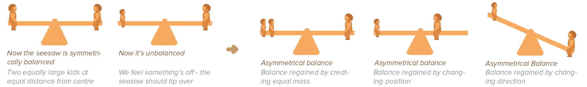
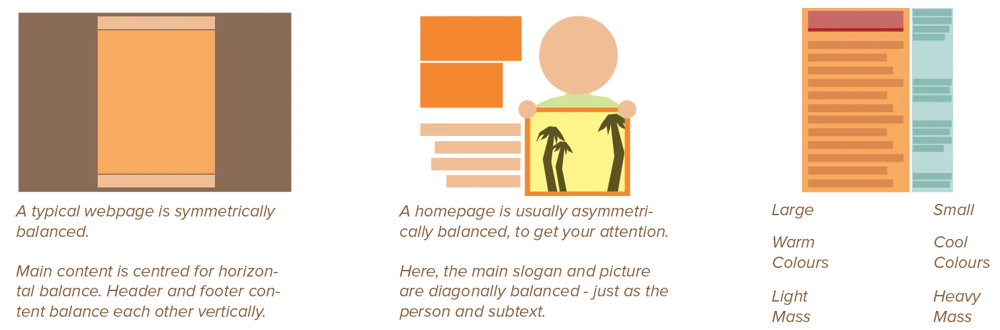

The last of the five big principles is more of an umbrella principle. *Balance* talks about achieving balance between the previous four principles. And it even goes beyond that, as balance is something that should be achieved in all areas of a design, from colour schemes, to texture, to shape. 

Balance simply means that no area of the design overpowers other areas---or, at least, not so much that you can't see the other areas anymore. Balance refers to that tugging contest between _patterns / structure_ and _variation / surprise_ I've mentioned numerous times in this course.

## The Purpose of Balance

The purpose of balance is to create a design that feels stable, coherent, and lively. People have a strong sense of weight and balance, as seen in the [Mass](../design-properties/mass/) chapter. They will immediately notice when something feels off. 

When a design is not balanced, attention is pulled away from its message. People will be focused on other things instead, or on only one particular aspect of the design.

## How to Achieve Balance

Balance is achieved by properly applying all the principles. By applying every principle not too little and not too much. By placing not too few nor too many elements on the page.

Don't put too much of one element in the design. Don't put too much of the design in one corner---contrast and balance everything. In general, balance comes from giving the general _areas_ of your design an equal _mass_.

Balance a heavy area with an area of white space or light mass. Balance a warm, intense colour with a cool, relaxing colour. Balance a complex shape with simple shapes. Balance a busy (textured) section with a very calm (empty) section.

Symmetry is inherently stable and perhaps the strongest form of balance. But asymmetric designs can be balanced as well, if you manage to contrast other aspects of the design. 

As mentioned in the [Figure-Ground](../figure-ground/) chapter, when figure and ground are balanced (instead of figure taking all the attention), the slight ambiguity between background and foreground adds surprise and visual interestingness.

Of course, this is quite a subjective principle. The same way that some people might find a dish too spicy, while others might find it actually lacks spice, even though they're talking about the same dish!

Finding balance in every design requires experience and experimenting. Apply the principles in whatever measure you think is fitting. Then take a back step and evaluate if something is used too little or too much. Adjust and repeat.

Do remember that all principles present themselves when using a grid. If you're stuck or don't know what to do, go back to your grid and literally count the size of elements, count the distance between elements, check the alignments (versus non-alignments), and mathematically balance it all. It will be a more boring or predictable design, but it's balanced point from which to start.

## Pitfalls to Avoid

There aren't clear pitfalls when it comes to balance. You either have it, or you don't. If you don't, add or remove elements or properties to achieve it, based on your own observations.

I guess the only pitfall is that you also need _balance_ in how you _balance_. What does that mean? Don't balance all your designs exactly the same way. If you use symmetry to balance _everything_, your design will look formal, static, like it's been generated by a computer. Yes, using the same font and font size for all text is "balanced" in that one way, but not balanced in terms of variation.

I keep saying it: beauty arises from a mix of things, a ryhthm of logical patterns and creative variation.