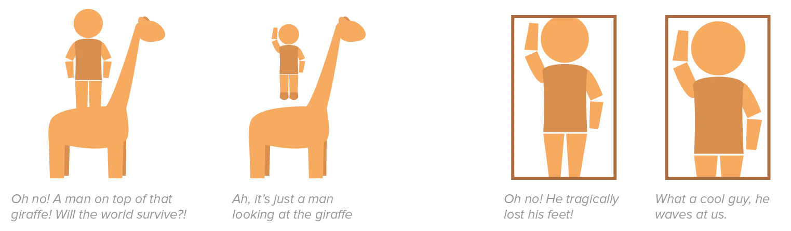
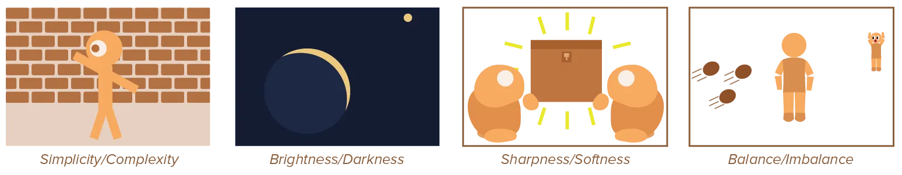
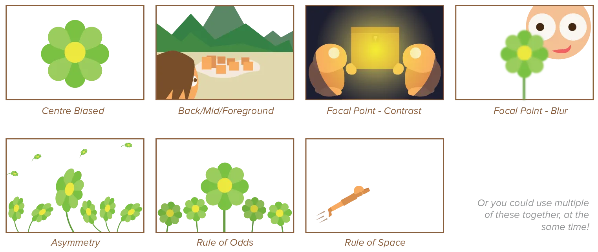

Hopefully you noticed that this course moved from the smallest possible pieces towards the biggest.

* We started with basic elements (point, line, shape)
* Then continued with principles applicable to groups of elements 
* And principles about larger areas or the whole general design
* And now we're at the chapter that's about the end product of every design: a *composition*. 

Good graphic design should end with an interesting and clear composition. This means that you already know quite a lot about how to do that! This chapter might seem unnecessary. But I wanted to show specific uses and applications of everything you've learned. This should help jumpstart your designs and give a better understanding of everything you've seen.

{}
Also, now you know what composition means. Just a fancy word for the collection of things that make a design.
{}

## What Exactly is Composition?

Composition is everything, literally. Composition is *which* elements you place within a design, and *how* you place them. It's the total package. It's about how elements are arranged throughout the design, but also about which elements you chose at all. 

On top of everything you've already learned, I want to leave you with three tips: 

* How to *avoid unintended visual illusions*
* How to create an *overall interesting design*
* And *common composition types*.

## Avoid Unintentional Visual Illusions

You definitely want to avoid a framing that creates unwanted visual illusions. These so-called **tangents** occur when picture elements just *touch*, but do not *overlap*. 

This can create bizarre illustrations where things seem to be connected or on top of each other, while they are actually far away from each other.

Additionally, avoid cutting off objects at small or narrow places. If somebody's hand is cropped out of the picture, you'll only see a person's arm and think the poor soul has lost their hand. If you frame the picture in such a way that, for example, also part of the arm is cropped out, it won't seem that way.

## Use Interesting Contrasts

By embracing **opposing** ideas in a single picture, you can establish creative tension. A few ideas are:

-   Repetition and Variation
-   Simplicity and Complexity
-   Clarity and Ambiguity
-   Balance and Imbalance
-   Brightness and Darkness
-   Sharpness and Softness
-   Active and Passive (Shapes)

## Common Compositions

Yes, "steal like an artist" and all that. Nothing is original. You're shooting yourself in the foot if you actively _ignore_ looking at existing designs, looking at other artists, and applying cliche templates used a million times before.

You can learn a lot by looking at other designs. There is a _reason_ certain compositions are common, and that's because they are easy, and practical, and they work.

So if you're stuck, try these five ideas for your next composition. As I said before, these are just guidelines, and there's no specific right or wrong here.

-   **Centre Biased**: The centre is the focal point. Pieces around it direct focus towards the centre by (invisible) perspective lines.
-   **Background, Midground, Foreground**: These three levels of distance complement each other.
-   **Focal Point---Contrast**: Create an (artificial) focus point by heavily contrasting it with the rest of the drawing.
-   **Focal Point---"Camera" Blur**: Blur everything you don't want to have focus. On the computer it's easy, in real life you'll need to work with gradients and smudging.
-   **Using Asymmetry**: Rotating stuff, displacing them, using non-symmetric shapes---all sorts of things that can create a sense of discomfort, danger, or exciting/thrilling things happening in the drawing.
-   **Rule of Odds:** Create a focal point by framing an element with an even number of surrounding elements. The odd number of elements makes it interesting and asymmetric, while the even number of background elements create symmetry.
-   **Rule of Space:** By leaving white space in a certain direction, you encourage the viewer's eye to move in that direction, implying motion towards a focal point.

