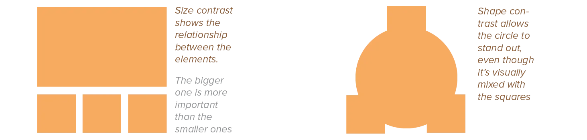
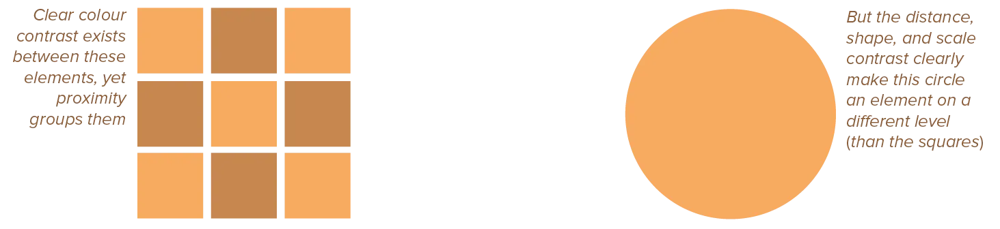
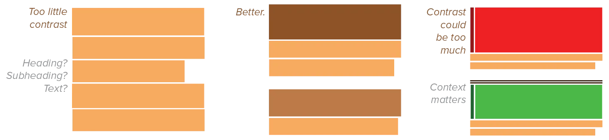

Contrast allows our eyes to see. Without it, everything would be the same, and we wouldn't be able to distinguish different objects or elements in a design. 

> Our eyes *love* contrast. 

It's not only necessary for structure and clarity, but also enhances the aesthetics of a design.

## The Purpose of Contrast

Therefore, the purpose of contrast is two-fold. 

* It creates an interesting and appealing design. 
* It allows the viewer to instantly *recognize* that hierarchy you so carefully created in your design. 

By giving elements near each other completely opposite properties ...

* The eye becomes interested in this design
* And it shows that those two elements are certainly not the same and represent a different level within the hierarchy, a different group or layer.

By placing a single tiny black square on a white page, for example, we immediately establish a focal point and make the page more interesting through contrast. By placing something red next to something green (its complementary colour), it becomes even "redder" and more vibrant. A curve becomes even curvier when it's next to something orthogonal and straight.

But without contrast, different groups ... aren't actually different groups in your design.

## How to Create Contrast

If put two elements on the page that are not the same, they cannot be *similar*. For contrast to be effective, they must be very different. 

I call this **no near misses**. Either something is identical, or it's very contrasted. Anything in between looks like an accident and confuses everyone.

This is achieved by exaggerating one or multiple properties. These properties can be anything we've already discussed: size, colour, shape, texture, typeface, orientation, and so on.

The juxtapositions between elements, however, can also be expressed in a more general way:

* Smooth versus rough, 
* Geometric versus organic
* Organized versus chaotic
* Static versus kinetic. 

This way, by contrasting more properties, the effect becomes more apparent and immediate.

Contrast will always make two elements distinct. But that doesn't mean they can't still be grouped or related.

Use the other Gestalt principles to show the positive relationship. Keep some properties identical to show grouping. And then use contrast to show these elements are not exactly the same, even if they're within the same group.

## Pitfalls to Avoid

The contrasting elements should never serve to confuse the reader. Or to create a focus that is not supposed to be one. 

Contrast can be too light, which seems more like a mistake than a choice. Contrast can also be too heavy, which overwhelms the viewer.

If you're going to contrast, do it with strength. Avoid contrasting a sort-of-heavy line with a sort-of-heavier line. Avoid contrasting black text with brown headlines. Don't be afraid to make words very large or very small---to speak loudly or speak in a whisper. Don't be afraid to make your graphics very bold or very minimal, as long as the result complements or reinforces your design or message. If the items are not exactly the same, make them *very* different.

The human eye can simultaneously detect contrasts in scale, value, shape, direction, and surface---as long as they're large enough.

## In summary

Contrast creates emphasis, importance, weight, or dominance for an element of a composition. A composition lacking contrast may result in visual monotony, neutrality, and even confusion.

The eye **loves** contrast. And it's needed to bring your hierarchy to fruition.

By offsetting contrast with other Gestalt principles, you can both group elements together _and_ make one the distinct focal point.

The ultimate challenge is to create a composition made from clearly unique elements with a unique purpose, that still work together as one orchestrated whole.