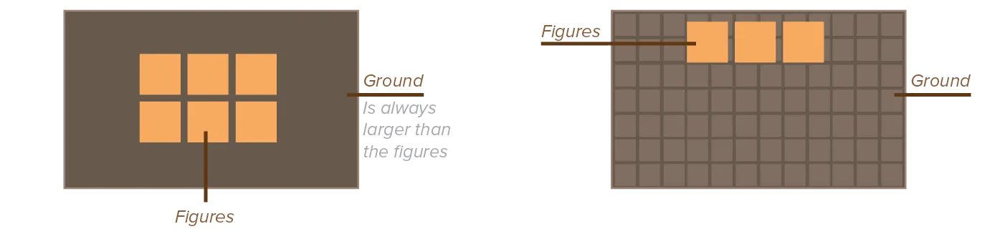
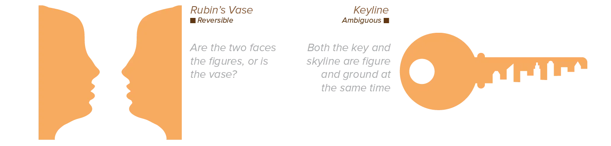
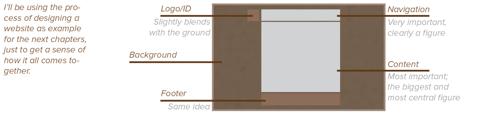

The first step towards ranking elements in your design, is establishing the *figure-ground* relationship. I've referred to the distinction between foreground and background several times already. The term figure-ground is just design language for the same thing.

* *Foreground* is what attracts attention and contains the actual content of the design. (Or the most crucial content.)
* *Background* is the space around the foreground that supports it without getting noticed. (Or the less crucial content.)

This means that the largest part of any design will actually be background! Which is why it deserves some further investigation.

{}
Designs with white or light backgrounds feel safer to us than those with dark backgrounds, because we can see well during the day and poorly at night. On the other hand, white maximizes the effort of our colour receptors, while black enables the eyes to rest. That's why most people report that they _prefer_ reading black text on white paper, while they are actually more _comfortable_ when reading white text on black background. Humans are strange.
{}

Determining foreground and background is often the first step. 

If you watch process videos by other designers, they often start by finding two contrasting colors. Then they fill their whole page with the background color and throw some big elements over it in the foreground color. In just a few steps, they've established 90% of what the design looks like, and already checked if it looks good.

From now on, the foreground will be called **figure**, and the background simply **ground**.

## Figure versus Ground

Figures are positive shapes, active, and objects of focus. Ground is negative space, passive, and the rest of the perceptual field.

Figures seem to move forward and have a clear position in space, ground recedes and has no clear location. There's only one ground, but there can be multiple figures.

Figures have a definite shape and borders, ground is shapeless and continues behind the figures and beyond the edges of the design.

Elements above the horizon line are more likely to be perceived as figures, while elements below the horizon line are more likely perceived as ground. (Which is quite logical, as the ground comes underneath the sky in the real world. Well, as long as you're not in some weird upside-down position.)

It's best to use figures for key elements that you want the viewer to be able to recall. Especially familiar, figurative, and representational objects are easy to see and identify as figure.

## The Relationship

There are three basic types of figure-ground relationships:

-   **Simple:** An independent figure is placed on top of the space that represents its ground. The ground can be shallow or have depth. The figure is clearly visible and separate from the ground.
-   **Reversible:** Figures function as ground, while ground functions as figure. This graphic inversion takes place because of the shapes that appear within the ground. It's a dynamic way to make neutral empty space more active and engaging in a composition, because positive and negative elements attract our attention equally and alternately.
-   **Ambiguous:** Graphic relationship between figure and ground is unclear or undetectable. Pairs of objects share the same edge or profile.

It's important to notice that they depend on each other _fully_. The figure determines the ground, and vice versa. The same way that positive and negative shapes are 100% linked: one creates the other.

## Stability

We say a figure-ground relationship is **stable**, if it's clear what the figure is. We're only focused on the figure, and never the ground. The figure receives more attention and immediacy than the ground. 

* Advantage? The focus point is clear and perceptual confusion is minimized.
* Disadvantage? It's potentially boring and static.

When a figure-ground relationship is **unstable**, the figure and ground are *ambiguous* or *reversible*. The design can be interpreted in different ways, and tension is created. 

* Advantage? The design is interesting, energetic, and powerful
* Disadvantage? It is potentially confusing and lacks hierarchy.

A good design, therefore, seeks balance between figure and ground. Creating some ambiguity or reversible effects to add visual energy and surprise, while at the same time keeping most of the relationship **simple**. The design becomes active and animated, while still focusing attention.

