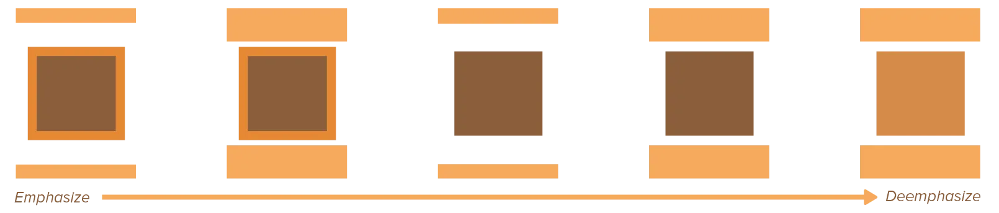
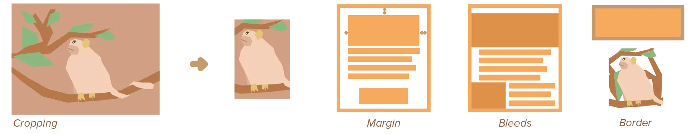
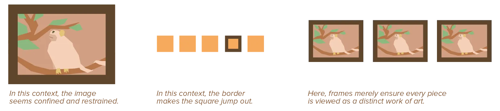

In the chapter on proportions, I already stated the size of the media you use plays an important role. If your paper is an A4, your design will automatically look better if it borrows some of that proportion (between width and height).

These boundaries are called a **frame**. This chapter looks at that specific frame ( = the edges of paper or material), but also at another powerful type of framing---within the design itself.

## What is a Frame?

Framing an element is a way to emphasize or deemphasize it. 

* When emphasizing, a frame makes its contents stand apart from its surroundings. This can be done in numerous ways, such as putting a visible border around it, or leaving a _lot_ of empty space between itself and the rest.
* When deemphasizing, the frame is subtle and makes its contents blend in with the rest of the design. This, again, can be done in numerous ways, such as removing any border or leaving a regular and predictable amount of white space around the element.

Either way, every element has a frame. Any part of your design has some edge, some place where they end and some other element starts.

It's your job to decide whether you emphasize this or not. Whether an element needs that attention and clarity, or not. Again, _you_ need to take control, instead of accidentally framing things in a visually confusing way!

A strong frame around an element makes it clear for the viewer this is where their attention should be. In turn, this means you shouldn't use too many strong frames, or the design becomes convoluted and chaotic. On the other hand, no frames at all---more often than not---create an unclear hierarchy.

## Common Frames

In most designs, at least some of the following frames are present:

-   **Cropping:** Essentially, cropping is the process of cutting an image or design into different and smaller proportions. By cutting off some of the original image, you can close in on detail and create interesting negative space. It can also suggest motion.
-   **Margins:** The margin is the area of white space between the edge of a paper and its contents. A wide margin places attention on the whole content, a narrow margin can make it seem like the content is bigger than it actually is---like it's bursting its seams. Margins also provide space for extra small and informational elements.
-   **Bleeds:** We say an image or design bleeds when it runs off the edges of the page. A bleeding image makes it seem like it's bigger and closer to you than it actually is, but it also creates lots of asymmetry and removes space for other elements.
-   **Image & Text:** Images and text have such a complicated texture that they are often framed to make them clearly stand apart from their surroundings as one individual object. Additionally, putting text on top of an image poses a challenge. The best way to solve it is putting a box around the text or reducing the contrast within the image.
-   **Border:** An actual, visible border can be put around elements. Borders define elements that lack an obvious edge, and can strongly emphasize anything. Borders are nothing more than lines. Although some are simple and subtle lines, and some are complex and also meant as decorative elements. Sharp borders set elements apart, while soft borders let them blend in.

## Natural Frames

Many elements and types of design have a natural, inherit frame. One that neither strongly emphasizes or deemphasizes an element---it's just a neutral frame.

For example, the edges of a simple, white piece of paper are natural frames. Putting a border against those edges often makes a design feel small, constrained and contained---it's like we're looking at the design through a small window. 

Similarly, basic elements such as lines, squares, and circles have their own simple contour that is easily recognizable and automatically frames them.

On the other hand, works of art are often framed within very obvious and explicit frames. Why? Paintings are often displayed together with many other paintings. They are hung on a wall of some colour and texture, perhaps illuminated by a spotlight of some kind, _many_ variables change how that art is viewed over time. As such, it needs to have a frame to make clear where it starts and ends. To make it stand on its own in _any_ environment.

{}
In video games, the most important elements usually receive an _outline_ of some sort. This is so common and useful, that most people forget it. Even "realistic 3D games" usually apply thick outlines around their main character, or an important artifact in the scene, just to make it stand out. But it's most visible in 2D cartoony games.
{}

Be aware of the surroundings of an element or complete design, which means to be aware of an element's natural borders. Framing small things makes them stand out, while framing large things can actually make them feel smaller and contained. 

This is not only true in two-dimensional design. For example, imagine a painting that you can only see by looking through a window in the room next to it. The painting would still feel a lot smaller, even though you can still see everything.

A frame can be a merely functional. But because _everything_ has a frame, and it's an easy way to change hierarchy, it is very frequently used to increase _aesthetics_ as well. Most of my websites have some type of "border image", or something that changes the edges and frames around blocks. Simply because I need a frame anyway---so I might as well make it pretty and consistent, right?

Use framing well. And know that every element inherently has a frame---it's your job to emphasize or deemphasize it.